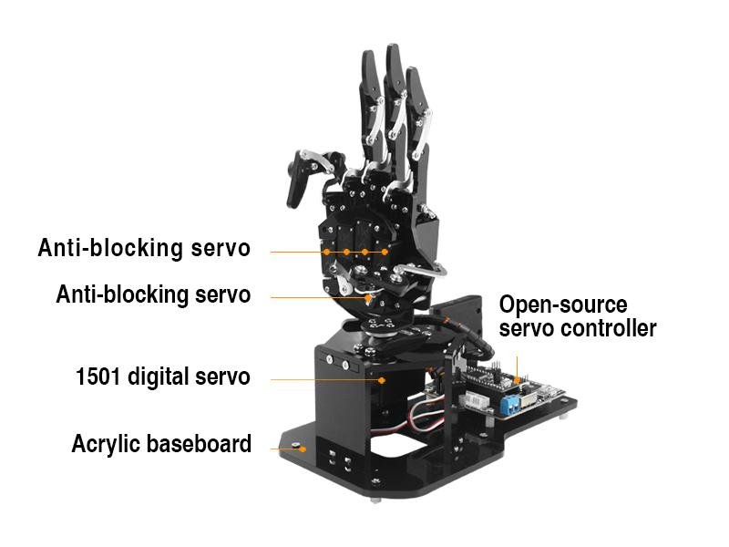
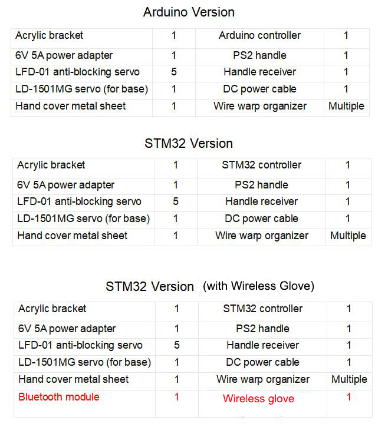
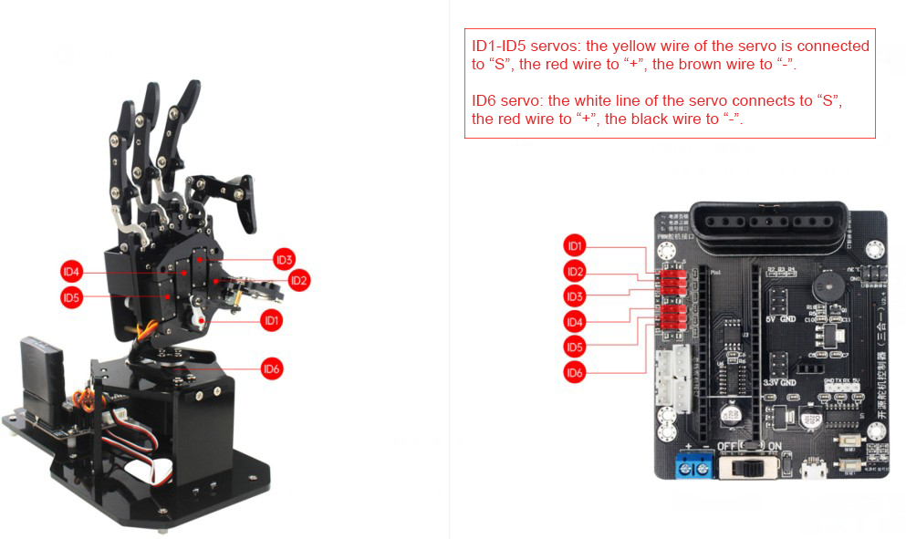
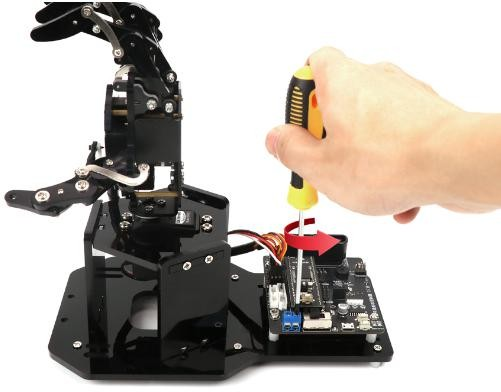
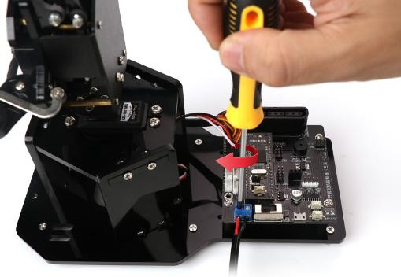
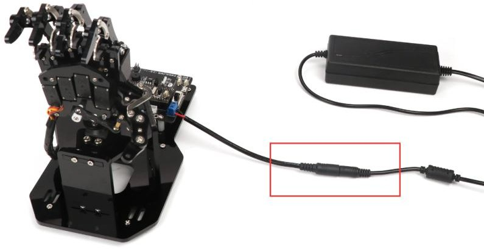
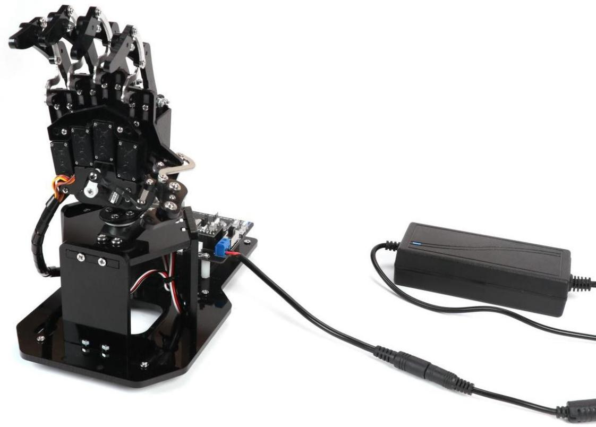

# 1. Getting Ready

## 1.1 Lesson 1 uHand2.0 Open-source Robotic Hand Introduction

### 1.1.1 Product Introduction

uHand2.0 is a bionic robotic palm compatible with Arduino programming and STM32 development. Its five fingers are driven by five anti-blocking LFD-01 servos. The pan-tilt is driven by a 180 degrees LD-1501MG digital servo. uHand2.0 supports handle and mobile control. With graphical PC software, editing action is easier and faster.

We prepare three versions for different learning situation as needed

Version one: Arduino microcontroller version. It is suitable for beginners who are learning Arduino programming and have a weak programming foundation.

Version two: STM32 microcontroller version. It is suitable for users who master certain basic programming skills and want to learn STM32.

Version three: STM32 version (including Wireless Glove). Wireless Glove has been added on the basis of the STM32 version.

### 1.1.2 Overview

Step 1：uHand2.0 Bionic Robotic Hand Instruction

The first two lessons of Folder “1. Getting Ready” explains `uHand2.0` structure and assembly. Lesson 3 Start uHand2.0 explains how to turn on device and its status.

Step 2: Quick Experience Instruction

Please go to “2. Remote Control Lessons” to learn how to control uHand2.0.

Handle Control: Understand the working principle of PS2 handle and master handle connection and device control method.

Mobile APP Control: Study how to connect mobile APP and control device via App.

> [!NOTE]
>
> **Mobile app control is only suitable for STM32 version.**

Step 3: PC Software control

Please go to fold “3. PC Software Control” to learn how to start uHand2.0 with PC software, how to program action group and download to uHand2.0, APP customization and offline running.

Step 4: Development tutorial

Please go to folder “4. Set Development Environment” to learn Arduino Nano or STM32 corresponding content according to your controller.

Please go to folder “5. Sample Code” to view programming source code of Arduino and STM32 microcontroller.

Step 5: Advanced Learning.

Please go to folder “6. Advanced Lessons” to learn secondary development. This section is optional,which is only for your reference.

Advanced lessons mainly include Add Offline Actions, secondary development communication protocol, Arduino and STM32 materials.

### 1.1.3 Packing List

## 1.2 Lesson2uHand2.0ServoWiring

## 1.3 Lesson 3 Start uHand2.0

Step 1: Counterclockwise twist the screw on DC power port of expansion board with screwdriver.

Step 2: Connect the red wire of DC power butted cable to the positive pole (+) on expansion board and the black wire to the negative pole (-). Then tighten the screw with screwdriver.

Step 3: Connect the male connector of power adapter to the female connector of DC power butted cable. Then plug the adapter into socket.

Step 4: Switch on the controller. The hand will show the grasping posture, which means the device is boot up successfully.

