# 2. Remoto Control

## 2.1 Lesson 1 Handle Control

### 2.1.1 Getting Ready

Step1: Insert the handle receiver into the controller as the figure shown below:

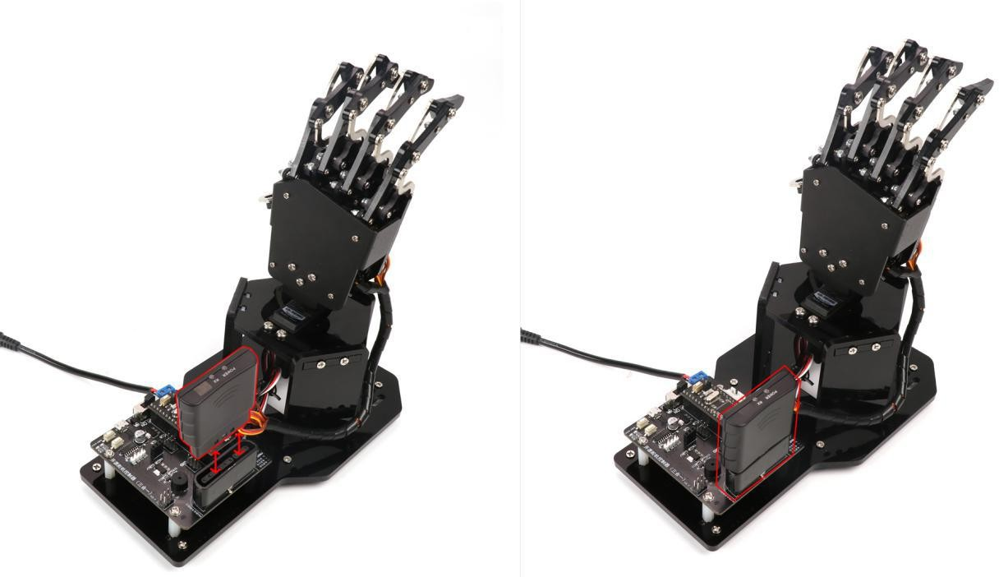

Step 2: Prepare two AAA batteries by yourself. Take the back shell of the handle off and insert the batteries into the battery box. Note: do not inversely insert the negative and positive poles.

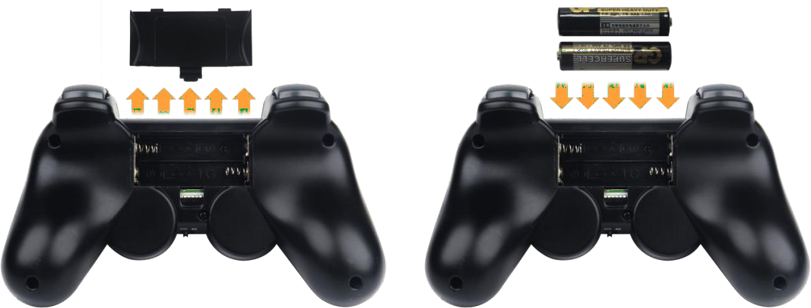

### 2.1.2 Device Connection

Step 1: switch on uHand2.0

Step 2: switch on handle. At this time, two LED lights (red and green) of the handle are flashing simultaneously.

Step 3: wait for a few seconds. The uHand2.0 will match with the handle automatically . After the match is completed, red and green LED lights will be on. (If only a green light or a single red light lights up after switching on, you can press “MODE” button.)

Step 4: If fail to connect, please switch off the uHand2.0 and handle first, and then repeat the previous steps to operate.

switching on the handle, or have no operation within 5 minutes after connection, the handle

will enter sleep mode. If want to restart the handle, you can press “START” button.

###  2.1.3 Mode Introduction

There are two modes for handle control: single servo mode and action group mode. The default mode is action group mode after connecting.

Action Group Mode: Press buttons to call corresponding action groups

(Please note that this mode can only be realized after the action group file is downloaded into controller. You can go to folder “**3. uHand2.0 PC software and action programming-> Lesson 1 PC software Introduction**” to refer corresponding materials.)

Single Servo Mode: Press the button to control the rotation of each servo on the hand.

Two modes switching method: Press “**SELECT**” button first without releasing, and then press “**START**” button. You can release your hand after hearing the prompt sound, which means uHand2.0 has been switched from “**action group mode**” to “single servo mode”.

### 2.1.4 Button Instruction

Button instructions in action group mode:

(Combination button pressing method: You need to first press “**SELECT**” without releasing, and then press corresponding button.)

<table>
<colgroup>
<col style="width: 35%" />
<col style="width: 64%" />
</colgroup>
<tbody>
<tr>
<td style="text-align: center;">

<strong>Button</strong>

</td>
<td style="text-align: center;">

<strong>Function</strong>

</td>
</tr>
<tr>
<td style="text-align: center;">

<strong>START</strong>

</td>
<td style="text-align: center;">Execute No.0 action group (return to middle position) once.</td>
</tr>
<tr>
<td style="text-align: center;">

<strong>↑</strong>

</td>
<td style="text-align: center;">Execute No.1 action group (digit 1 gesture) once</td>
</tr>
<tr>
<td style="text-align: center;">

<strong>↓</strong>

</td>
<td style="text-align: center;">Execute No.2 action group (digit 2 gesture) once</td>
</tr>
<tr>
<td style="text-align: center;">

<strong>←</strong>

</td>
<td style="text-align: center;">Execute No.3 action group (digit 3 gesture) once</td>
</tr>
<tr>
<td style="text-align: center;">

<strong>→</strong>

</td>
<td style="text-align: center;">Execute No.4 action group (digit 4 gesture) once</td>
</tr>
<tr>
<td style="text-align: center;">

</td>
<td style="text-align: center;">Execute No.5 action group (digit 5 gesture) once</td>
</tr>
<tr>
<td style="text-align: center;">

<strong>×</strong>

</td>
<td style="text-align: center;">Execute No.6 action group (digit 6 gesture) once</td>
</tr>
<tr>
<td style="text-align: center;">

</td>
<td style="text-align: center;">Execute No.7 action group (digit 7 gesture) once</td>
</tr>
<tr>
<td style="text-align: center;">

<strong>○</strong>

</td>
<td style="text-align: center;">Execute No.8 action group (digit 8 gesture) once</td>
</tr>
<tr>
<td style="text-align: center;">

<strong>L1</strong>

</td>
<td style="text-align: center;">Execute No.9 action group (digit 9 gesture) once</td>
</tr>
<tr>
<td style="text-align: center;">

<strong>R1</strong>

</td>
<td style="text-align: center;">Execute No.10 action group (fist) once</td>
</tr>
<tr>
<td style="text-align: center;">

<strong>L2</strong>

</td>
<td style="text-align: center;">Execute No.11 action group (vow gesture) once</td>
</tr>
<tr>
<td style="text-align: center;">

<strong>R2</strong>

</td>
<td style="text-align: center;">Execute No.12 action group (Provocative gesture) once</td>
</tr>
<tr>
<td style="text-align: center;">

<strong>SELECT+</strong>

</td>
<td style="text-align: center;">Execute No.13 action group (“I Love You” gesture) once</td>
</tr>
<tr>
<td style="text-align: center;">

<strong>SELECT+×</strong>

</td>
<td style="text-align: center;">Execute No.14 action group (finger dance 1) once</td>
</tr>
<tr>
<td style="text-align: center;">

<strong>SELECT+</strong>

</td>
<td style="text-align: center;">Execute No.15 action group (finger dance 2) once</td>
</tr>
<tr>
<td style="text-align: center;">

<strong>SELECT+○</strong>

</td>
<td style="text-align: center;">Execute No.16 action group (finger dance 3) once</td>
</tr>
</tbody>
</table>

Button instructions in single servo mode:

<table>
<colgroup>
<col style="width: 26%" />
<col style="width: 51%" />
<col style="width: 21%" />
</colgroup>
<tbody>
<tr>
<td style="text-align:center"  style="text-align: right;"><strong>Button</strong></td>
<td style="text-align:center"  style="text-align: right;"><strong>Function</strong></td>
<td style="text-align:center" >

<strong>Servo</strong>

</td>
</tr>
<tr>
<td style="text-align:center"  style="text-align: right;"><strong>START</strong></td>
<td style="text-align:center"  style="text-align: right;">

Servo back to original position angle

</td>
<td style="text-align:center" >No.1-6 servo</td>
</tr>
<tr>
<td style="text-align:center"  style="text-align: right;">

<strong>R1</strong>

</td>
<td style="text-align:center"  style="text-align: right;">Thumb bend</td>
<td style="text-align:center"  rowspan="2">No.1 servo</td>
</tr>
<tr>
<td style="text-align:center"  style="text-align: right;">

R2

</td>
<td style="text-align:center"  style="text-align: right;">Thumb straighten</td>
</tr>
<tr>
<td style="text-align:center"  style="text-align: right;">

<strong>L2</strong>

</td>
<td style="text-align:center"  style="text-align: right;">Forefinger bend</td>
<td style="text-align:center"  rowspan="2">No.2 servo</td>
</tr>
<tr>
<td style="text-align:center"  style="text-align: right;">

<strong>L1</strong>

</td>
<td style="text-align:center"  style="text-align: right;">Forefinger straighten</td>
</tr>
<tr>
<td style="text-align:center"  style="text-align: right;">

</td>
<td style="text-align:center"  style="text-align: right;">Middle finger bend</td>
<td style="text-align:center"  rowspan="2">No.3 servo</td>
</tr>
<tr>
<td style="text-align:center"  style="text-align: right;">

<strong>○</strong>

</td>
<td style="text-align:center"  style="text-align: right;">Middle finger straighten</td>
</tr>
<tr>
<td style="text-align:center"  style="text-align: right;">

</td>
<td style="text-align:center"  style="text-align: right;">Ring finger straighten</td>
<td style="text-align:center"  rowspan="2">No.4 servo</td>
</tr>
<tr>
<td style="text-align:center"  style="text-align: right;">

<strong>×</strong>

</td>
<td style="text-align:center"  style="text-align: right;">Ring finger bend</td>
</tr>
<tr>
<td style="text-align:center"  style="text-align: right;">

<strong>↑</strong>

</td>
<td style="text-align:center"  style="text-align: right;">Little finger bend</td>
<td style="text-align:center"  rowspan="2">No.5 servo</td>
</tr>
<tr>
<td style="text-align:center"  style="text-align: right;">

<strong>↓</strong>

</td>
<td style="text-align:center"  style="text-align: right;">Little finger straighten</td>
</tr>
</tbody>
</table>
## 2.2 Lesson 2 Mobile App Control

### 2.2.1 APP Installation

Find “uHand.apk” installation pack under the same folder and install it on your phone. (uHand2.0 APP only supports Android version.)

### 2.2.2 Device Connection Method

> [!NOTE]
>
> * **Due to the hardware compatibility issue, Arduino version does not support mobile control.**
>
> * **Please open the Bluetooth and GPS service first before using the APP.**
>
> * **Please match and connect the device through Bluetooth in APP. Do not match through password in the phone settings.**
>
> * **This section takes APP in Android version as example. The system version is required to be Android 6.0 and above.**

Step 1: Make sure that Bluetooth module is connected correctly. Then switch on uHand2.0.

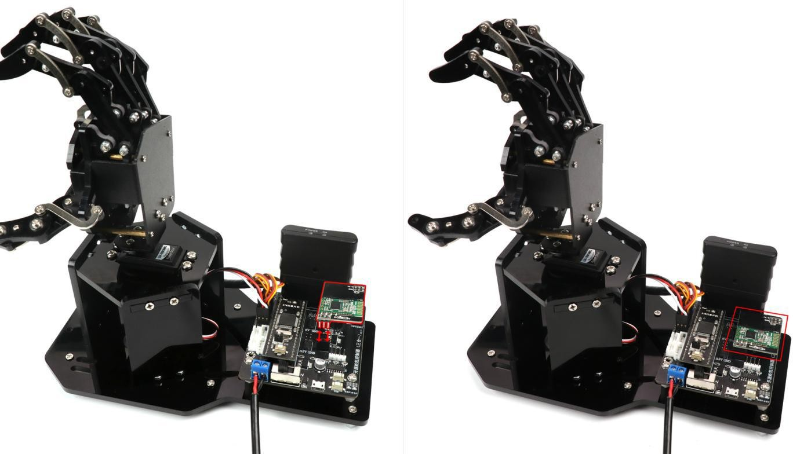

Step 2: Open mobile APP

Step 3: Click the red Bluetooth icon in the upper left corner of APP home interface to enter device search state.

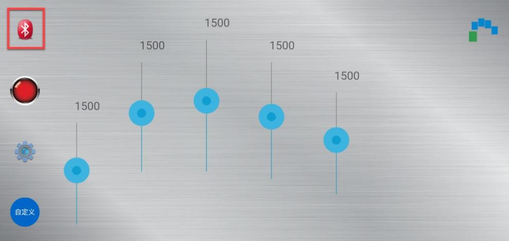

Step 4: Wait for a while, and then select “Hiwonder” from the device list.

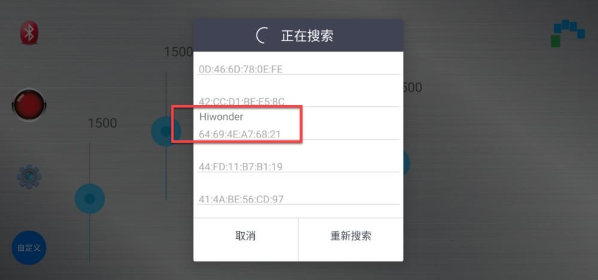

Step 5: After the connection is completed, Bluetooth icon in the upper left corner will turn blue and “Bluetooth is connected” will prompt in the interface.

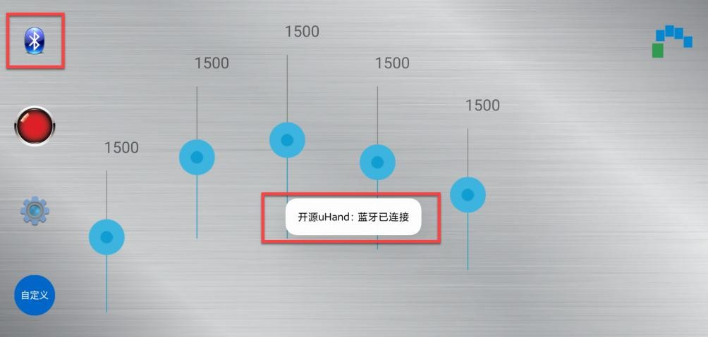

### 2.2.3 Buttons Function Instruction

The following table is the button instruction of the APP.

<table>
<colgroup>
<col style="width: 44%" />
<col style="width: 55%" />
</colgroup>
<tbody>
<tr>
<td style="text-align:center"><strong>Icon</strong></td>
<td style="text-align:center"><strong>Function</strong></td>
</tr>
<tr>
<td>

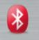

</td>
<td>

Bluetooth connection button. After the device is connected, the Bluetooth icon will turn blue.

</td>
</tr>
<tr>
<td>

</td>
<td style="text-align: center;">

Reset button. After clicking this button, the hand will be reset to the initial posture.

</td>
</tr>
<tr>
<td style="text-align: center;">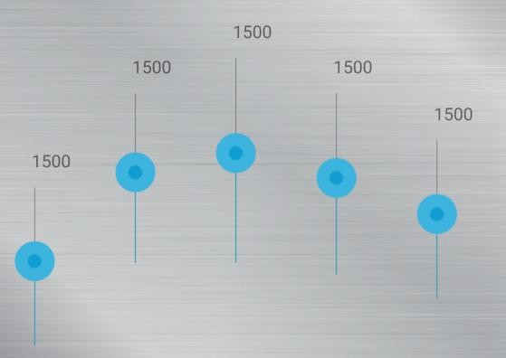</td>
<td style="text-align: center;">

Drag sliders to control the rotation of the servos corresponding to fingers.

</td>
</tr>
<tr>
<td>

</td>
<td style="text-align: center;">

Click to switch to multi-finger control interface.

</td>
</tr>
<tr>
<td style="text-align:center"></td>
<td>

Click multiple colored squares to control the rotation of the servo corresponding to the finger.

(The interface of multi-finger mode)
</td>
</tr>
<tr>
<td>

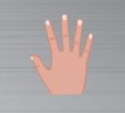

</td>
<td style="text-align: center;">

Click to switch to sliders control interface.

</td>
</tr>
<tr>
<td>

</td>
<td style="text-align: center;">

Click to check version number, servo speed settings

</td>
</tr>
<tr>
<td>

</td>
<td style="text-align: center;">

Click to call the action group file that has been downloaded to uHand2.0.

</td>
</tr>
</tbody>
</table>

## 2.3 Lesson 3 Wireless Glove Control

### 2.3.1 Preparation

The controller of wireless glove has built-in Bluetooth module and has been burnt firmware program before delivery.

Step1: Make sure that the Bluetooth module of uHand2.0 has been connected correctly.

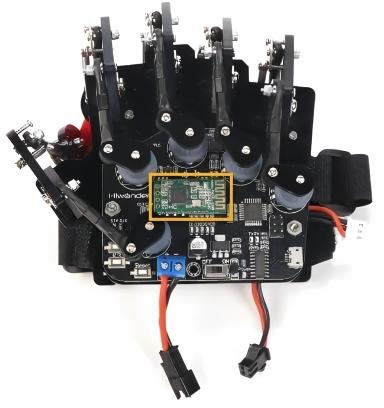

Step 2: Before using the wireless glove, please confirm that the battery has been fully charged.

Charging method:

After the charger is connected to the battery charging cable, the indicator will be green.

When the charger indicator is red, it is charging.

When the red charger indicator turns green, it means the charging is completed.

### 2.3.2 Device Connection

* **Device wearing**

Step1: Connect the power wires, red to red and black to black.

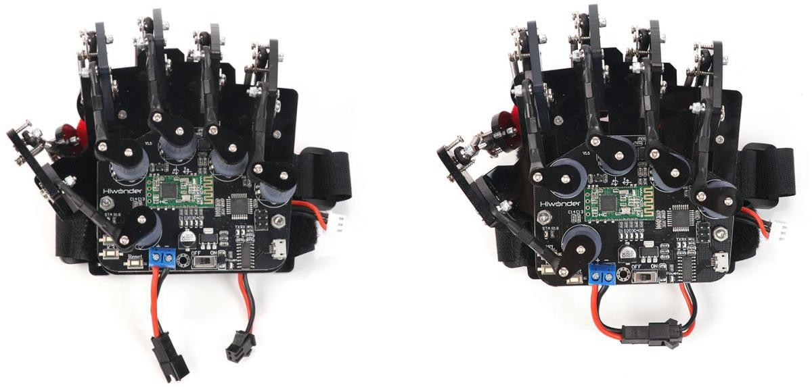

Step 2: Untie all the straps on the glove. Then put 5 fingers into the corresponding finger straps in turn, and tighten the finger traps.

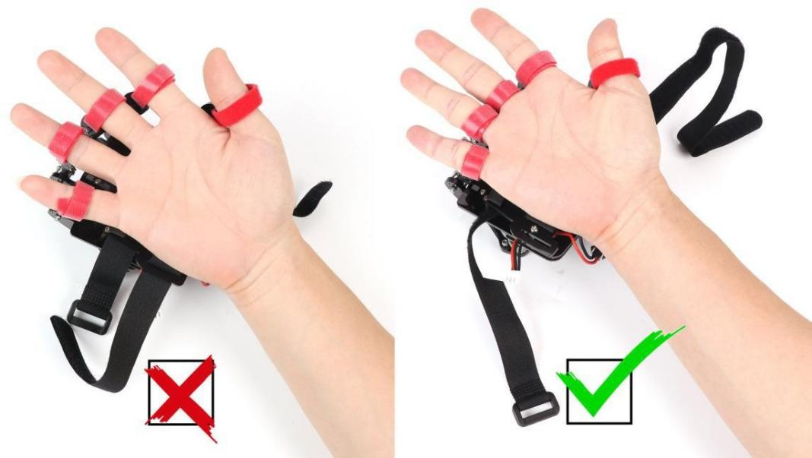

> [!NOTE]
>
> **The finger cots should be fixed at the root of the fingers,for better control!**

Step 3:After wearing the finger traps, tie the two wrist straps as the figure shown below.

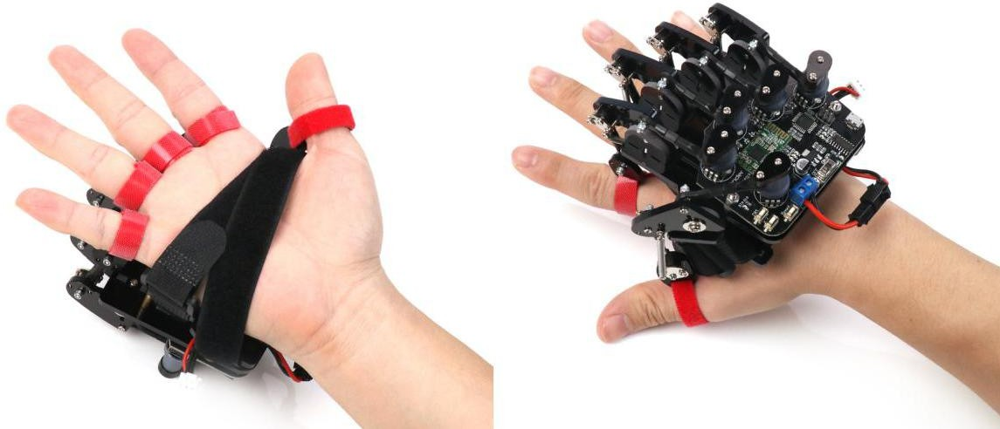

* **Device Calibration**

For better experience, the wireless glove must be calibrated before using. The specific steps are as follow :

Step 1: Straighten out your arm and clench your fist with the palm direction is vertically downward. Then switch on the glove and you can see the lights D1-D5 will flash once.

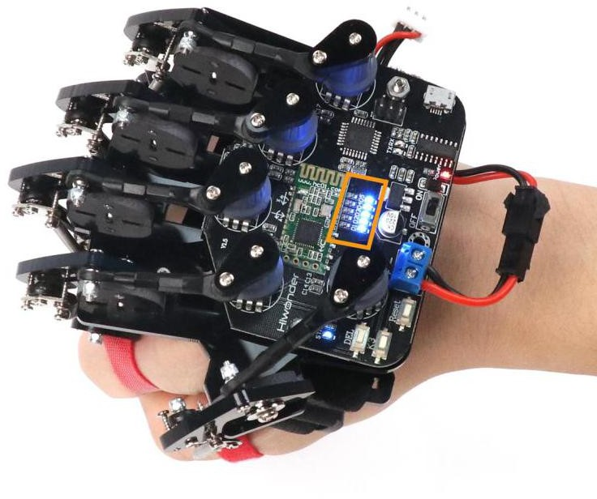

Step 2: After flashing, completely stretch your hand and the lights D1-D5 will flash again to indicate that the calibration is complete.

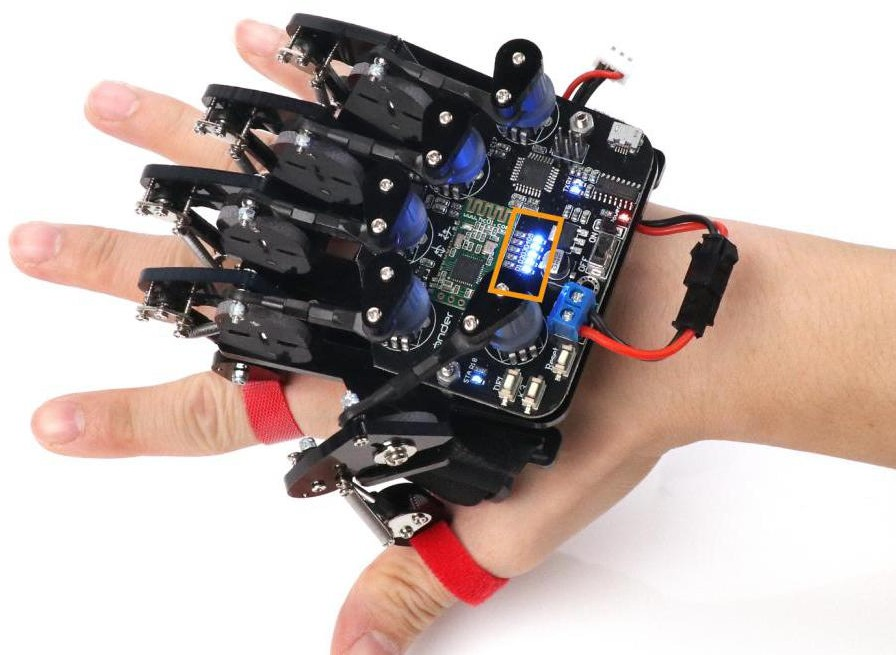

> [!NOTE]
>
> **If fail to calibrate, you can press “DEL” key on controller again. Then repeat the above steps to calibrate.**

Step 3: After the calibration is complete, connect to Bluetooth. The flashing frequency of STA indicator on the controller indicates the current Bluetooth connection status. The “DEL”key can clear the previous Bluetooth connection record.

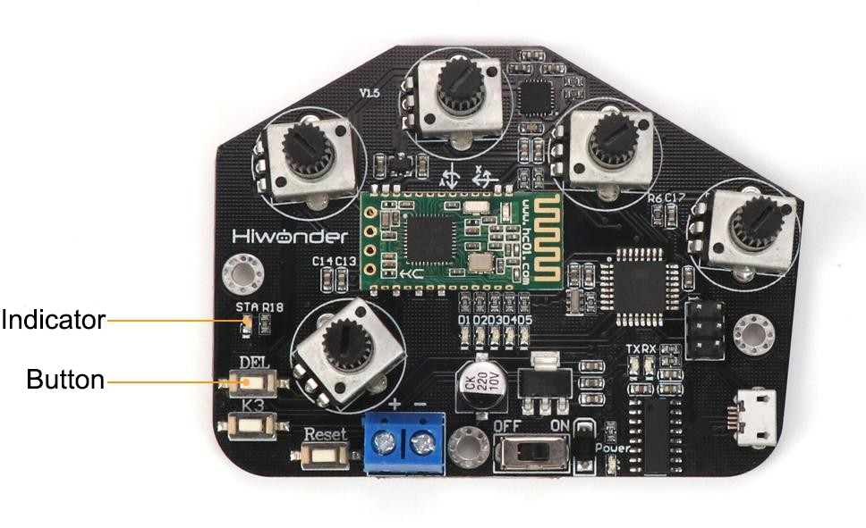

The corresponding relation between the flashing frequency of STA indicator an the Bluetooth connection status is shown in the following table:

<table>
<colgroup>
<col style="width: 31%" />
<col style="width: 68%" />
</colgroup>
<tbody>
<tr>
<td style="text-align: center;"><strong>STA indicator</strong></td>
<td style="text-align: center;">

<strong>Bluetooth</strong>

</td>
</tr>
<tr>
<td style="text-align: center;">Fast flashing</td>
<td style="text-align: cneter;">No Bluetooth connection record and Bluetooth unconnected</td>
</tr>
<tr>
<td style="text-align: center;">Slow flashing</td>
<td style="text-align: center;">

There is Bluetooth connection record but Bluetooth unconnected

</td>
</tr>
<tr>
<td style="text-align: center;">Continuous lighting up</td>
<td style="text-align: center;">

Bluetooth connected

</td>
</tr>
</tbody>
</table>

If STA status indicator flashes slowly or lights up but cannot control the uHand2.0, you can press “DEL” button. At this time, STA indicator flashes fast, which indicates that the Bluetooth connection records are cleared successfully. Then connect Bluetooth again according to the previous steps.

### 2.3.3 Mode Selection

Notes: The uHand2.0 can only be controlled by wireless glove in a one-to-one

manner, that is, one-to-many manner can not be allowed. (if multiple robots are purchased)

In addition, before entering corresponding mode, please make sure that the device has been connected successfully.

In order to distinguish between different control modes. The KEY3 button for switching the control mode and 5 LED lights (D1~D5) indicating the different control modes are preset on wireless glove.

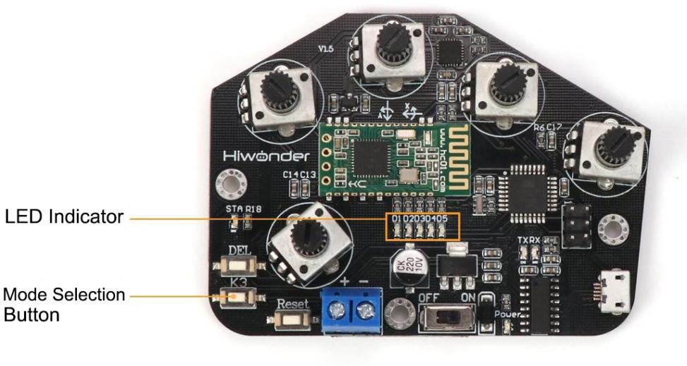

In this section, we use the uHand2.0. If switch to this mode, you need to press“KEY3”

button multiple times until lights D1-D4 keep on simultaneously.

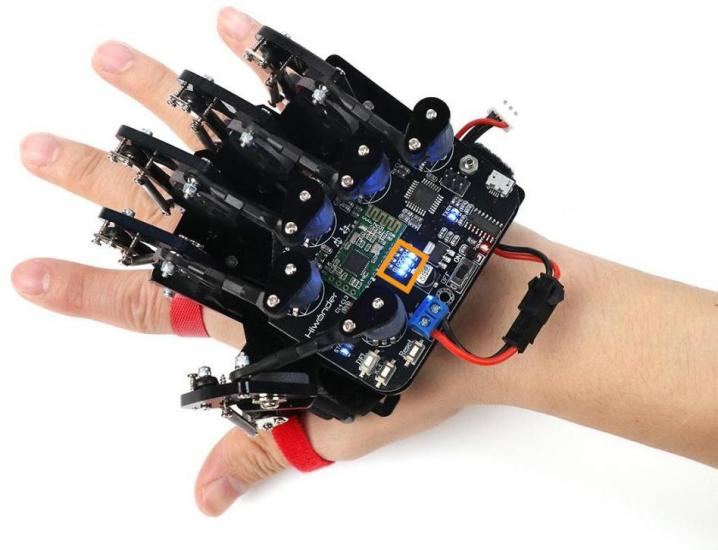

If “KEY3” button is pressed and then none of the 5 LED lights responds, you can restart the glove and repeat the operations from device connection step.

### 2.3.4 Button Diagram

The glove straps on wireless glove corresponds to the servos on uHand2.0’s finger. By manipulating the glove, uHand2.0 can execute the corresponding action. Their correspondence is shown in the following figure.

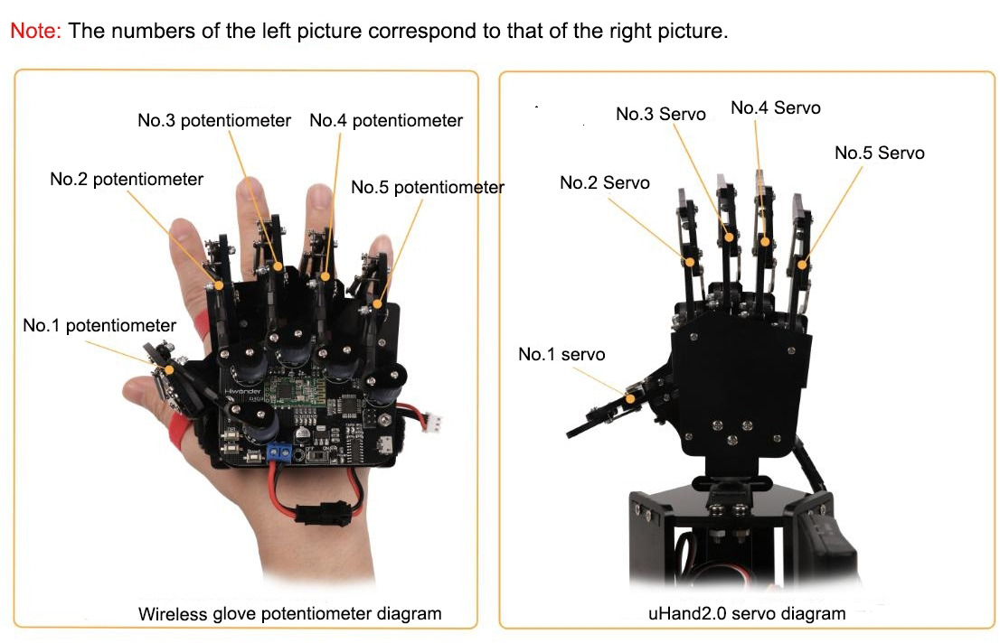

> [!NOTE]
>
> **Please keep uHand2.0 away from human body during using to avoid accidental injury and control the robot as slow as possible.**
