# 3. PC software and Action Programming

## 3.1 Lesson1 uHand2.0 PC Software Introduction

### 3.1.1 Device Connection

Step 1: Connect power and switch on the device.

Step 2: Use micro-USB cable to connect the USB serial port on the controller to USB port on computer as the figure shown below.

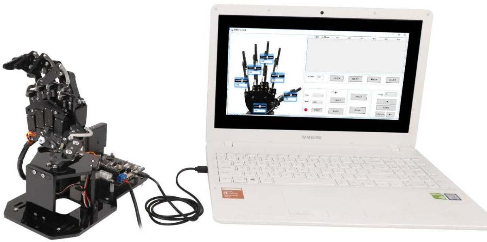

Step 3: Go to folder “**uHand2.0 PC software**” under the same directory of this section to open user terminal program. (select the software version according to your computer system)

Step 4: After opening PC software, the main interface is as shown in the figure below:

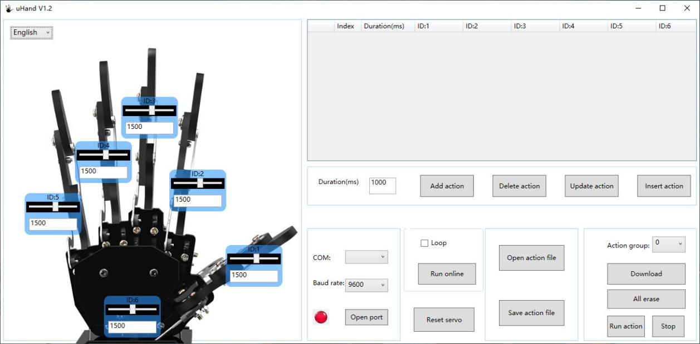

Step 5: Find the connected COM port in the following red box and keep the settings of baud rate 9600 unchanged. Then press “**open serial port**” to connect.

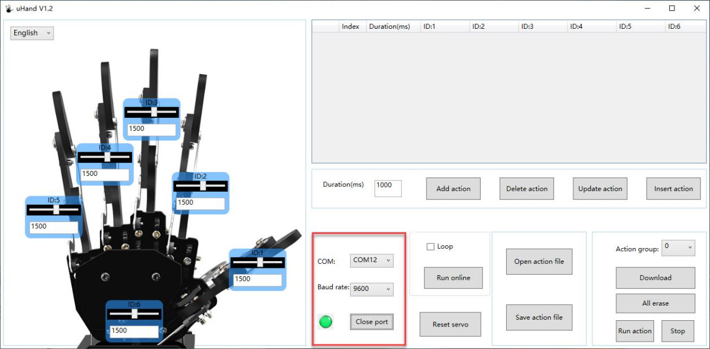

Reminder: If several COM ports appear, please go to “**Device management**” to check the terminal port number containing CH340/CH341tag and then connect again. In addition, if COM1 appears, it normally is system communication port and do not connect it.

### 3.1.2 Function Instruction

The main interface of uHand2.0 PC software is divided int o 4 parts as the image shown bellow.

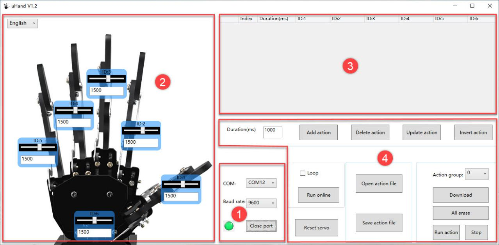

①:Device Connection Area

<table>
<colgroup>
<col style="width: 29%" />
<col style="width: 70%" />
</colgroup>
<tbody>
<tr>
<td style="text-align: center;">

Icon

</td>
<td style="text-align: center;">Function Instruction</td>
</tr>
<tr>
<td style="text-align: center;">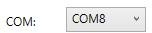</td>
<td style="text-align: center;">Select the device connection port.</td>
</tr>
<tr>
<td style="text-align: center;">

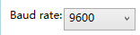

</td>
<td style="text-align: center;">

Select the device connection baud rate. It defaults 9600 and do not need to be changed.

</td>
</tr>
<tr>
<td style="text-align: center;">

</td>
<td style="text-align: center;">

Press to open or close the serial port. Select “open serial port” and then the indicator on the left side will light green. Select “close serial port” and then the indicator will light red.

</td>
</tr>
</tbody>
</table>

②:Servo Control Area

Servo control area displays the selected servo icons and you can drag the corresponding slider to adjust the servo position.

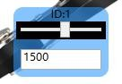

<table>
<colgroup>
<col style="width: 29%" />
<col style="width: 70%" />
</colgroup>
<tbody>
<tr>
<td style="text-align: center;">

Icon

</td>
<td style="text-align: center;">

Function Instruction

</td>
</tr>
<tr>
<td style="text-align: center;">

</td>
<td style="text-align: center;">Indicate servo ID number. Take ID1 as an example</td>
</tr>
<tr>
<td style="text-align: center;">

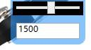

</td>
<td style="text-align: center;">

Use to adjust the servo position. The value of ID1-ID5 servo ranges from 900 to 2000. The value of servo ID6 ranges from 500 to 2500.

</td>
</tr>
</tbody>
</table>

③: Action Data List:

Action data list displays the execute time of each action in the current action group and the value of each servo in each action.

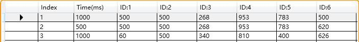

<table>
<colgroup>
<col style="width: 29%" />
<col style="width: 70%" />
</colgroup>
<tbody>
<tr>
<td style="text-align: center;">

Icon

</td>
<td style="text-align: center;">Function Instruction</td>
</tr>
<tr>
<td style="text-align: center;">

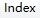

</td>
<td style="text-align: center;">

Action group number. An action group can save up to 255 actions so the maximum number is 255. If it exceeds 255 actions, online run only will be prompted and the action group cannot be downloaded.

</td>
</tr>
<tr>
<td style="text-align: center;">

</td>
<td style="text-align: center;">Action running time, that is, the required time for executing the action.</td>
</tr>
<tr>
<td style="text-align: center;"></td>
<td style="text-align: center;">It corresponds to the servo angle value. Double-click  to modify the value directly.</td>
</tr>
</tbody>
</table>
④: Action Group Setting Area

<table>
<colgroup>
<col style="width: 34%" />
<col style="width: 65%" />
</colgroup>
<tbody>
<tr>
<td style="text-align: center;">

Icon

</td>
<td style="text-align: center;">Function Instruction</td>
</tr>
<tr>
<td style="text-align: center;">

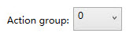

</td>
<td style="text-align: center;">

The selection button for action group number. Click to select the number between 0 and 230. Generally, No.0 group action is the middle action.

</td>
</tr>
<tr>
<td style="text-align: center;">

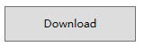

</td>
<td style="text-align: center;">

Download the current action group into robot. After downloading, it will cover the origin action `group.`

</td>
</tr>
<tr>
<td style="text-align: center;">

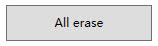

</td>
<td style="text-align: center;">

(Caution) Click to delete all the data from No.0 to `No.230` action `group.`

</td>
</tr>
<tr>
<td style="text-align: center;">

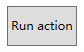

</td>
<td style="text-align: center;">

Execute the action (selected serial number) once.

</td>
</tr>
<tr>
<td style="text-align: center;">

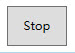

</td>
<td style="text-align: center;">

Stop the running action group.

</td>
</tr>
<tr>
<td style="text-align: center;">

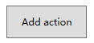

</td>
<td style="text-align: center;">

The servo values in servo control area as an action is added into the last line of the action data list.

</td>
</tr>
<tr>
<td style="text-align: center;">

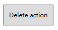

</td>
<td style="text-align: center;">Click to delete the selected action in action data list.</td>
</tr>
<tr>
<td style="text-align: center;">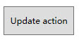</td>
<td style="text-align: center;">

Replace the selected angle value in action data list. (The angle value is replaced with the servo value in the left servo control area. The action running time is replaced to the time set in “action time(ms)” . )

</td>
</tr>
<tr>
<td style="text-align: center;">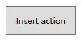</td>
<td style="text-align: center;">Insert a line of actions in front of the selected action.</td>
</tr>
<tr>
<td style="text-align: center;">

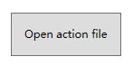

</td>
<td style="text-align: center;">

Click to select the action group that you want to open to load the action group data into action data list.

(The provided action files is located in “7.Appendix

-&gt; Action Group File”)

</td>
</tr>
<tr>
<td style="text-align: center;">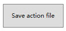</td>
<td style="text-align: center;">

The actions in action data list are saved into the specific location.

</td>
</tr>
<tr>
<td style="text-align: center;">

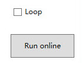

</td>
<td style="text-align: center;">

Click to execute the actions in action data list once.

(If tick “Loop”, the robot will repeatedly execute the actions. )

</td>
</tr>
<tr>
<td style="text-align: center;">

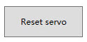

</td>
<td style="text-align: center;">

After clicking, all servos are back to the original position (1500).

</td>
</tr>
</tbody>
</table>
## 3.2 Lesson 2 Action Group Programming

### 3.2.1 Project Outcome

Create an action group consisting of 6 actions to allow uHand2.0 to “Greet”.

### 3.2.2 Action Implementation

* **Action Programming** 

Step 1: switch on uHand2.0 and connect to computer. Then double-click to open the PC software.

Step 2: Click “**open file**” button in action group setting area to open No.0 action group in folder “**7. Appendix-\> Action group files**”.

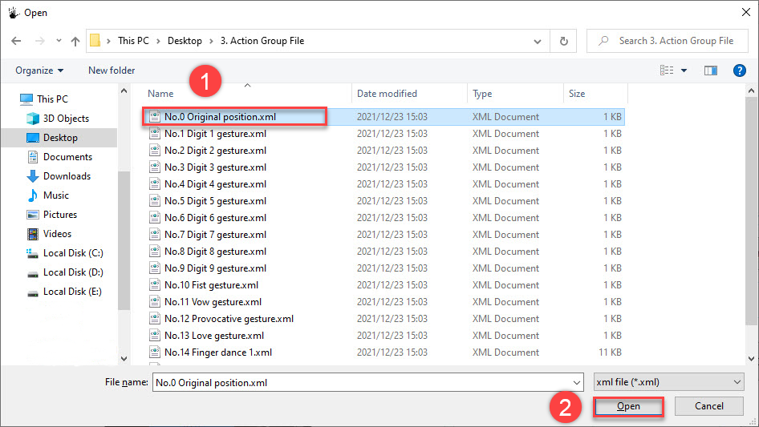

Step 3: Click “**online running**” button to update the corresponding servo value in servo control area.

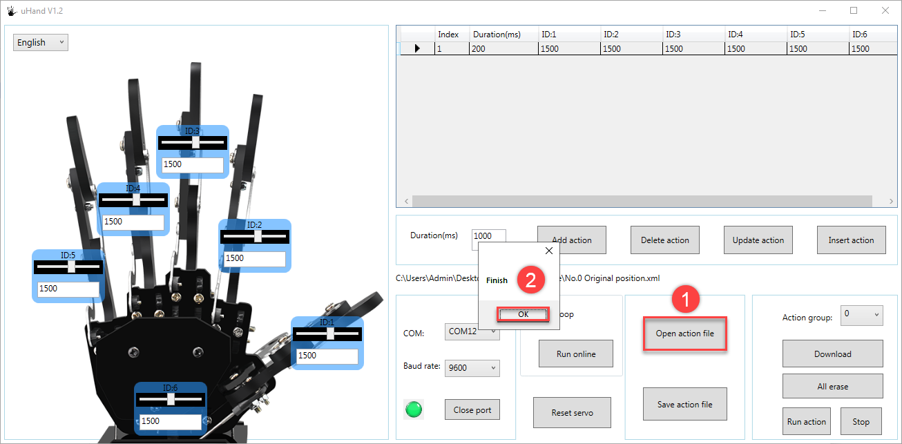

Step 4: Program the hand to turn to the left. According to the distribution of servo ID, drag the slider corresponding to ID6 to 740 and then click “**add action**”.

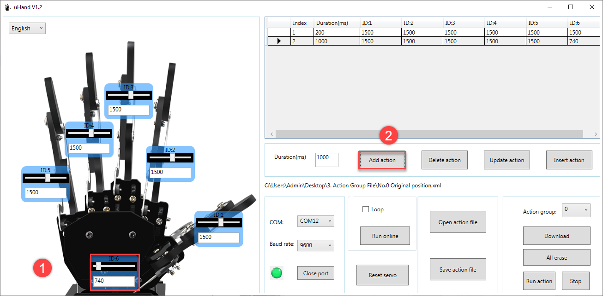

Step 5: Program the hand to open as action 3. Drag the slider to adjust the action value of ID1, ID2, ID3, ID4 and ID5 servo to 980, 1920, 1876,1856 and1800. Then add it to action 3.

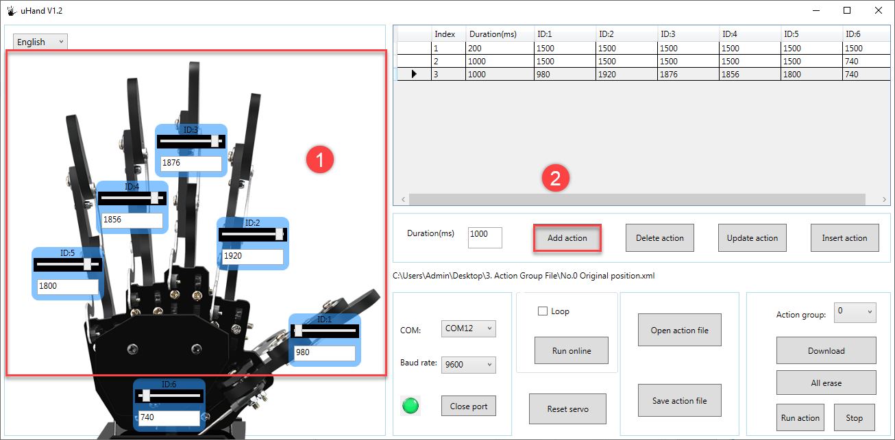

Step 6: Program the hand back to the initial position as action 4. Click “reset servo” button to reset all the servo value to 1500 and then click “**add action**”.

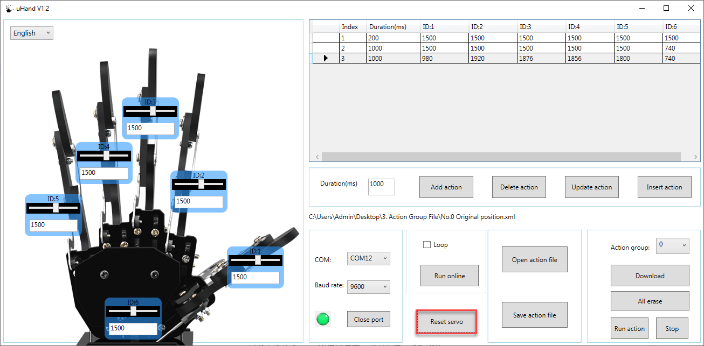

Step 7: Program Action 5 to turn to the right. Drag the slider corresponding to ID6 servo to 2260, and then click “**add action**”.

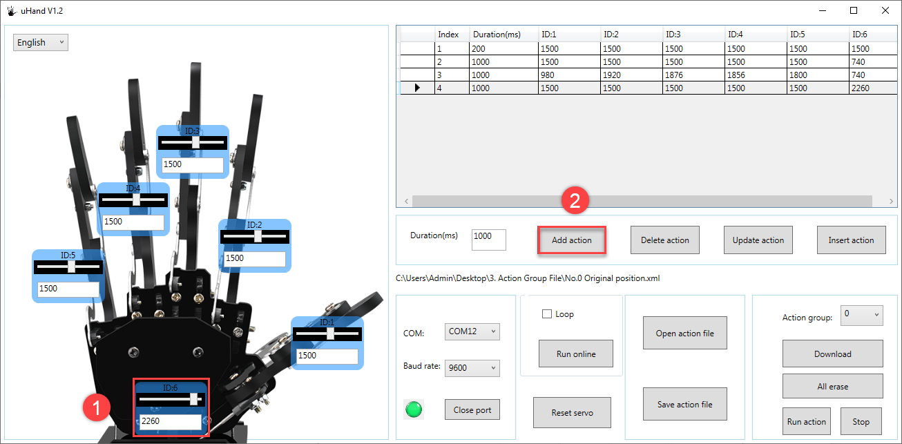

Step 8: Action 6 we let the hand open. Therefore, add the No.5 action again, and then paste the value of ID1-ID5 in No.3 action to the corresponding ID in No.6 action. (You can double-click to select the ID value. Then press “**Ctrl+C**” to copy and press “**Ctrl+V**” to paste.)

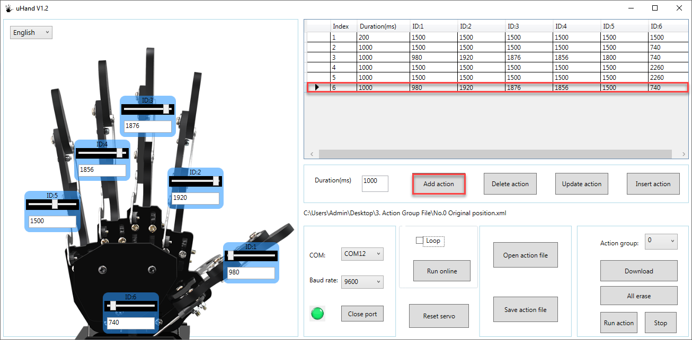

* **Download Action Group**

Step 1: After programming, please save the action group for future debugging. Click “**Save action file**” and name it in the pops-up window (format: action group number and antion group name, such as 20 greet). Then, click “**save**”.

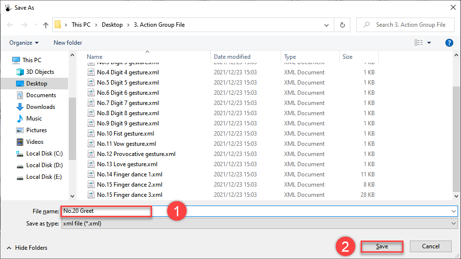

Step 2: After saving the file, download the action into the corresponding action group. Select “**20**” as action group number, and then click “**download**” button.

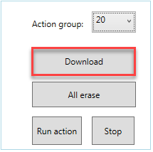

After downloading, the interface will prompt “**Download Complete**”, and then click “**Ok**” to close it.

## 3.3 Lesson 3 APP Customization

### 3.3.1 Project Outcome

Execute the action group in the folder "**Lesson 2 Action Programming**" through

mobile APP custom function.

### 3.3.2 Complete Program

* **Preparation**

1)  Confirm that Bluetooth and GPS service have been enabled.

2)  Confirm that No.20 action group has been successfully downloaded into uHand2.0.

(Software will prompt after downloading)

* **Operation Steps**

Step 1: switch on the robot and then open mobile APP “**uHand**”.

Step 2: Connect device according to the tutorial in folder “**2. Remote Control” -\> “Lesson 2 Mobile Control**”

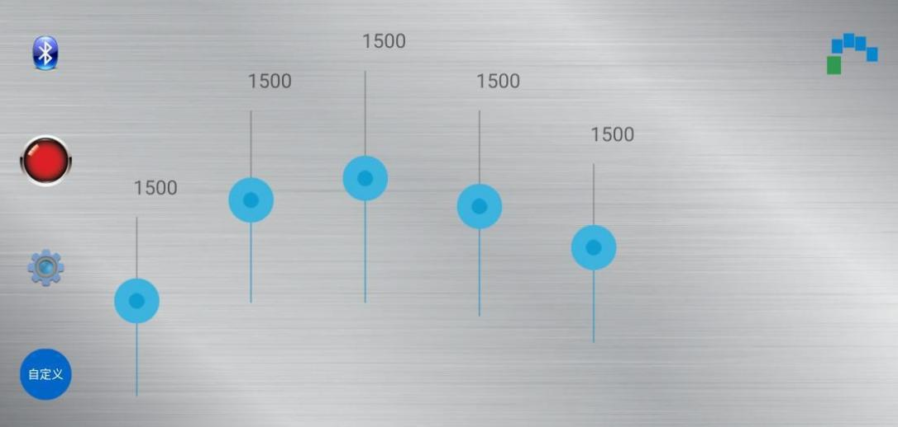

Step 3: Click “**customize**” button in the home interface. Then click “**add**” in the pops-up interface.

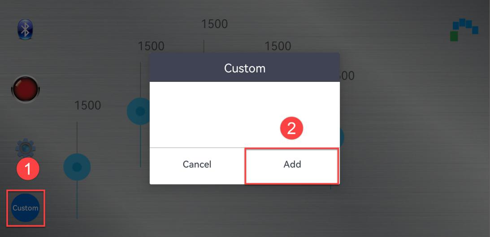

Step 4: Enter the action group name and action group number in the pops-up interface.

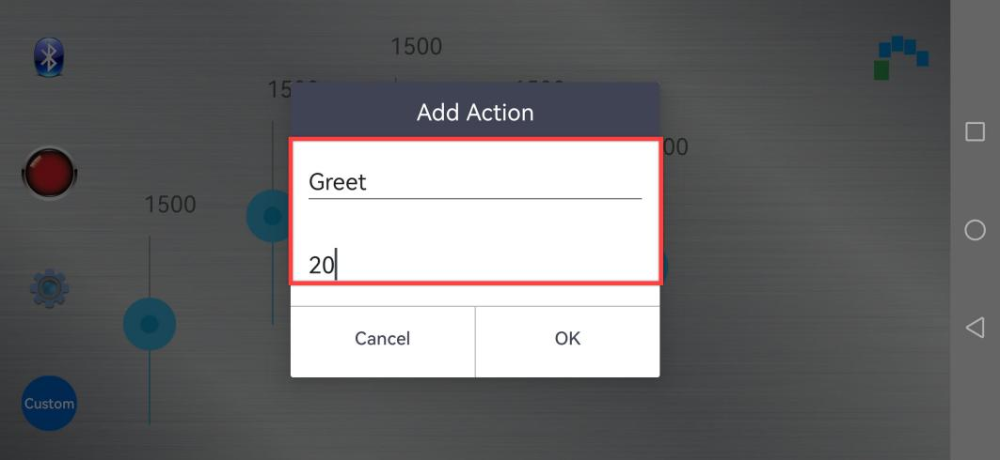

Step 5: After adding the action, click the action group name to execute the corresponding action once.

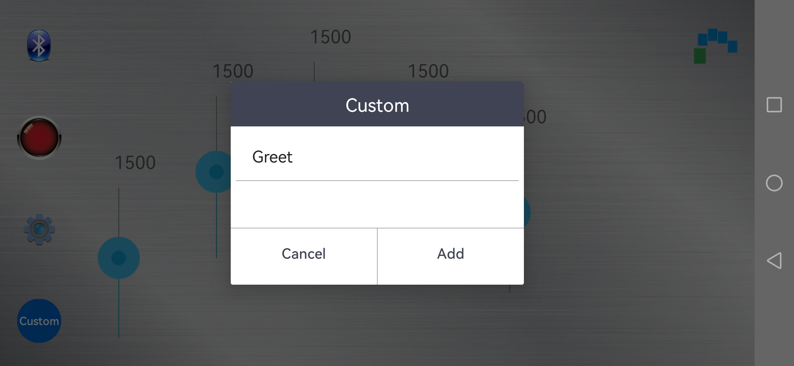

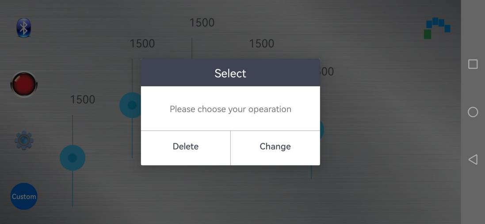

Step 6: If want to delete, drag or long press the action group name and then click “**delete**”.

## 3.4 Lesson 4 Offline Running

### 3.4.1 Project Outcome

Control robot only by pressing the button on uHand2.0.

### 3.4.2 Complete Program

Step 1: Connect the controller on uHand2.0 to the computer through USB cable and then open the PC software.

Step 2: Open any one of action groups in the provided folder **7. Appendix/Action group. file**”).

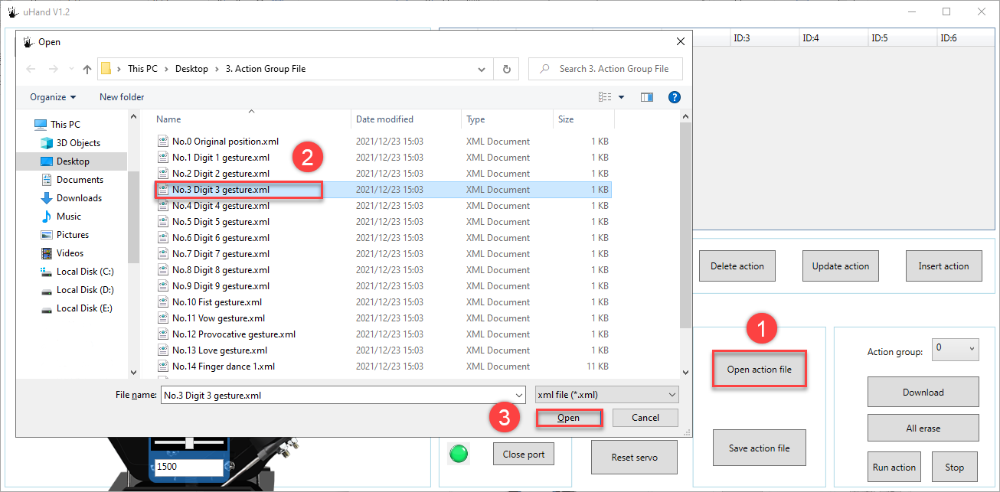

Step 3: Set the action group number to 100 and then click on “**Download**” button.

(Note: If wanna run offline, you should download it into No. 100 Action group because No.100 action group is set to run offline by default.)

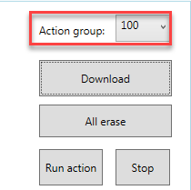

Step 4: After the action is downloaded, “**Download successful**” will be prompted in the pops-up interface. Then click “**OK**” to close the tip .

Step 5: switch on the robot. Press KEY1 the offline running button to run the No.100 action group.

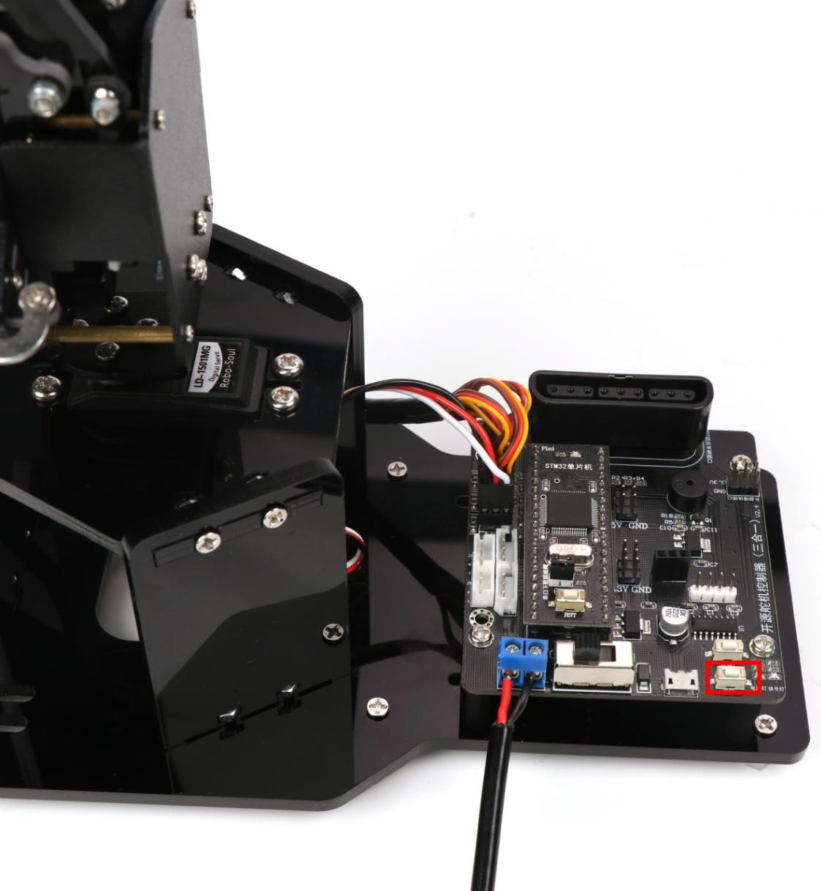

> [!NOTE]
>
> When downloading the action group, please note that each action group saves up to 255 actions. If exceed the maximum number, the remained actions will be downloaded into the next action group.
>
> No.100 action group is set to run offline by default. You can modify it according to the provided tutorial in folder “**6. Advanced Lessons/2. Adding Offline Action**”.
>
> If want to modify the action group number for offline running, you need to start with No.100 action group. No blank action group can be saved in the middle of the offline running action groups, (For example No.100, 101, 102 are offline running action groups, the N0.101 action groups can not be blank.) otherwise offline running will stop at No.101 action groups.
