# 4. Set Development Environment

## 4.1 Arduino Nano

### 4.1.1 Arduino IDE Installation

#### 4.1.1.1 Arduino Software Installation

Arduino IDE is a software specially designed for Arduino single-chip microcomputer, with powerful functions. No matter which versions, they have same installation processes. Take the windows version of Arduino-1.8.12 software version as an example:

1)  Go to folder “**Arduino IDE Installation Pack**”, double-click to run the file “**arduino-1.8.5-windows.exe**”.

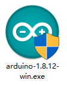

2)  Click “I Agree” to install it.

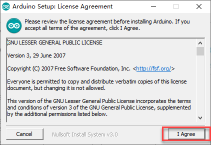

3)  Select default options, click "Next" to enter the next step.

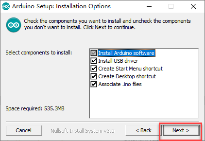

4)  Click "Browser" to select destination folder to install, and then click “**Install**” button.

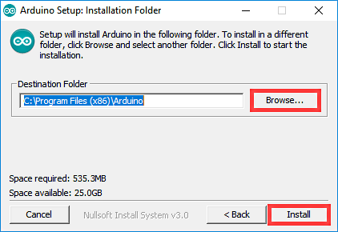

5)  Wait for the program installation to complete.

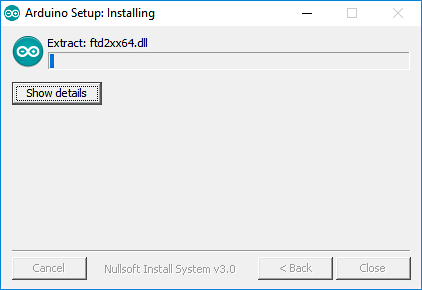

6)  If prompted to install the chip driver during the installation process, click “**Install**” button.

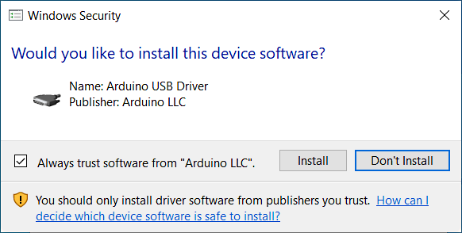

7)  After Installing, click “**close**” button.

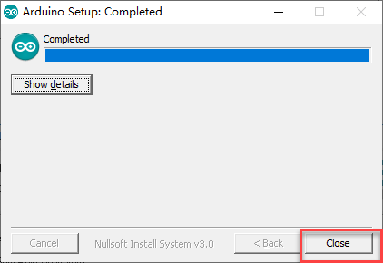

#### 4.1.1.2 Software Introduction

1)  Double click to open Arduino IDE.

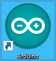

2)  Interface of the Arduino IDE as shown below.

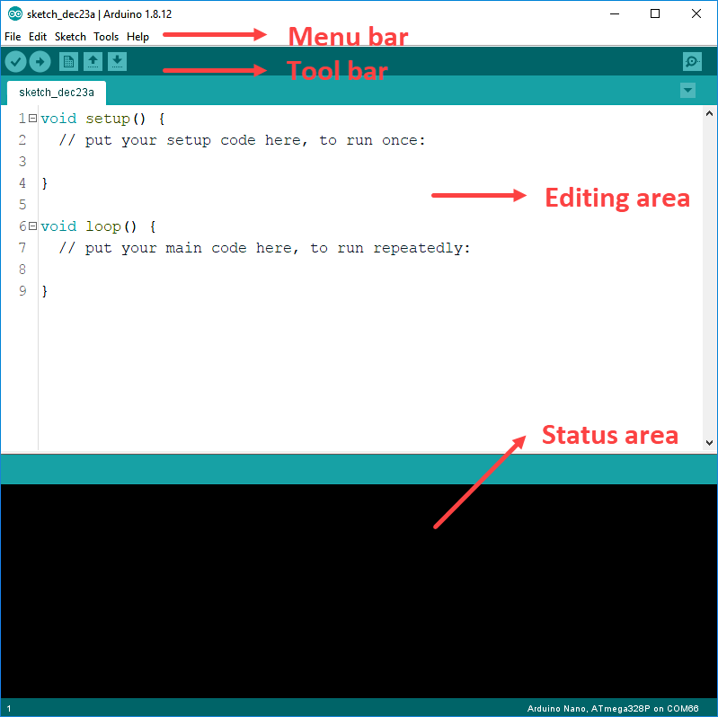

3)  Click to select "**File-\>Preferences**". In the pop-up window, you can set the IDE project save location, language, font size, line number, etc.

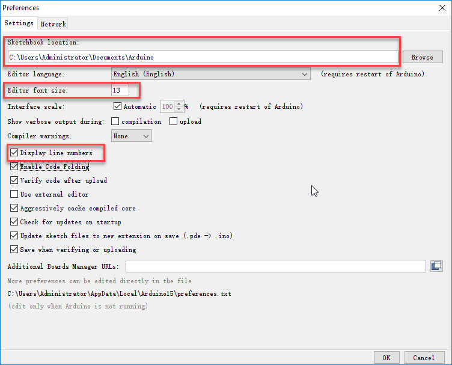

4)  Main function of Arduino IDE interface: 1.Toolbar 2.Project preference 3.Serial monitor 4.Code editing area 5. Debugging prompt area.

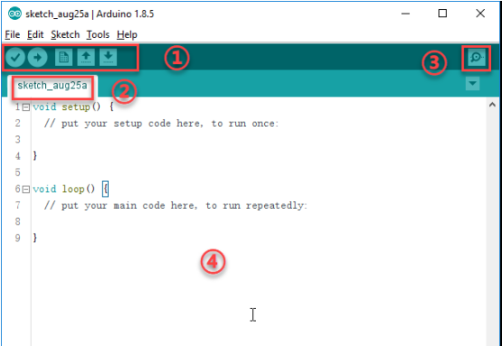

5)  On the toolbar, Arduino IDE provides shortcut keys for common functions, as shown in the following table:

<table>
<colgroup>
<col style="width: 24%" />
<col style="width: 75%" />
</colgroup>
<tbody>
<tr>
<td style="text-align: center;"><strong>Toolbar Icon</strong></td>
<td style="text-align: center;"><strong>Function</strong></td>
</tr>
<tr>
<td style="text-align: center;"></td>
<td style="text-align: center;">

Correction. Verify whether a program is written correctly, and if it is correct, compile the project.

</td>
</tr>
<tr>
<td style="text-align: center;"></td>
<td style="text-align: center;">Download, Download program to the Arduino controller</td>
</tr>
<tr>
<td style="text-align: center;"></td>
<td style="text-align: center;">Create a new project</td>
</tr>
<tr>
<td style="text-align: center;"></td>
<td style="text-align: center;">Open a project.</td>
</tr>
<tr>
<td style="text-align: center;"></td>
<td style="text-align: center;">Save a project.</td>
</tr>
<tr>
<td style="text-align: center;"></td>
<td style="text-align: center;">

Serial monitor can check the data sent or received by the serial port.

</td>
</tr>
</tbody>
</table>

### 4.1.2 Lesson 2 Program Compilation and Download

#### 4.1.2.1 Program Compilation

To generate the program that can run in the controller, we need to compile the readable code into the command that can be recognized by robot through Arduino IDE.

1. Double-click to open “**Arduino IDE**”.

2. Select “**ArduinoServo.ino**” in folder “**5. Sample Code/Arduino Nano/Arduino source code/ArduinoServo**" , and then click “**Open**”.

3. Confirm the selection of the development board and the port on toolbar. Select the development board “**Arduino Nano**” and the processor “**ATmega328P**” in “**Tool-\> Development board/ Processor**”.

4. Select the corresponding port to Arduino controller in “**Tool -\>port**”.

   (The export port here is COM15. Please choose the port according to your own computer because different computer may different. If COM1 appears in port options, it is generally a system communication port not the actual port of development board. )

5. If the computer is connected to multiple USB device and cannot determine the connection port of Arduino controller, you can open “**your computer**” on your desktop and then click “**Property -\> Device Management**” to check the corresponding port of the Arduino controller.

6. Click  button after setting the development board, processor and port. If the program is correct, the debugging area will display "**compiling program..**" and "**compiling complete**", and the debugging prompt area will show the number of bytes used by the current project, the occupied program storage space, etc.

#### 4.1.2.2 Program Download

1)  After compiling, download the hex file generated in the previous step into the Arduino development board. Click  to download the program.

2)  When uploading prompt is displayed, you need to press the white reset button on the Arduino Nano board immediately, and then wait for the program to be burned. After the program is downloaded, the debug status bar will show that the upload is successful.

If fail to download, you can try to choose the processor model to “**ATmega328p (Old Bootloader)**”.

## 4.2 STM32

### 4.2.1 Keil Software Activation Tutorial

Statement: the tutorial is integrated from the Internet and and is intended for user learning only, please do not use it for dissemination, reproduction or other commercial purposes. If you are using it for commercial purposes, please purchase the original version.

Step 1: Right-click “**run as administrator**” to open Keil software.

Step 2: Click “**File-\>License Management**” in turn.

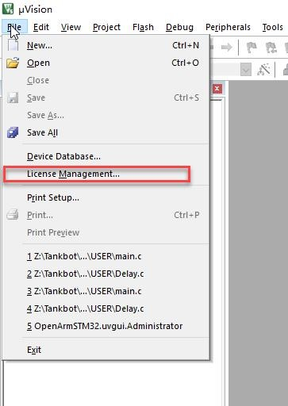

Step 3: Copy CID.

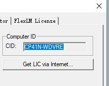

Step 4: Keep the Keil software interface stay on the desktop, and then right-click “**run as administrator**” to open “**MDK registration.exe**”.

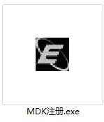

Step 5: Paste the copied CID into the CID in the opened interface and select “**ARM**” as Target. Then press “**Generate**” button to obtain a string of activation codes.

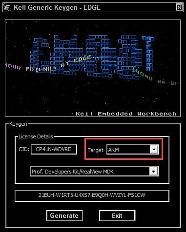

Step 6: Copy the activation codes, and then switch to the Keil software. Paste the activation codes into the corresponding position shown in the following figure and, click “**Add LIC**”.

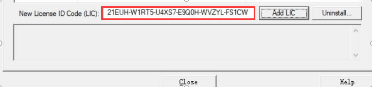

### 4.2.2 Lesson 1 Keil Software Installation and Program compilation

> [!NOTE]
>
> **Please activate the software first after installing Keil software, otherwise failure compilation will occur and affect the normal use.**
>
> **Activation method can refer to the provided tutorial in file “Keil software Activation Tutorial” under the same directory. If you use it for commercial purpose, please support and purchase the original software!**

####  4.2.2.1 Keil Software Installation

Keil MDK-ARM is a powerful programming software specially designed for microcontrollers. The same installation method to different versions. Take V5.10 version as an example.

Step 1: Go to the folder “**Keil Installation Pack and mcuisp Download Tool**” to extract “**MDK5.zip**” folder, and then open “**mdk510.exe**” file.

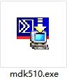

Step 2: Click “**Next**” to install.

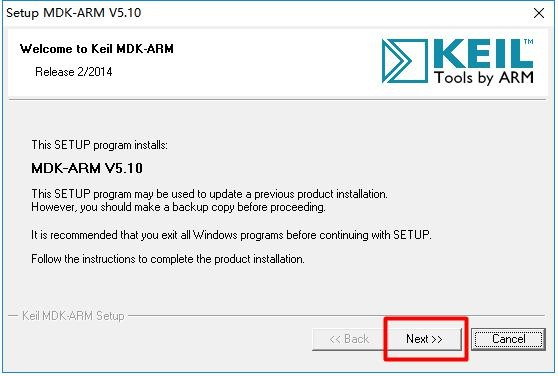

Step 3: Check to agree in the red box, and then click “**Next**” to proceed.

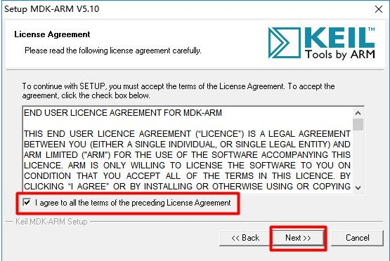

Step 4: Select the installation path.

Step 5: Enter user information. You can enter arbitrarily but not be blank, otherwise can not proceed to the next step.

Step 6: After entering, click “**Next**” to install.

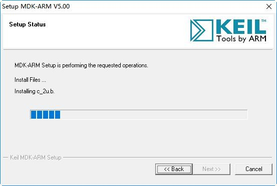

Step 7: Wait a while. When the interface prompting the installation of Ulink driver pops up, click “**Install**”.

Step 8: When the installation is complete, click “**Finish**”.

#### 4.2.2.2 Open the Project

Step 1: Go to the folder “**5. Sample Code/ STM32/ STM32 source code**” to extract “**STM32 2.2.zip**” file. Then get the STM32 project folder and double-click to open “**OpenArmSTM32.uvproj**” as the figure shown below.

Step 2: After opening the project file, we will briefly introduce you the main interface of Keil. For a complete presentation of the main interface, we will show you the pre-compiled program as an example.

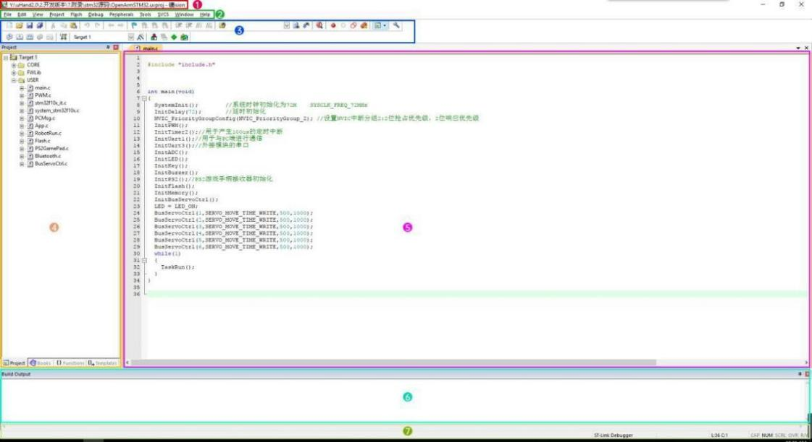

Keil interface is divided into several areas:

<table>
<colgroup>
<col style="width: 18%" />
<col style="width: 26%" />
<col style="width: 55%" />
</colgroup>
<tbody>
<tr>
<td style="text-align: center;">

No.

</td>
<td style="text-align: center;">

Area Name

</td>
<td style="text-align: center;">Function</td>
</tr>
<tr>
<td style="text-align: center;">

①

</td>
<td style="text-align: center;">Project name bar</td>
<td style="text-align: center;">

Use to display the current name and the path of the project file.

</td>
</tr>
<tr>
<td style="text-align: center;">②</td>
<td style="text-align: center;">Menu bar</td>
<td style="text-align: center;">

The menu bar contains File, Edit, View, Project, help windows and etc.

</td>
</tr>
<tr>
<td style="text-align: center;">

③

</td>
<td style="text-align: center;">

Tool bar

</td>
<td style="text-align: center;">

This window contains some common shortcuts.

</td>
</tr>
<tr>
<td style="text-align: center;">

④

</td>
<td style="text-align: center;">Project window</td>
<td style="text-align: center;">

A workspace can include multiple projects. This window is used to display the project content (project, group, source code files).

</td>
</tr>
<tr>
<td style="text-align: center;">

⑤

</td>
<td style="text-align: center;">Editing window</td>
<td style="text-align: center;">The area for writing code</td>
</tr>
<tr>
<td style="text-align: center;">

⑥

</td>
<td style="text-align: center;">Information window</td>
<td style="text-align: center;">

This window contains some information such as compilation information, debugging information, finding information.

</td>
</tr>
<tr>
<td style="text-align: center;">

⑦

</td>
<td style="text-align: center;">

Status bar

</td>
<td style="text-align: center;">

This window contains status information loading state, warning number, mouse cursor location,

This window contains status information such as readiness, error and warning number, cursor's row position, character encoding, keyboard Num lock, etc.

</td>
</tr>
</tbody>
</table>
Step 3: After opening the project file, configure the file options. Click  configure project target options button and refer to the figure below to set the options.

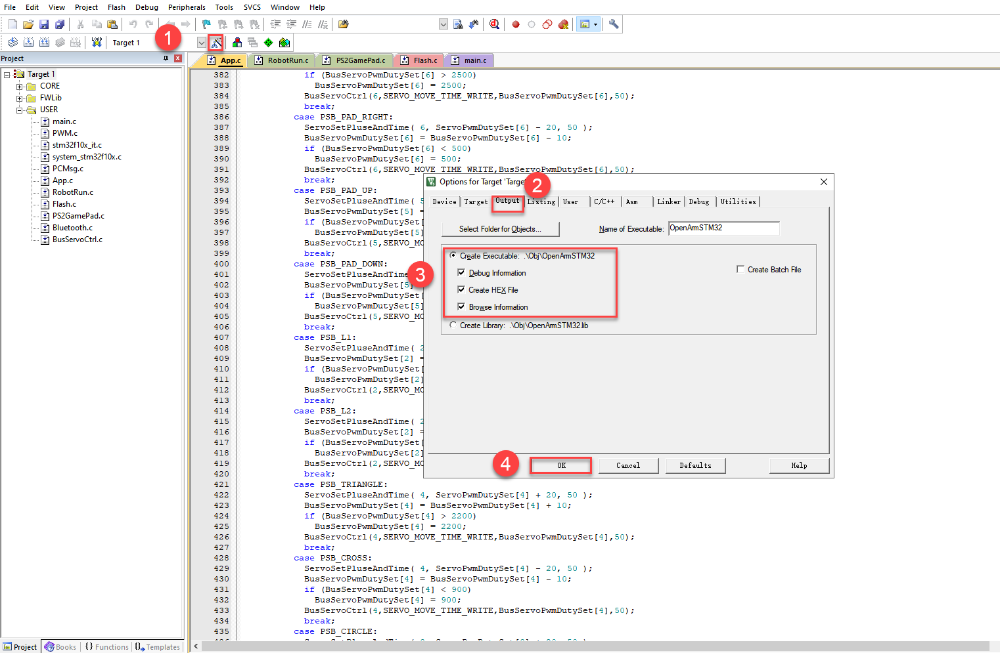

Step 4: Next, compile the target file in the project. There are three buttons for compilation as shown in the upper-center red box. Click the first button “**Translate**” to translate the currently active file. Wait a moment, the compilation result can be viewed in information window. “0 Error(s), 0 Warning(s)” will be prompted when the compilation is successful.

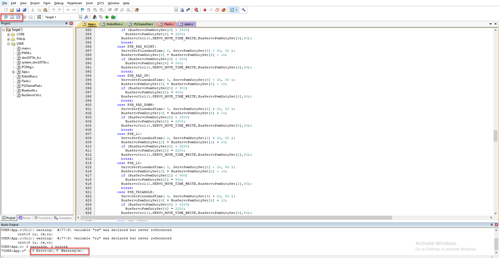

Step 5: After compiling, “**.hex**” file will be generated automatically. You can view in folder “**5.Sample Code/STM32/STM32 source code/ST32 2.2/Obj**” shown in the figure below.

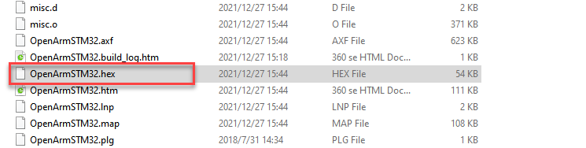

### 4.2.3 Lesson 2 Program Download

#### 4.2.3.1 Install Serial Port Driver

Before proceeding to the next step, please make sure that Keil software has been installed. If the serial port driver of CH340/CH341 chip has been installed, you can skip this step.

Step 1: Double-click to open ch341ser.exe in folder “**Keil software installation pack and mcuisp dowload tool/ serial port driver program**”

Step 2: Click “**Install**” , and then “**Install**” and “**Uninstall**” button turns gray. Wait for a while, “**Driver Installation Successful**” will be prompted.

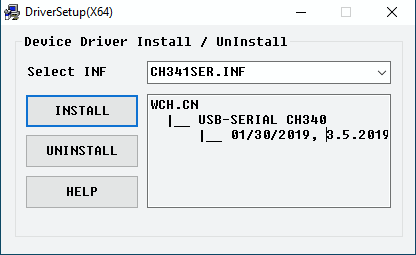

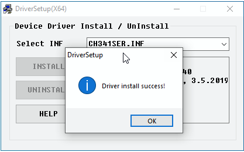

#### 4.2.3.2 Program Download Method

Step 1: Connect USB serial port on controller to USB port on computer with micro-USB cable.

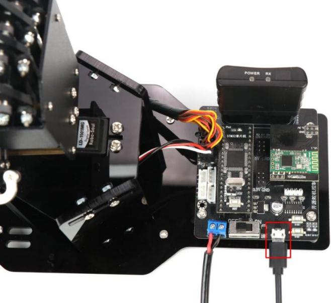

Step 2: Please refer to the red box shown in the figure below. Remove the jumper cap on the STM32 microcontroller, and turn on the power switch to enter the burn-in mode.

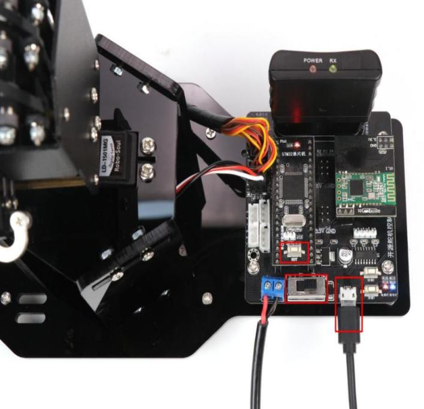

Step 3: Before confirming that the serial port driver is installed correctly and the USB port is connected, open “**This computer**” on computer desktop. Then click “**properties-\>Device management**” in turns to check the serial port number corresponding to the controller.

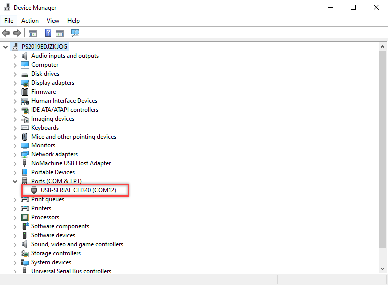

Step 4: Go to folder “**4. Set Development Environment -\>stm32 -\>Keil installation pack and mcuisp download tool**”, and then double-click to use mcuisp download tool to download program.

Step 5: Select the corresponding serial port and baud rate in the interface. (Take COM11 as an example. The serial port may be different for each computer, so just choose it according to your computer. If COM1 appears, it is usually the system communication port, not the actual port of the development board. The baud rate is 115200, please do not change it.)

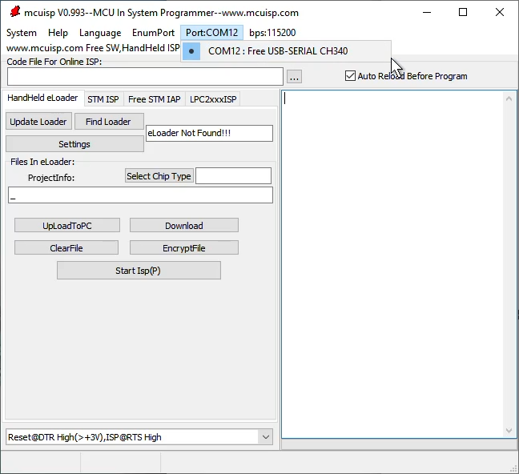

Step 6: Click 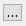 in the interface and select the path where the .hex file is located. Then click “**Open**” as the figure shown below.

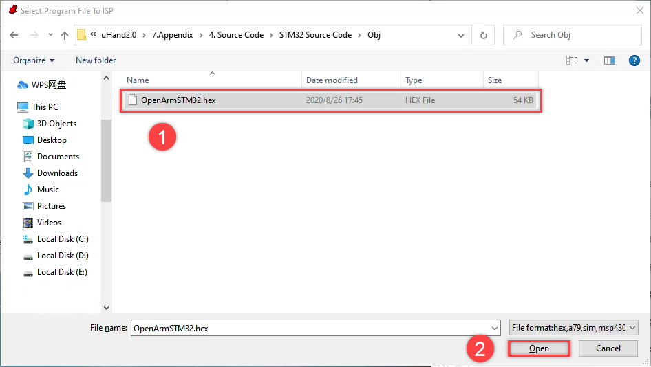

Step 7: Next, set “**STMISP**” option. Uncheck “**Execute after ISP complete**” and keep the remaining options unchanged.

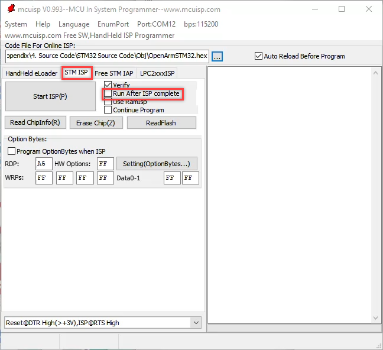

after it is written into the microcontroller. Therefore, it is recommended to uncheck the option. If checked, please note that keep your body away from the robot’s movement range to avoid injury.

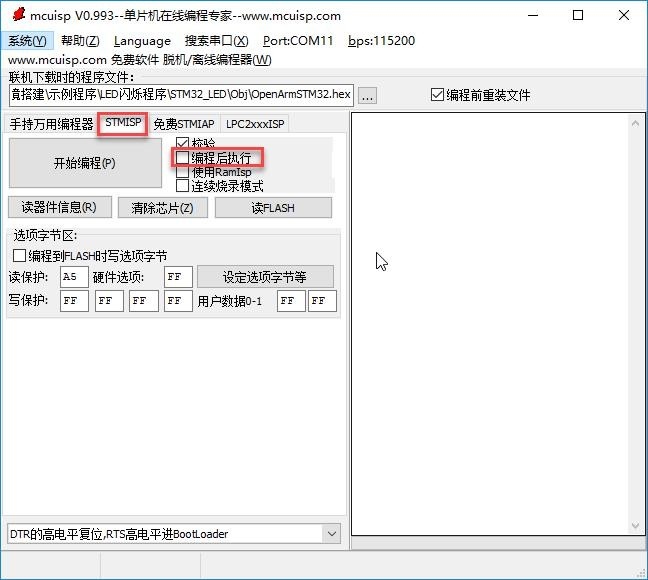

Step 8: After the settings is complete, click “**start programming**” button to burn the program into the development board. When the information “**Everything is normal**” is prompted on the right side of the window, it means the installation is finished.

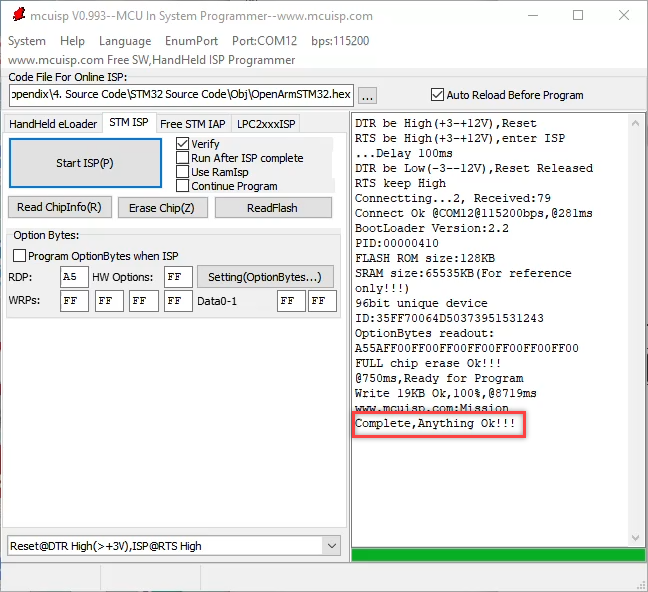

burn-in mode. Then check whether the jumper cap is removed and press “**RST**” key. Finally, download the program again according to the steps above.

Step 9: Disconnect the USB cable and reinsert the jumper cap on STM32 microcontroller. Then press “**RST**” button to switch to “**running mode**”.

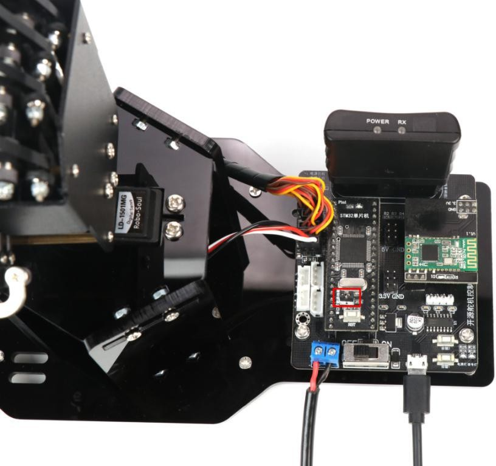
