# 5. Sample Code learning

## 5.1 Arduino Nano

### 5.1.1 Lesson 1 Timer

#### 5.1.1.1 Project Purpose

Learn the principle of microcontroller timer to write the function to realize the timing function of 100 us.

#### 5.1.1.2 Project Principle

Timer is a hardware device used to calculate time on microcontroller. It can be used to allow the microcontroller to execute the specified operation at the specified interval or calculate the exact interval between events.

Timer on microcontroller generally consists of a time-base generator and a counter. Time base is the basic unit of time.

The time base generator generates a signal with the time base as the period, and the counter counts the number of signals generated by the time-base generator. For example, if the time base is 1 second, the time base generator generates a signal per second, and the counter value is added by 1 per second. When the counter value is equal to the value we set, the microcontroller performs the operation we set.

#### 5.1.1.3 Program analyst

The timer used in Arduino generally uses the packaged library functions, but here register is used to set the timer according to the data manual. TCCR2A is all set to 0 , which is normal port operation. When TCCR2B is set to CS22: CS21: CS20 = 1: 1: 0, it means 256 frequency division. TIMSK2 is set to output compare A match to interrupt enable. TCNT2 sets the initialization time, and finally Sei( ) open the total interrupt.

```c
void InitTimer2(void)		//100us@12.000MHz  
{
	TCCR2A=0;
	TCCR2B=_BV(CS21)|_BV(CS20);
	TIMSK2=_BV(TOIE2);
	TCNT2=206;//(256-206)/500000=100us  
	sei();
}
```

### 5.1.2 Lesson 2 Detection Button

#### 5.1.2.1 Project Purpose

Use the button on the controller to control the on and off of the LED light.

#### 5.1.2.2 Project Principle

When mechanical button is pressed or released, due to the effect of mechanical elasticity, the mechanical jitter of the contacts usually stabilizes after a certain period of time, and the jitter time is generally 5-10ms. If the on/off status of the button is detected during the contact jitter, it may lead to an error in judgment.

The mechanical jitter of the button can be eliminated by using hardware circuits or software `de-jittering` method. In this section, software method is used to eliminate jitter.

The principle of software de-jittering is to execute a delay program about 10ms first when a button pressed is detected, and then re-detect whather the button is still pressed to confirm that the button pressed is not caused by jitter. Similarly, when a button released is detected, the method of delaying and then judging is used to eliminate the effect of jitter.

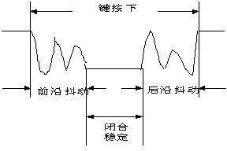

#### 5.1.2.3 Program Analyst

We can see this program in App.cpp as the figure shown below:

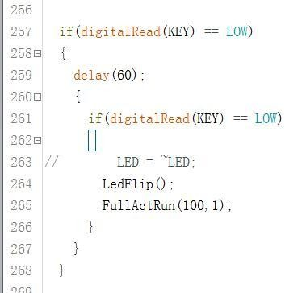

Firstly, we need to judge whether the button is pressed. If it is pressed, detect whether the button is pressed after a delay of 60ms.

If the button is still pressed, we can judge that the key is pressed and then execute the following operations: flash the LED light once and finally run `No.100` action group once.

### 5.1.3 Project Purpose

Realized that the buzzer on the controller makes sound when the input voltage of the controller is low.

#### 5.1.3.1 Project Principle

Timer is a hardware device used to calculate time on microcontroller. It can be used to allow the microcontroller to execute the specified operation at the specified interval or calculate the exact interval between events.

Timer on microcontroller generally consists of a time-base generator and a counter. Time base is the basic unit of time.

The time base generator generates a signal with the time base as the period, and the counter counts the number of signals generated by the time-base generator. For example, if the time base is 1 second, the time base generator generates a signal per second, and the counter value is added by 1 per second. When the counter value is equal to the value we set, the microcontroller performs the operation we set.

All in all, If want to make buzzer sound, the microcontroller has to detect the button status once after a period of time. We need to set the time base of the timer first, and then set the count value. Finally, set the action to be executed when the specified time is reached.

#### 5.1.3.2 Program Analyst

This program in App.cpp as the figure shown below.

```c
void Buzzer(void)
{//Put it in the 100us timer interrupt  (放在100us定时器中断中)
	static bool fBuzzer = FALSE;
	static uint32 t1 = 0;
	static uint32 t2 = 0;
	if(fBuzzer)
	{
		t1++;
		if(t1 <= 2)
		{
			digitalWrite(BUZZER, LOW);//2.5KHz  (2.5KHz)
		}
		else if(t1 <= 4)
		{
			digitalWrite(BUZZER, HIGH);//2.5KHz  (2.5KHz)
		}
		if(t1 == 4)
		{
			t1 = 0;
		}
	}
```

1)  The program starts with setting to fBuzzer = FLASE、BuzzerState = 0 so these programs will be skipped directly. The runtime of this program can be be viewed in the following program:

```c
TCNT2=206; //定时器3中断  100us  (Timer 3 interrupt 100us)
	Buzzer();
	if(++time >= 10)
	{
		time = 0;
		gSystemTickCount++;
//		Ps2TimeCount++;
		 if (GetBatteryVoltage() < 5500) //小于5.5V报警 (Alarm when less than 5.5V)
    {
      timeBattery++;
      if (timeBattery > 5000) //持续5秒 (Last 5 seconds)
      {
        BuzzerState = 1;
      }
    }
    else
    {
      timeBattery = 0;
      if (manual == TRUE)
      {
        BuzzerState  = 1;
        mytime++;
        if (mytime > 80 && mytime < 130)
        {
```

2)  It is the interrupt of time 3 and will respond once every 100μs. Then call Buzzer function, but its two judgement values do not match, so it is skipped directly.

3)  Go on looking at the next part. Delay 100x10μs, that is, 1ms enter if to get battery voltage and judge. If less than 5500, detection after 5s. if still less than 5500 after 5s, set BuzzerState to 1, otherwise it will be cleared to 0 and then judge again.

4)  When the battery voltage is less than 5.5V, BuzzerState is set to 1 and Buzzer is called to enter the corresponding judgement. The buzzer pin to high or low level according to the judgement result to make the buzzer sound. After a period of time, turn off the buzzer, and the judge the battery voltage again, and so on.

### 5.1.4 Lesson 4 Voltage Detection and Low-voltage Alarm

#### 5.1.4.1 Project Purpose

Use ADC to examine the battery voltage and realize the buzzer to make low-voltage alarm.

#### 5.1.4.2 Project Principle

ADC (A/D converter) is short for analog-digital converter. In microcontroller application system, the input analog voltage signal is often converted into the digital signal that can be recognized by microcontroller, and the technology converting the continuously changing analogue signal into digital signal is called A/D conversion technology.

In practice, A/D can be connected between the input signal and the microcontroller to complete A/D conversion, or you can also choose to use a microcontroller with built-in A/D converter. Our controller has built-in A/D converter. When the analog signal is imported into the controller, it can be converted into the digital signal, and then process with the numerical analysis to calculate the voltage value.

#### 5.1.4.3 Program Analyst

Let’s look at how to obtain the battery voltage. This function still be in App.cpp.

```c
void CheckBatteryVoltage(void)
{
	uint8 i;
	uint32 v = 0;
	for(i = 0;i < 8;i++)
	{
		v += GetADCResult();
	}
	v >>= 3;
	
	v = v * 1875 / 128;//adc / 1024 * 5000 * 3(3代表放大3倍，因为采集电压时电阻分压了)  
    				  //adc/ 1024 * 5000 * 3(3 means it is amplifiedby 3 times,because the resistor divides the voltage when collecting the voltage)
	BatteryVoltage = v;
}

uint16 GetBatteryVoltage(void)
{//电压毫伏 (voltage millivolt)
	return BatteryVoltage;
}
```

1)  Firstly, read the AD detection channel of battery voltage, that is, the analog value of ADC_BAT pin.

2)  Then take the sample value 8 times through the “for” loop, and then shift the value to the right by three places, that is, divide it by 8 to get the average value. Finally, the analog value is converted into the voltage, and the voltage value is returned through the `GetBatteryVoltage` function. The `GetBatteryVoltage` function is called in the interrupt of timer 3 as the figure shown below:

```c
TCNT2=206; //定时器3中断  100us  (Timer 3 interrupt 100us)
	Buzzer();
	if(++time >= 10)
	{
		time = 0;
		gSystemTickCount++;
//		Ps2TimeCount++;
		 if (GetBatteryVoltage() < 5500) //小于5.5V报警 (Alarm when less than 5.5V)
    {
      timeBattery++;
      if (timeBattery > 5000) //持续5秒 (Last 5 seconds)
      {
        BuzzerState = 1;
      }
    }
    else
    {
      timeBattery = 0;
      if (manual == TRUE)
      {
        BuzzerState  = 1;
        mytime++;
        if (mytime > 80 && mytime < 130)
```

3)  If the battery voltage is less than 5.5V, it will be detected again after 5s. If the voltage is still less than 5.5V after 5s, BuzzerState will be set to 1 to make buzzer sound.

### 5.1.5 Lesson 5 Multi-channel Servo Control 

#### 5.1.5.1 Project Purpose

Learn the principle of the servo control and control several servos to rotate.

#### 5.1.5.2 Project Principle

* **Servo Internal Structure**

Servo consists of several parts namely small DC motor, a set of change gears, a linear feedback potentiometer, and a control circuit.

Of these, the high-speed DC motor provides the raw power for the servo and drives the reduction gear set to produce the high torque output. The greater the gear ratio, the greater the output torque of the servo, which means that it can drive a heavier load (limited by the gear strength), but the lower the output speed (response speed).

* **Servo Working Principle**

Servo is a typical closed loop feedback system. Its principle can refer to the figure below.


The reduction gear is driven by motors and its output terminal drives a linear potentiometer for positional detection. This potentiometer converts the angle into a proportional voltage feedback to the control circuit. Then the control circuit compares the proportional voltage with the angle corresponding to the input control signal and drives the motor to rotate clockwise or counterclockwise so as to make the potentiometer feedback angle to approach to the anticipated angle of the control signal, which achieves the accurate the purpose of accurate positioning of the servo motor.

* **How to control servo**

Servo motors have three wires: power, ground, and signal.

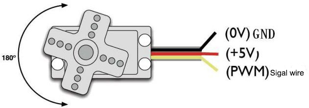

The power and ground wires are used to provide energy required for the internal DC motor and the control circuit. The voltage usually ranges between 5V and 8V, and the power supply should be isolated from the power supply of the processing system as much as possible. (because it will generate noise.)

Since the servo will also pull down the amplifier voltage during heavy load, the ratio of power supply for the whole system must be reasonable.

Input a periodic positive pulse signal. The high level time of this periodic pulse signal is usually between 1ms-2ms, and the low level time should be between 5ms and 20ms. The analog servo needs to maintain a periodic signal all the time to keep the angle of the servo. When the signal is lost, servo will no longer output power.

In this case we are using a digital servo that can maintain the locked angle by sending the correct high level signal once, so the low level time requirement is not strict.

In this section, we are using a digital servo, as long as the correct high-level signal is sent once to maintain the locked angle, so the requirement for low-level time is not strict.


#### 5.1.5.3 Program Analyst

1)  Initialize servo connection. Then connect the 6 servos to different pins and set the angle limit range at the same time.

2)  TaskRun is called in loop. `TaskTimeHandle` function is called in TaskRun and this function will be timed to call `ServoPwmDutyCompare` function.

```c
void ServoPwmDutyCompare(void)//脉宽变化比较及速度控制  (Pulse width change comparison and speed control)
{
	uint8 i;
	
	static uint16 ServoPwmDutyIncTimes;	//需要递增的次数  (number of increments needed)
	static bool ServoRunning = FALSE;	//舵机正在以指定速度运动到指定的脉宽对应的位置  (servo is moving to the position corresponding to the specified pulse width at the specified speed)
	if(ServoPwmDutyHaveChange)//停止运动并且脉宽发生变化时才进行计算      ServoRunning == FALSE &&   (only calculate when stopped and pulse width changed)
	{
		ServoPwmDutyHaveChange = FALSE;
		ServoPwmDutyIncTimes = ServoTime/20;	//当每20ms调用一次ServoPwmDutyCompare()函数时用此句  (when ServoPwmDutyCompare() is called every 20ms, use this)
		for(i=0;i<8;i++)
		{
			//if(ServoPwmDuty[i] != ServoPwmDutySet[i])
			{
				if(ServoPwmDutySet[i] > ServoPwmDuty[i])
				{
					ServoPwmDutyInc[i] = ServoPwmDutySet[i] - ServoPwmDuty[i];
					ServoPwmDutyInc[i] = -ServoPwmDutyInc[i];
				}
				else
				{
					ServoPwmDutyInc[i] = ServoPwmDuty[i] - ServoPwmDutySet[i];
					
				}
				ServoPwmDutyInc[i] /= ServoPwmDutyIncTimes;//每次递增的脉宽  (pulse width increment each time)
			}
		}
		ServoRunning = TRUE;	//舵机开始动作  (servo starts moving)
	}
	if(ServoRunning)
	{
		ServoPwmDutyIncTimes--;
		for(i=0;i<8;i++)
		{
			if(ServoPwmDutyIncTimes == 0)
			{		//最后一次递增就直接将设定值赋给当前值  (last increment, directly assign set value to current value)

				ServoPwmDuty[i] = ServoPwmDutySet[i];

				ServoRunning = FALSE;	//到达设定位置，舵机停止运动  (reached set position, servo stops)
			}
			else
			{

				ServoPwmDuty[i] = ServoPwmDutySet[i] + 
					(signed short int)(ServoPwmDutyInc[i] * ServoPwmDutyIncTimes);

			}
			if((i >= 0) && (i <= 6))
			{
				myservo[i - 1].writeMicroseconds(ServoPwmDuty[i]);
			}
```

3)  When set the function parameters as the figure shown above,that is, the command of the servo rotation, the ServoPwmDuty Compare function will decompose the time according to the set value.

4)  Then loop to judge the angle of all the servos that need to be changed and divide the rotation of servos into multiple times by decomposing the time so as to achieve the control to the time, that is, the control of the servos speed. The shorter the time, the faster the speed.

### 5.1.6 Lesson 6 PS2 Handle Control

#### 5.1.6.1 Project Purpose

Learn the principle of PS2 handle control and realize the data communication of PS2 handle.

#### 5.1.6.2 Project Principle

The human–computer interface is very important in control system. Handle is easy and convenient to operation and suitable for robot control. In this section, we choose a common PS handle as the control device.

The PS handle requires only four signal wires to communicate with the microcontroller. The communication method between the handle and microcontroller is serial mode, which occupies fewer I/O ports and the communication protocol is simpler. Therefore, it is very suitable for development. The following is the pin definition diagram of the PS handle receiver.

| **Pin** | **Definition** | **Application**                                              |
| ------- | -------------- | ------------------------------------------------------------ |
| 1       | DATA           | The serial data line from the handle to the host, this signal is an 8-bit serial data, synchronously transmitted on the falling edge of the clock (input and output signals change from high to low in the clock signal, and all signals are read from the front edge of the clock to the level Done before the change.) |
| 2       | COMMAND        | The serial data line from the host to the handle works in the same way as the DATA signal. |
| 3       | NC             | No use                                                       |
| 4       | GND            | Power ground and signal ground                               |
| 5       | 3.3v           | Power votage. The effective working voltage is 3V-5V.        |
| 6       | Attention      | Used to provide a handle trigger signal and the signal is at a low level during communication. Equivalent to chip select signal |
| 7       | CLOCK          | Signal direction: from the host to the handle. Used to keep data in sync |
| 8       | NC             | No use                                                       |
| 9       | acknolege      | The response signal from the handle to the host. This signal becomes low in the last clock cycle after each 8Bit data is sent, and remains low. If the ACK signal does not go low for about 60us, the PS host will try another handle. |

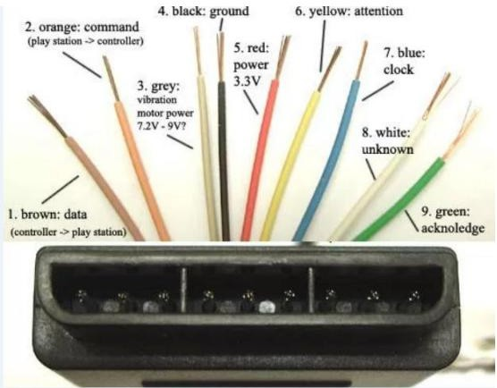

#### 5.1.6.3 Program Analyst

1)  Firstly, initialize PS2 handle in `InitPS2` function of setup function.

```c
PS2X ps2X;                                     //实例化手柄类  (instantiate handle class)
void InitPS2()
{
	ps2X.config_gamepad(A2, A4, A3, A5);  //设置PS2接口 A2号IO为clock,A4号IO为command,A3号IO为attention,A5号IO为data  (set PS2 interface: A2 for clock, A4 for command, A3 for attention, A5 for data)
}
```

2. Then analyze the `ps2Handle` function.

```c
void ps2Handle() {                      //PS2 手柄 处理  (PS2 handle processing)  
  static uint32_t Timer;                //定义静态变量Timer， 用于计时  (define static variable Timer for timing)          
  if (Timer > millis())                 //Timer 大于 millis（）（运行的总毫秒数）时返回，//Timer 小于 运行总毫秒数时继续运行下面的语句  (if Timer > millis() (total milliseconds running), return; if Timer < total milliseconds, continue)
    return;
    
  ps2X.read_gamepad();                  //读取PS手柄按键数据  (read PS handle button data)

  if ( Mode == 0 )
  {
    if ( ps2X.Button( PSB_SELECT )   )
    {
      if ( ps2X.ButtonPressed( PSB_START ))
      {
        Mode = 1;
        manual = TRUE;
        FullActRun(0, 1);
        LedFlip();
        for (int i = 0 ; i < 8 ; i++)
        {
          ServoPwmDutyset[i] = 1500;
        }
        ServoSetPluseAndTime( 1, 1500, 1000 );
        ServoSetPluseAndTime( 2, 1500, 1000 );
        ServoSetPluseAndTime( 3, 1500, 1000 );
        ServoSetPluseAndTime( 4, 1500, 1000 );
        ServoSetPluseAndTime( 5, 1500, 1000 );
        ServoSetPluseAndTime( 6, 1500, 1000 );
        return;
      }
    }
    else {
      if (ps2X.ButtonPressed(PSB_START)) { //If the "up" button on the left side is pressed
        LedFlip();
        FullActRun(0, 1);
        Timer = millis() + 50;               //Timer adds 50ms to the total running milliseconds. It will run again after 5Oms.
        return;       //返回，退出此函数  (return, exit this function)
      }
```

3. After entering `ps2Handle` function, delay a period of time first before reading the data. After confirming that the data is read completely, the corresponding operation is executed according to the value of the key. LedFlip is a blinking LED light to indicate the completion of the key.

4. FullActRun is the action group running function and will be mentioned in the following chapter. It actually calls the downloaded action group in the controller, and then exit delay.

### 5.1.7 Lesson 7 SPI_Flash Read and Write

#### 5.1.7.1 Project Purpose

Learn the principle FLASH memory and SPI bus communication, realize reading and writing of SPI FLASH on the controller, and display the written characters in the serial port assistant.

#### 5.1.7.2 Project Principle

Flash memory is a type of [nonvolatile memory](https://searchstorage.techtarget.com/definition/nonvolatile-memory) that can retain data for an extended period of time even without current supply, and its storage characteristic is equivalent to the hard disk drive. This feature is the basis for flash memory to become the storage medium for various portable digital devices.

The Serial Peripheral Interface (SPI), developed by Motorola, is a high-speed full duplex interface. It is widely used in ADCs, LCDs and MCUs and suitable for occasions with higher communication speed requirements.

```c
void InitSpi(void)
{
	pinMode(SS,OUTPUT);
	
	SPI.begin ();
	SPI.setDataMode(SPI_MODE0);
	SPI.setBitOrder(MSBFIRST);
}
```

SPI FLASH is a type of flash memory that reads and writes through `SPI` interface. The general SPI FLASH has two characteristics for reading and writing:

1. When writing, only 1 can be written, not 0.

2. When erasing, it is erased by sector (that is, all data becomes 0), and the sector size varies according to different chips (the chip we chose has 4096 bytes per sector).

   Based on the above two points, we can know that the data of a byte is to change the corresponding data bit in the chip from 0 to 1 or from 1 to zero.

   Because FLASH does not support writing 0 when writing so we are required to erase the corresponding sector to 0. However, the original data will be lost after erasing, so it is generally read first, and then the sector is erased. At the end, rewrite the modified data into Flash.

#### 5.1.7.3 Program Analyst

1)  The `InitFlash` function is called in the setup section and its function body is in Flash.cpp. It calls the `InitSpi` function that used to initialize SPI.

2)  When reading and writing SPI Flash,corresponding commands are required to send to SPI Flash. This commands can usually be found in the chip manual. The following figure is the command of table SPI Flash:

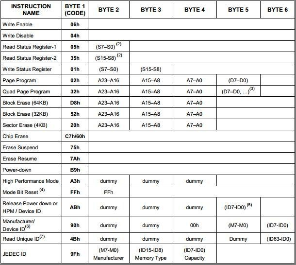

3. We define the commands that may be used in the header file with macro definitions according to this table, which is convenient to use.

```c
#define SFC_WREN        		0x06                    //串行Flash命令 (Serial Flash command set)
#define SFC_WRDI        		0x04
#define SFC_RDSR        		0x05
#define SFC_WRSR        		0x01
#define SFC_READ        		0x03
#define SFC_FASTREAD    		0x0B
#define SFC_RDID        		0xAB
#define SFC_PAGEPROG    		0x02
#define SFC_RDCR        		0xA1
#define SFC_WRCR        		0xF1
#define SFC_SECTORER    		0xD7
#define SFC_BLOCKER     		0xD8
#define SFC_SECTOR_ERASE		0x20
#define SFC_CHIPER      		0xC7
```

4. The following figure is to check whether Flash is busy. Because Flash will not receive read and write commands when it is busy. Therefore, the Flash status must be checked before reading and writing, and the reading and writing operations can be initiated until the Flash is idle.

```c
void CheckBusy()
{
	digitalWrite(SS, HIGH);
	digitalWrite(SS, LOW);
	SPI.transfer(SFC_RDSR);
	while(SPI.transfer(0) & 0x01); 
	digitalWrite(SS, HIGH);
}
```

5. After the status detection, pull down the selection. Then use the fast read command and send the address to be read. Finally, use a for loop to store the read data into the buffer. The writing operation is similar to the reading operation and the difference is that the status detection is done at the end.

   Finally, the command to erase Flash sector is as follow:

```c
void FlashRead(DWORD addr, DWORD size, BYTE *buffer) 
{
    digitalWrite(SS, HIGH);
    digitalWrite(SS, LOW);
    SPI.transfer(SFC_READ);
	SPI.transfer((BYTE)(addr>>16));
	SPI.transfer((BYTE)(addr>>8));
	SPI.transfer((BYTE)addr);
    for(int i = 0; i < size; i++)
    {
        buffer[i] = SPI.transfer(0);
    }
    digitalWrite(SS, HIGH);
    CheckBusy();
}
```

```c
void FlashRead(DWORD addr, DWORD size, BYTE *buffer) 
{
    digitalWrite(SS, HIGH);
    digitalWrite(SS, LOW);
    SPI.transfer(SFC_READ);
	SPI.transfer((BYTE)(addr>>16));
	SPI.transfer((BYTE)(addr>>8));
	SPI.transfer((BYTE)addr);
    for(int i = 0; i < size; i++)
    {
        buffer[i] = SPI.transfer(0);
    }
    digitalWrite(SS, HIGH);
    CheckBusy();
}

void FlashWrite(DWORD addr, DWORD size, BYTE *buffer) 
{
    digitalWrite(SS, HIGH);
    digitalWrite(SS, LOW);  
    SPI.transfer(SFC_WREN);
    digitalWrite(SS, HIGH);
    digitalWrite(SS, LOW);  
    SPI.transfer(SFC_PAGEPROG);
	SPI.transfer((BYTE)(addr>>16));
	SPI.transfer((BYTE)(addr>>8));
	SPI.transfer((BYTE)addr);
    for(int i = 0; i < size; i++)
    {
        SPI.transfer(byte(buffer[i]));
    }
    digitalWrite(SS, HIGH);
    CheckBusy();
}
```

### 5.1.8 Lesson 8 Serial Port Controls Servo

#### 5.1.8.1 Project Purpose

Learn the serial communication and use it to control serial bus servo to execute the corresponding commands

#### 5.1.8.2 roject Principle

Serial communication interface that is shorts for the serial port refers to a serial communication port sending data one bit at a time. In the MCU and embedded environment, the serial port generally refers to the UART port.

According to the level standard of the interface, it can be divided into RS-232、RS-422、RS485、TTL, etc. TTL serial port is usually not converted by the specialized chip after we derive from the MCU chip.

Two types of physical ports are provided: DB9 connector and 4-pin header.

#### 5.1.8.3 Program Analyst

1)  Firstly, we need to initial the serial port. `InitUart1` function is executed in Setup section.

```c
void InitUart1(void)
{
  //bitSet(UCSR0A,U2X0);
  bitSet(UCSR0B,RXCIE0);
  bitSet(UCSR0B,RXEN0); 					
  bitSet(UCSR0B,TXEN0); 					
  bitSet(UCSR0C,UCSZ01);
  bitSet(UCSR0C,UCSZ00);					
  UBRR0=(F_CPU/16/9600-1);//波特率9600  (baud rate 9600)
}
```

2)  Trough a series of operation on register, InitUart1 sets it to the transmittable data and its baud rate is 9600. Then, let’s look at the `TaskPCMsgHandle` function called in the loop.

3)  Then, judge the returned value of `UartRxOK` function. `UartRxOK` function is pulled upward first and then UartRxComplete value is judged.

```c
			fFrameStart = FALSE;
			messageLength = 0;

			startCodeSum = 0;
		}
		
	}
	if(fFrameStart)
	{
		Uart1RxBuffer[messageLength] = rxBuf;
		if(messageLength == 2)
		{
			messageLengthSum = Uart1RxBuffer[messageLength];
			if(messageLengthSum < 2)// || messageLengthSum > 30
			{
				messageLengthSum = 2;
				fFrameStart = FALSE;
				
			}
				
		}
		messageLength++;

		if(messageLength == messageLengthSum + 2) 
		{
			if(fUartRxComplete == FALSE)
			{
```

4)  Suppose that the data frame sent to this program is "0x55 0x55 0x05 0x03 0x01 0xD0 0X07", this message refers to controlling the No. 1 servo to rotate to the 2000 position within 1000ms.

5)  Suppose that the data frame sent to this program is "0x55 0x55 0x05 0x03 0x01 0xD0 0X07", this message refers to controlling the No. 1 servo to rotate to the 2000 position within 1000ms.

6)  The received data is saved in rxBuf. If the data frame 0x55 is received , then startCodeSum+1.

7)  When receiving two 0x55, startCodeSum will be cleared to 0. If the fFrameStart is set to true, the next frame of data will be saved. If no data is received, then judge again.

8)  If fFrameStart is true, 0x55 will be saved to the second position in Uart1RxBuffer after receiving two 0x55 (with subscript 1).

9)  After all the data has been received according to the data format, then we go back to the `TaskPCMsgHandle` function and UartRxOK will return “True”.

10)  We classify the received data according to the command value, and then convert the other data values into the rotation time and position of the servo ID. Finally, realize the servo rotation through the `ServoSetPluseAndTime` function .

### 5.1.9 Project Purpose

Write the received action data to Flash through the serial communication.

#### 5.1.9.1 Project Principle

We have learned the writing and reading of SPI Flash. In this section, we are going to save the action data into Flash. The working process is as follow:

Receive the serial data

Do write action data?

Yes No

Write the data to the corresponding address in Flash

Other operations

Learning from the above, we need to extract the action data from the data received by the serial port, and then write it into Flash correctly. In the previous section, we learned that Flash erasing is sector-based, and at the same time only 1 can be written but not 0.

Therefore, in order to facilitate programming and management, storage address is aligned with the sector size of the Flash chip saved by 4096 bytes, which improves the efficiency and reduce the error rate.

#### 5.1.9.2 Program Analyst

```c
			case CMD_FULL_ACTION_ERASE:
				FlashEraseAll();
				McuToPCSendData(CMD_FULL_ACTION_ERASE,0,0);
				break;

			case CMD_ACTION_DOWNLOAD:
				SaveAct(UartRxBuffer[4],UartRxBuffer[5],UartRxBuffer[6],UartRxBuffer + 7);
				McuToPCSendData(CMD_ACTION_DOWNLOAD,0,0);
				break;
```

As you can see from the above figure, the action erase and the action download functions have been added. This two functions are implemented by two functions `FlashEraseAll()` and `SaveAct()`. The protocols of the two commands are as follows.

Parameter 2: the total frame of the action group

Parameter 3: which frame of the data

Parameter 4: the number of the servos to be downloaded

Parameter 5: upper-byte of time

Parameter 6: lower-byte of time

Parameter 7: Servo ID number

Parameter 8: lower-byte of angle position

Parameter 9: the upper eight bits of the angle `position.` Parameter......: The format is the same as that of parameters 7, 8, and 9, the angular position of the different ID. For each frame of data downloaded, the controller returns data with the same command value, but as a command packet without parameters.

Before implementing these two functions, the storage location of the data in Flash needs to be arranged first. The following figure shows address distribution of data storage:

1. The first sector is used to store LOBOT signs; If there is no LOBOT sign, the sector will be considered to be a new Flash chip;

2. The second sector stores the number of actions of the action `group.` Each action group occupies one byte, that is, each action group can store 255 actions. We only use the first 256 bytes of this sector, that is, up 256 action groups can be stored.

3. All 256 bytes of the data is read during operating. Then erase the data of this sector and rewrite the modified data into. Starting from the this sector is the area for storing action group data. Each action group occupies 16KB, that is, four sectors. The process of writing an action group is as follows:

   The first step: erase the storage area 48 of the action group to be written.

   The second step: Write the actions of the action group one by one. At the same time, check if the written action is the last action in this action `group.`

   The third step: If it is the last action, we consider that the action has been written completely, and then update the number of the action groups in the second sector. The way to erase an action is to change the number of the actions of the corresponding action group to 0. The way to erase all action groups is to change the first 256 bytes of the second sector to 0. The following figure shows the implementation of this part of the program:

```c
void InitMemory(void)
{
	uint8 i;
	uint8 logo[] = "LOBOT";
	uint8 datatemp[8];

	uint8 tt[4] = {0,1,2,3};
	uint8 ttt[4] = {5,5,5,5};
	
	FlashRead(MEM_LOBOT_LOGO_BASE,5,datatemp);
	for(i = 0; i < 5; i++)
	{
		if(logo[i] != datatemp[i])
		{
			FlashEraseSector(MEM_LOBOT_LOGO_BASE);
			FlashWrite(MEM_LOBOT_LOGO_BASE,5,logo);
			FlashEraseAll();
			break;
		}
	}
}
```

### 5.1.10 Lesson 10 Run the Action stored in Flash

#### 5.1.10.1 Project Purpose

Through the serial command or PS2 handle, control to read the action data in Flash and run the read action `group.`

#### 5.1.10.2 Project Principle

In this section, we will implement the robotic arm to run the specified action group through the serial command. We need to implement the function of running the action group, and implement the corresponding serial command and call the corresponding action group through the button of PS2 handle. Look at the corresponding serial command protocol as follows:

The command of running action group

Command name CMD \_ACTION_GROUP_RUN

Command `value:` 6 Data length: 5

`Instruction`: run action `group.` If the parameter times are unlimited, the parameter value is 0.

Parameter 1: The number parameter of the action group to be run.

Parameter 2: The `lower-byte` parameter of the times of the action group to be executed.

Parameter 3: The upper byte parameter of the times of the action group to be executed.

For example, control No.1 servo to rotate to 2000 position on 1000ms. The command is as follow:

<table>
<colgroup>
<col style="width: 14%" />
<col style="width: 14%" />
<col style="width: 16%" />
<col style="width: 54%" />
</colgroup>
<tbody>
<tr>
<td style="text-align: center;">
<p>Frame header</p>
</td>
<td style="text-align: center;">
<p>Data length</p>
</td>
<td style="text-align: center;">Command</td>
<td style="text-align: center;">
<p>Parameter</p>
</td>
</tr>
<tr>
<td style="text-align: center;">
<p>0x55 0x55</p>
</td>
<td style="text-align: center;">
<p>0x08</p>
</td>
<td style="text-align: center;">
<p>0x03</p>
</td>
<td style="text-align: center;">
<p>0x01 0xE8 0x03 0x01 0xE8 0x03 0x01 0xD0 0x07</p>
</td>
</tr>
</tbody>
</table>


#### 5.1.10.3 Program Analyst

1)  Firstly, set the environment for running action `group.` For example, whether there are actions in the action group, the number of action contained in the action group, and check whether there is any action group currently running. Then do the corresponding treatment according to different situations to prevent errors. Then set the parameters for running the action group and set the sign for running the action `group.`

```c
void FullActRun(uint32 actFullnum,uint32 times)//初始化并运行新的动作  (initialize and run new action)
{
	uint8 frameIndexSum;
	FlashRead(MEM_FRAME_INDEX_SUM_BASE + actFullnum,1, &frameIndexSum);
	UART1SendDataPacket(&frameIndexSum,1);
	if(frameIndexSum > 0)//该动作组的动作数大于0，说明是有效的，已经下载过动作了。  (action count > 0, valid, actions have been downloaded)
	{
		FrameIndexSum = frameIndexSum;
		if(ActFullNum != actFullnum)
		{
			if(actFullnum == 0)
			{//0号动作组强制运行，可以中断当前正在运行的其他动作组  (action group 0 is forced to run, can interrupt other running action groups)
				fRobotRun = FALSE;
				ActFullRunTimes = 0;
				fFrameRunFinish = TRUE;
			}
		}
		else
		{	//只用前后两次动作组编号相同才能修改次数  (only modify times when the action group numbers are the same)
			ActFullRunTimesSum = times;
		}
		
		
		if(FALSE == fRobotRun)
		{
			ActFullNum = actFullnum;
			ActFullRunTimesSum = times;
			FrameIndex = 0;
			ActFullRunTimes = 0;
			fRobotRun = TRUE;
			
			TimeActionRunTotal = gSystemTickCount;
		}
```

2)  Running an action is to read the running time of this action and and the angle information of each servo from the corresponding location in Flash. Then control the servo to rotate to the corresponding angle at the specified time through the program written before to control the servo.

```c
uint16 ActSubFrameRun(uint8 fullActNum,uint8 frameIndex)
{
	uint32 i = 0;

//	uint16 frameSumSum = 0;	//由于子动作都是连续存放的，子动作的帧数又是不确定的数  (since sub-actions are stored continuously, the frame count is uncertain)
	//，所以要总在一起算。所有前面子动作的帧加起来  (so they must be counted together; sum all previous sub-action frames)
	uint8 frame[ACT_SUB_FRAME_SIZE];
	uint8 servoCount;
	uint32 time;
	uint8 id;
	uint16 pos;

	FlashRead((MEM_ACT_FULL_BASE) + (fullActNum * ACT_FULL_SIZE) + (frameIndex * ACT_SUB_FRAME_SIZE)
		,ACT_SUB_FRAME_SIZE,frame);
	
	servoCount = frame[0];
	time = frame[1] + (frame[2]<<8);

	if(servoCount > 8)
	{//舵机数超过8个，说明下载了错误动作  (servo count > 8, indicates wrong action downloaded)
		FullActStop();
		return 0;
	}
	for(i = 0; i < servoCount; i++)
	{
		id =  frame[3 + i * 3];
		pos = frame[4 + i * 3] + (frame[5 + i * 3]<<8);
		ServoSetPluseAndTime(id,pos,time);
	}
	return time;
}
```

3)  Implement the running action is to read the action data from the corresponding position in the Flash. Then call `ServoSetPluseAndTime` function and add the treatment that can judge whether the data is correct to prevent the wrong action after the data error.

4)  To execute an action group, it needs to be able to automatically execute one action and then execute the next action until all the actions in the action group have been executed.

5)  We want the program to defer the execution time of an action after it has been executed. When the execution time has expired, the action will be considered finished and a new action will be executed. At the same time, this function can check the running sign of action `group.` When the sign is true, the action group will be executed, and if the sign is false, it will not be executed.

```c
void TaskRobotRun(void)
{

	if(fRobotRun)
	{
		if(TRUE == fFrameRunFinish)
		{//运行完成后开始下一帧动作运行  (after completion, start next frame action)
			fFrameRunFinish = FALSE;
			TimeActionRunTotal += ActSubFrameRun(ActFullNum,FrameIndex);//将这帧动作的时间累加上  (add the time of this frame action)
		}
		else
		{
			if(gSystemTickCount >= TimeActionRunTotal)
			{//不断检测这帧动作在指定时间内运行完成  (constantly check if this frame action completes within specified time)
				fFrameRunFinish = TRUE;
				if(++FrameIndex >= FrameIndexSum)
				{//已运行完该动作组最后一个动作  (finished the last action of this action group)
					FrameIndex = 0;
					if(ActFullRunTimesSum != 0)
					{//如果运行次数等于0，即代表无限次运行，就不进入if语句，就一直运行了  (if run times = 0, means infinite, skip if and keep running)
						if(++ActFullRunTimes >= ActFullRunTimesSum)
						{//到达运行次数，运行停止  (reached run times, stop)
							fRobotRun = FALSE;
              if(ActFullNum == 100)
              {
                FullActRun(101,1);
              }
						}
					}
				}
			}
		}
	}
```

6)  gSystemTickCount is the number of milliseconds that have elapsed since the returned program started to run. The number of milliseconds at this moment plus the running time of the action is the number of milliseconds elapsed for the whole program when the action run is completed.

7)  When the 54 milliseconds are reached, it can be considered that the next action is started or the entire action group has been completed. After implementing the function of running action group, we add the code for processing the action group command in the serial data processing function.

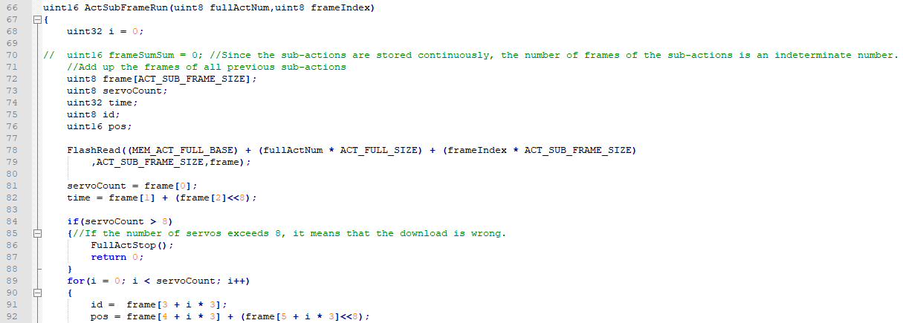

8)  Stopping action group is to call the stop action group function. This function is to set several variables and signs so that the Task_RobotRun funciton will no longer run the action `group.`

```c
void FullActStop(void)
{
	fRobotRun = FALSE;
	ActFullRunTimes = 0;

	fFrameRunFinish = TRUE;

	FrameIndex = 0;
}

```

9)  Then read the button state of the PS2 handle in loop and perform different operations according to different button states. For example, when the up button is pressed, `No.1` action group will be executed, and when the START button is pressed, `No.0` action group is executed.

```c
      if (ps2X.ButtonPressed(PSB_START)) { //如果左侧向上按钮被按下  (if the left up button is pressed)
        LedFlip();
        FullActRun(0, 1);
        Timer = millis() + 50;               //Timer 在 运行总毫秒数上加 50ms，50ms 后再次运行  (Timer adds 50ms to total running ms, runs again after 50ms)
        return;       //返回，退出此函数  (return, exit this function)
      }
      if (ps2X.ButtonPressed(PSB_PAD_UP)) { //如果左侧向上按钮被按下  (if the left up button is pressed)
        LedFlip();
        FullActRun(1, 1);
        Timer = millis() + 50;
        return;
      }
      if (ps2X.ButtonPressed(PSB_PAD_DOWN)) {  //如果左侧向下按钮被按下  (if the left down button is pressed)
        LedFlip();
        FullActRun(2, 1);
        Timer = millis() + 50;
        return;
      }
      if (ps2X.ButtonPressed(PSB_PAD_LEFT)) {  //如果左侧向左按钮被按下  (if the left left button is pressed)
        LedFlip();
        FullActRun(3, 1);
        Timer = millis() + 50;
        return;
      }
      if (ps2X.ButtonPressed(PSB_PAD_RIGHT)) { //如果左侧向右按钮被按下  (if the left right button is pressed)
        LedFlip();
        FullActRun(4, 1);
        Timer = millis() + 50;
        return;
      }
      if (ps2X.ButtonPressed(PSB_GREEN)) {     //如果右侧绿色按钮（即右侧三角形按钮）被按下  (if the right green button (triangle) is pressed)
        LedFlip();
        FullActRun(5, 1);
        Timer = millis() + 50;
        return;
      }
      if (ps2X.ButtonPressed(PSB_BLUE)) {       //如果右侧蓝色按钮（即右侧交叉按钮）被按下  (if the right blue button (cross) is pressed)
        LedFlip();
        FullActRun(6, 1);
        Timer = millis() + 50;
        return;
      }
      if (ps2X.ButtonPressed(PSB_PINK)) {       //如果右侧粉红色按钮（即右侧正方形按钮）被按下  (if the right pink button (square) is pressed)
        LedFlip();
        FullActRun(11, 1);
        Timer = millis() + 50;
        return;
      }
      if (ps2X.ButtonPressed(PSB_RED)) {       //如果右侧粉红色按钮（即右侧正方形按钮）被按下  (if the right pink button (square) is pressed) // Note: original comment says pink but red? kept as is.
        LedFlip();
        FullActRun(12, 1);
        Timer = millis() + 50;
        return;
      }
      if (ps2X.ButtonPressed(PSB_L1)) {        //如果左侧L1按钮被按下  (if left L1 button is pressed)
        LedFlip();
        FullActRun(13, 1);
        Timer = millis() + 50;
        return;
      }
      if (ps2X.ButtonPressed(PSB_R1)) {        //如果左侧L2按钮被按下  (if left L2 button is pressed) // Note: original says L2 but R1? kept as is.
        LedFlip();
        FullActRun(14, 1);
        Timer = millis() + 50;
        return;
      }
      if (ps2X.ButtonPressed(PSB_L2)) {       //如果右侧R1按钮被按下  (if right R1 button is pressed) // Note: original says R1 but L2? kept as is.
        LedFlip();
        FullActRun(15, 1);
        Timer = millis() + 50;
        return;
      }
      if (ps2X.ButtonPressed(PSB_R2)) {          //如果右侧R2按钮被按下  (if right R2 button is pressed)
        LedFlip();
        FullActRun(16, 1);
        Timer = millis() + 50;
        return;
      }
      Timer = millis() + 50;
    }
  }
```

10) So far, the functions of uHand2.0 have been basically implemented.

## 5.2 STM32

### 5.2.1 Lesson 1 Timer Controls LED

#### 5.2.1.1 Project Purpose

Use the timer on the controller to control the on and off of the LED light.

#### 5.2.1.2 Project Principle

If want to light up LED light, we need to know how the LED light is connected to the STM32. Through checking the schematic diagram, we know that LED is connected to the PB9 IO port of STM32, and lights up when it is low level.

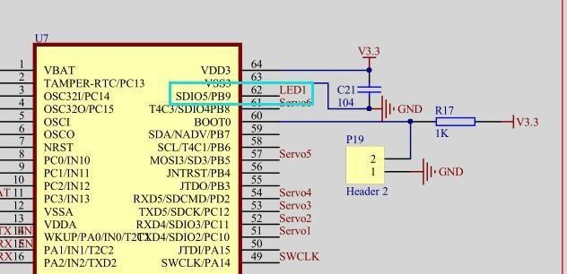

From the above information, we can know that the process of lighting up LED is:

1)  Configure I/O port parameters to make I/O Push–pull output or Open-drain output.

2)  Set the I/O port to the low-level, which LED will be lighted up.

#### 5.2.1.3 Program Analyst

```c
void InitLED(void)
{

	GPIO_InitTypeDef  GPIO_InitStructure;

	RCC_APB2PeriphClockCmd(RCC_APB2Periph_GPIOB, ENABLE);	
	GPIO_InitStructure.GPIO_Pin = GPIO_Pin_9;				 
	GPIO_InitStructure.GPIO_Mode = GPIO_Mode_Out_PP; 		 
	GPIO_InitStructure.GPIO_Speed = GPIO_Speed_50MHz;
	GPIO_Init(GPIOB, &GPIO_InitStructure);

}
```

1)  Execute the LED I/O port within configured in the `InitLED` function in the main function. Now, we can write 0 or 1 to the I/O port, and then control the LED light to turn on or off.

```c
#define LED_ON		0
#define LED_OFF		1
```

```c
	LED = LED_ON;
```

2. The above figure shows the LED light is turned on, where LED_ON is a macro definition corresponding to 0. If we track LED, we will find that LED is also a macro definition, as shown in the second figure below.

```c
#define LED 		PBout(9)
```

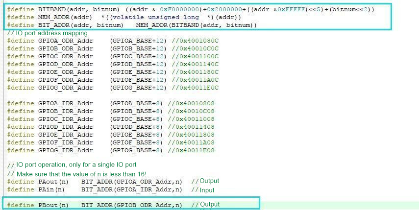

3. We can find these codes in include.h and find that the LED eventually is parsed as:

LED becomes PBout(9)

PBout(9) becomes BIT_ADDR(GPIOB_ODR_Addr, 9)

BIT_ADDR(GPIOB_ODR_Addr, 9) becomes MEM_ADDR(BITBAND(GPIOB_ODR_Addr, 9)

MEM_ADDR(BITBAND(GPIOB_ODR_Addr, 9) becomes \*((volatile unsigned long\*)( BITBAND(GPIOB_ODR_Addr, 9)))

Eventually becomes to:

*((volatile unsigned long\*)(((GPIOB_ODR_Addr & 0xF0000000)+0x2000000+(( GPIOB_ODR_Addr & 0xFFFFF)\<\<5)+( 9 \<\<2)))

The STM32 registers can not be operated in bits. To operate a specific I/O port, we must use a combination of shift and logic operations.

To facilitate the operation of the I/O port, the bit field function is provided in STM32, which can map the input and output of each I/O port to an independent address through each bit on register. Thus, you just need to write the address into data to operate the corresponding I/O port.

1)  BITBAND converts the provided output register address and I/O port number into the corresponding operation address. Therefore, just change the address and write 0 or 1 to control the LED light on and off.

### 5.2.2 Lesson 2 Button Detection

#### 5.2.2.1 Project Purpose

Use the button on controller to control the on and off of the LED light.

#### 5.2.2.2 Project Principle

Through checking the schematic diagram of the controller, the button is connected to the PC0I/O port of the STM32 and the other end is GND. Therefore, if want to use the buttons, PC14 needs to be configured to pull-ups input mode, and then judge the status of the buttons by detecting the status of the PC14.

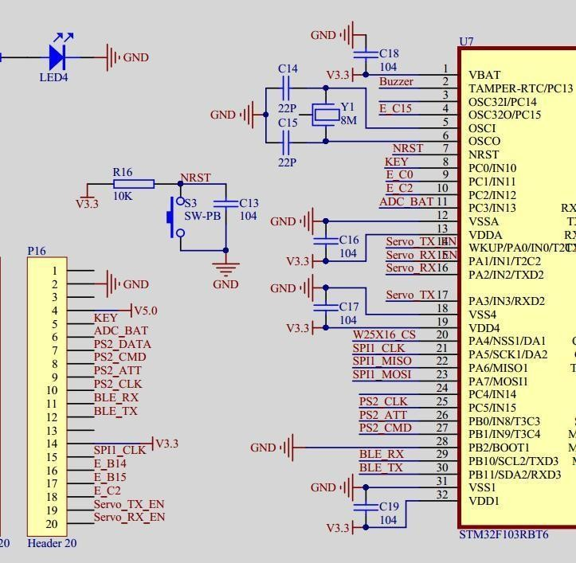

When the mechanical buttons is pressed or released, due to the effect of mechanical elasticity, it is usually accompanied by a certain period of the mechanical jitter of the contacts. The vibration time is generally 5-10ms. In addition, the connection status of the button can be detected during the contact vibration.

The mechanical jitter of the button can be eliminated by using hardware circuits or software `de-jittering` method. In this section, software method is used to eliminate jitter. The principle of software de-jittering is to execute a delay program about 10ms first when a button pressed is detected, and then re-detect whather the button is still pressed to confirm that the button pressed is not caused by jitter. Similarly, when a button released is detected, the method of deferring and then judging is used to eliminate the effect of jitter.

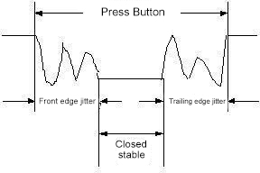

#### 5.2.2.3 Program Analyst

1)  In this section, buttons are added to control the LED light. Similar to controlling LED lights, initialize corresponding I/O port first.

```c
void InitKey(void)
{

	GPIO_InitTypeDef GPIO_InitStructure;
	RCC_APB2PeriphClockCmd(RCC_APB2Periph_GPIOC,ENABLE);
	GPIO_InitStructure.GPIO_Pin  = GPIO_Pin_0;
	GPIO_InitStructure.GPIO_Mode = GPIO_Mode_IPU;
	GPIO_Init(GPIOC, &GPIO_InitStructure);
}
```

2)  The biggest difference from the initialization of I/O port of LED is to configure I/O port to pull-up input GPI/O_Mode_IPU. After finishing the configuration of the I/O port, read the status of I/O port to judge whether the button is pressed. We ca see that TaskRun is executed cyclically in the main function.c

```c
	while(1)
	{
		TaskRun();
	}
}
```

3)  The following code can be found in TaskRun, which is used to detect the button state as shown in the following figure:

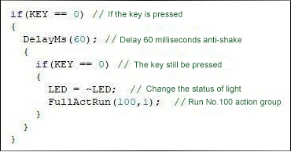

4)  Detect whether the I/O port where the button is located is low. If it is low,it will be pressed, and then delay 60 milliseconds. If it is still low, then confirm that the button is ot pressed while being disturbed.

5)  After confirming the button is pressed, the corresponding operation can be executed. `FullActRun` function is called in the code, which is used to execute the action `group.` We will introduce it in the following chapters.

### 5.2.3 Lesson 3 Buzzer Sound

#### 5.2.3.1 Project Purpose

Control the buzzer on controller to make sound through the timer.

#### 5.2.3.2 Project Principle

The buzzer is a electronic sound device with an integrated structure.It is widely used in computers,printers and other electronic products.

Its sounding principle is when the current passes through the oscillator, it produces a magnetic field to drive the vibration diaphragm to make sound. Therefore, a certain amount of current is required for the buzzer to make sound.

By changing the signal frequency, the pitch of the buzzer can be adjusted. The higher the frequency, the higher the pitch. In addition, the volume of the buzzer cab be controlled by changing the duty ratio of the high or low levels of the driving signal.

Because the current required by buzzer is relatively large, we use a triode to drive buzzer. The triode is an 8050 NPN triode, which is turned on at high level and cut off at low level.

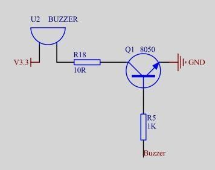

The base electrode of triode is connected to the PC13I/O port. We need to generate a signal on PC13 to drive the buzzer

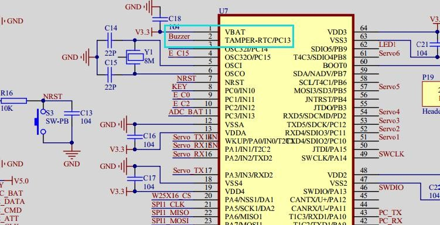

#### 5.2.3.3 Program Analyst

1)  We use a timer to flip the high and low levels of PC13 periodically to produce signal. At the same time, we have configured the timer 2 to be interrupted every 100us. Other than that, we need to configure the working parameters of timer 2, the parameters for interrupting the controller and the start of timer 2.

```c
void InitTimer2(void)		//100us
{
	NVIC_InitTypeDef NVIC_InitStructure;
	
	TIM_TimeBaseInitTypeDef  TIM_TimeBaseStructure;
	RCC_APB1PeriphClockCmd(RCC_APB1Periph_TIM2, ENABLE); //时钟使能  (clock enable)

	TIM_TimeBaseStructure.TIM_Period = (10 - 1); //设置在下一个更新事件装入活动的自动重装载寄存器周期的值  (set the value for the auto-reload register period)
	TIM_TimeBaseStructure.TIM_Prescaler =(720-1); //设置用来作为TIMx时钟频率除数的预分频值  (set prescaler value)
	TIM_TimeBaseStructure.TIM_ClockDivision = 0; //设置时钟分割:TDTS = Tck_tim  (set clock division)
	TIM_TimeBaseStructure.TIM_CounterMode = TIM_CounterMode_Up;  //TIM向上计数模式  (TIM up-count mode)
	TIM_TimeBaseInit(TIM2, &TIM_TimeBaseStructure); //根据TIM_TimeBaseInitStruct中指定的参数初始化TIMx的时间基数单位  (initialize TIMx time base unit according to specified parameters)

	TIM_ITConfig(  //使能或者失能指定的TIM中断  (enable or disable specified TIM interrupt)
	    TIM2, //TIM2
	    TIM_IT_Update  |  //TIM 中断源  (TIM interrupt source)
	    TIM_IT_Trigger,   //TIM 触发中断源  (TIM trigger interrupt source)
	    ENABLE  //使能  (enable)
	);

	TIM_Cmd(TIM2, ENABLE);  //使能TIMx外设  (enable TIMx peripheral)
	
	NVIC_InitStructure.NVIC_IRQChannel = TIM2_IRQn;  //TIM2中断  (TIM2 interrupt)
	NVIC_InitStructure.NVIC_IRQChannelPreemptionPriority = 2;  //先占优先级0级  (preemption priority level 0) // Note: comment says 0 but code says 2, kept as is.
	NVIC_InitStructure.NVIC_IRQChannelSubPriority = 3;	//从优先级3级  (sub-priority level 3)
	NVIC_InitStructure.NVIC_IRQChannelCmd = ENABLE; //IRQ通道被使能  (IRQ channel enabled)
	NVIC_Init(&NVIC_InitStructure);  //根据NVIC_InitStruct中指定的参数初始化外设NVIC寄存器  (initialize NVIC registers according to parameters)
}
```

2)  After the timer 2 and the interrupting are properly configured, the interrupting function will be executed every 100us. We can find that the Buzzer function is called in timer 2 from observing the interrupting function. This function is used to process the buzzer control as shown in the figure below:

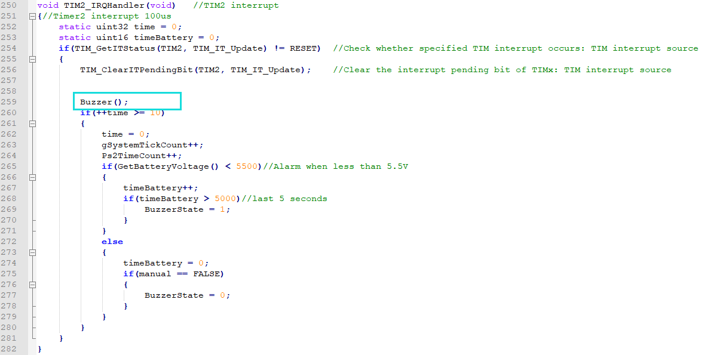

3)  In the code shown in the figure below, the red frame is the part for generating PWM and the blue frame is the part for controlling the time of the sound. When fBuzzer is true, I/O will be flipped once every 200us, otherwise it will output low-level.

The code in blue box is to control the state of fBuzzer. When BuzzerState is false, fBuzzer is set to false and stop sound output.

When Buzzerstate is true, the state of fBuzzer can be changed once every 500ms so as to realize the effect of beeping every 500ms. The final effect is that the buzzer will beep every 0.5s.

### 5.2.4 Lesson 4 ADC Detects Voltage and Realizes Low-voltage Alarm

#### 5.2.4.1 Project Purpose

Use ADC to examine the battery voltage and realize the buzzer to make low-voltage alarm.

#### 5.2.4.2 Project Principle

ADC (A/D converter) is short for analog-digital converter. In microcontroller application system, the input analog voltage signal is often converted into the digital signal that can be recognized by microcontroller, and the technology converting the continuously changing analogue signal into digital signal is called A/D conversion technology.

In practice, A/D can be connected between the input signal and the microcontroller to complete A/D conversion, or you can also choose to use a microcontroller with built-in A/D converter. Our controller has built-in A/D converter. When the analog signal is imported into the controller, it can be converted into the digital signal, and then process with the numerical analysis to calculate the voltage value.

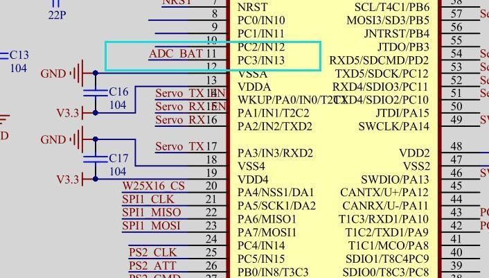

By checking the schematic diagram, we can know that the battery voltage is separated into PC3 pin of STM32 through three 1k resistant so that the voltage detected by ACD is required to multiple 3 and then get the real battery voltage.

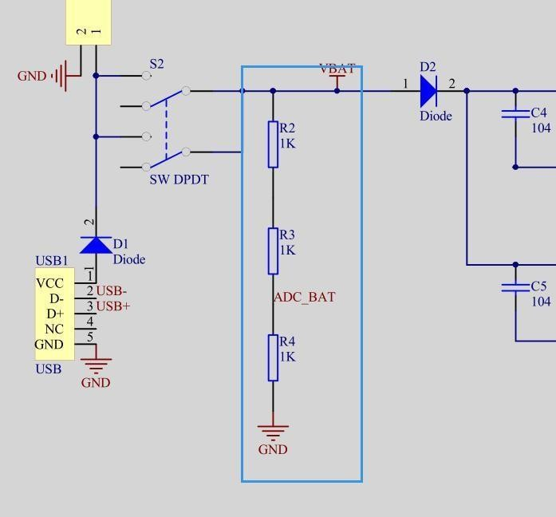

#### 5.2.4.3 Program Analyst

1. ADC is an independent peripheral, and its clock needs to be turned on before using ADC, and it can be turned off when it is idle to reduce power consumption.

2. The yellow box in the figure below is the clock code for configuring the ADC and the red box is the configuration of I/O port to be collected by the ADC. The collected battery voltage is connected to the PC3 I/O port of STM32 so we need to configure PC3 to analog input mode to perform analog-to-digital conversion.

3. The green box is the parameter configuration of ADC. In STM32, ADC supports multiple working modes such as single conversion, continuous conversion, scan conversion. There we use one ADC and configure to single-channel single conversion. The start of the conversion is controlled by software. The black box is the code for calibrating ADC.

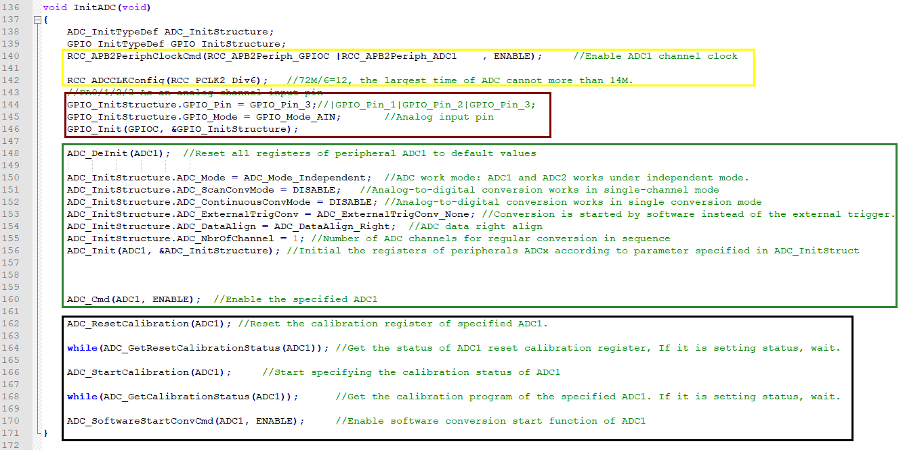

4. After configuring the ADC, we can call the function below to detect the battery voltage.

```c
void CheckBatteryVoltage(void)
{
	uint8 i;
	uint32 v = 0;
	for(i = 0;i < 8;i++)
	{
		v += GetADCResult(ADC_BAT);
	}
	v >>= 3;
	
	v = v * 2475 / 1024;//adc / 4096 * 3300 * 3(3代表放大3倍，因为采集电压时电阻分压了)  (adc/4096*3300*3, 3 means amplified by 3 times because resistor divider is used)
	BatteryVoltage = v;

}
```

5. In the code shown in the figure above, the `GetADCResult` function is called 8 times continuously. GetADCReslt is the function for obtaining ADC sampling value. This function has a parameter which is the channel number used for conversing the channel. Through the manual or the schematic diagram, you can know that the ADC channel of the battery voltage sampling corresponding to the I/O port is channel 13.

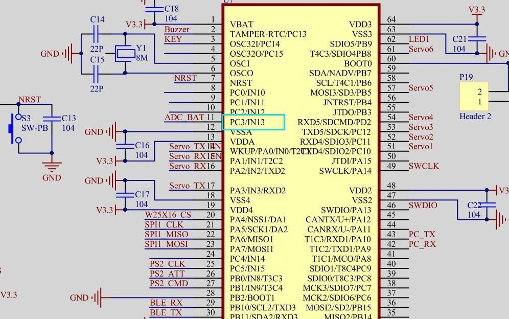

6. The return value obtained is summed and then shifted to the right by 3 bits. Shifting 3 bits to the right is equivalent to dividing by 8, which means that the value is averaged 8 times and then the value is converted to the corresponding voltage.

7. The ADC of STM32 is 12 bits, that is, when the measured voltage is 3.3V, the sampling value of ADC is 4096. 4096/3300 = ADC / XmV so the voltage should be ADC / 4096 \* 3300mV. Because the sampled voltage has been divided to one-third of the original, it needs to be multiplied by 3. The final battery voltage should be ADC sampling value/ 4096 \* 3300 \* 3.

8. Next, let’s look at the `GetADCResult` function. When the ADC conversion is completed, the converted value will be returned.

```c
uint16 GetADCResult(BYTE ch)
{
	//设置指定ADC的规则组通道，设置它们的转化顺序和采样时间  (set regular group channel of specified ADC, set conversion order and sampling time)
	ADC_RegularChannelConfig(ADC1, ch, 1, ADC_SampleTime_239Cycles5);	//ADC1,ADC通道3,规则采样顺序值为1,采样时间为239.5周期  (ADC1, ADC channel 3, regular sample order 1, sample time 239.5 cycles)

	ADC_SoftwareStartConvCmd(ADC1, ENABLE);		//使能指定的ADC1的软件转换启动功能  (enable software conversion start for ADC1)

	while(!ADC_GetFlagStatus(ADC1, ADC_FLAG_EOC)); //等待转换结束  (wait for conversion end)

	return ADC_GetConversionValue(ADC1);	//返回最近一次ADC1规则组的转换结果  (return last conversion result of ADC1 regular group)
}
```

9)  In the 100us interrupt of timer 2, the code can be viewed, as shown in the blue box below. The function of GetBatteryVoltage is to obtain the battery voltage. If all the detected voltage values are less than 6.4 in 5s, the buzzer will be started to alarm.

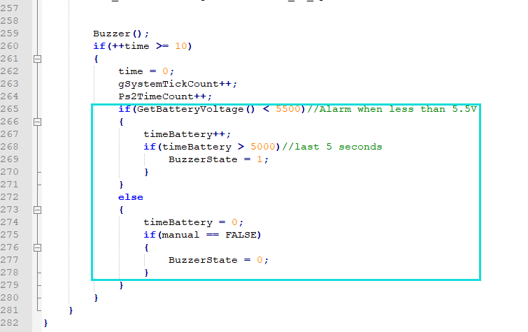

10) GetBatteryVoltage returns the value of global variables `BatteryVoltage` directly.

```c
uint16 GetBatteryVoltage(void)
{//电压毫伏  (voltage millivolt)
	return BatteryVoltage;
}
```

11) CheckBatteryVoltage is called every 500ms in TaskTimerHandle so as to update the battery voltage data. TaskTimerHandle is called in each main loop in TaskRun.

### 5.2.5 **Project Purpose**

Learn the principle of the servo control and control several servos to rotate.

####  5.2.5.1 Project Principle

* **Servo Internal Structure**

Servo consists of several parts namely small DC motor, a set of change gears, a linear feedback potentiometer, and a control circuit.

Of these, the high-speed DC motor provides the raw power for the servo and drives the reduction gear set to produce the high torque output. The greater the gear ratio, the greater the output torque of the servo, which means that it can drive a heavier load (limited by the gear strength), but the lower the output speed (response speed).

* **Servo Working Principle**

Servo is a typical closed loop feedback system. Its principle can refer to the figure below.

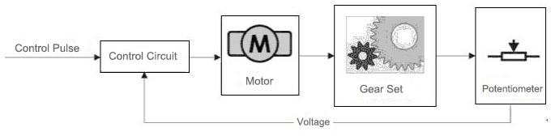

The reduction gear is driven by motors and its output terminal drives a linear potentiometer for positional detection. This potentiometer converts the angle into a proportional voltage feedback to the control circuit. Then the control circuit compares the proportional voltage with the angle corresponding to the input control signal and drives the motor to rotate clockwise or counterclockwise so as to make the potentiometer feedback angle to approach to the anticipated angle of the control signal, which achieves the accurate the purpose of accurate positioning of the servo motor.

* **How to control servo**

Servo motors have three wires: power, ground, and signal.


The power and ground wires are used to provide energy required for the internal DC motor and the control circuit. The voltage usually ranges between 5V and 8V, and the power supply should be isolated from the power supply of the processing system as much as possible. (because it will generate noise.)

Input a periodic positive pulse signal. The high level of this periodic pulse signal is usually between 1ms-2ms, and the low level time should be between 5ms and 20ms.

Analog servo is required to maintain periodic signal all the time to keep the servo angle. When the signal is lost, servo will no longer output power. The digital servo is used in uHand2.0 As long as the correct high-level signal is sent once, the locked angle can be maintained, and no strict requirement for the low level time.

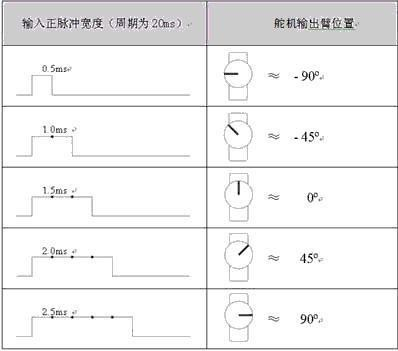

#### 5.2.5.2 Program Analyst

1)  The pulse width of the signal for controlling ranges 500us-2500us. 2500us–20000us is low level.

2)  There is a way for you: take 500us high level as an example, that is, it is 500us high level + 2000 low level + 17500us low level; 1000us high level is 1000us high level + 1500us low level + 17500us low level. Therefore, we actually only need to control the high and low level division of 2500us and keep the low level at other times.

3)  We know that s whole signal period is 20ms, that is, 20000us, which means eight 2500us. Therefore, cyclic control of the 2500is high and low level division of eight servos in a 20ms period can realize the operation of controlling eight servos with a timer.

4)  If want to control the servo, the pin for controlling the servo needs to be configured to Push-Pull output mode.

```c
void InitPWM(void)
{
	GPIO_InitTypeDef  GPIO_InitStructure;
	
	InitTimer3();
	
	RCC_APB2PeriphClockCmd(RCC_APB2Periph_GPIOB, ENABLE);
	GPIO_InitStructure.GPIO_Pin = GPIO_Pin_5 | GPIO_Pin_8;
	GPIO_InitStructure.GPIO_Mode = GPIO_Mode_Out_PP;		 
	GPIO_InitStructure.GPIO_Speed = GPIO_Speed_50MHz;
	GPIO_Init(GPIOB, &GPIO_InitStructure);

	RCC_APB2PeriphClockCmd(RCC_APB2Periph_GPIOC, ENABLE);
	GPIO_InitStructure.GPIO_Pin = GPIO_Pin_10| GPIO_Pin_11 | GPIO_Pin_12;
	GPIO_InitStructure.GPIO_Mode = GPIO_Mode_Out_PP;		 
	GPIO_InitStructure.GPIO_Speed = GPIO_Speed_50MHz;
	GPIO_Init(GPIOC, &GPIO_InitStructure);
	
	RCC_APB2PeriphClockCmd(RCC_APB2Periph_GPIOD, ENABLE);
	GPIO_InitStructure.GPIO_Pin = GPIO_Pin_2;
	GPIO_InitStructure.GPIO_Mode = GPIO_Mode_Out_PP;		
	GPIO_InitStructure.GPIO_Speed = GPIO_Speed_50MHz;
	GPIO_Init(GPIOD, &GPIO_InitStructure);
}
```

5. The minimum resolution of the servo control signal is 1us so the time base of the timer can be configured to 1us. Turn on the timer interrupt, and then modify the output status of I/O port and the time of next interrupt in timer `interrupt.`

```c
void InitTimer3(void)
{
	NVIC_InitTypeDef NVIC_InitStructure;
	
	RCC->APB1ENR|=1<<1;//TIM3时钟使能  (TIM3 clock enable)
 	TIM3->ARR=10000 - 1;  //设定计数器自动重装值//刚好1ms  (set auto-reload value, exactly 1ms)    
	TIM3->PSC=72 - 1;  //预分频器72,得到1Mhz的计数时钟  (prescaler 72, get 1MHz count clock)
	//这两个东东要同时设置才可以使用中断  (these two must be set together to use interrupt)
	TIM3->DIER|=1<<0;   //允许更新中断  (enable update interrupt)				
//	TIM3->DIER|=1<<6;   //允许触发中断  (enable trigger interrupt)	   
	TIM3->CR1|=0x01;    //使能定时器3  (enable timer 3)
	
	NVIC_InitStructure.NVIC_IRQChannel = TIM3_IRQn;  //TIM3中断  (TIM3 interrupt)
	NVIC_InitStructure.NVIC_IRQChannelPreemptionPriority = 0;  //先占优先级3级  (preemption priority level 0) // Note: comment says 3 but code 0, kept as is.
	NVIC_InitStructure.NVIC_IRQChannelSubPriority = 3;	//从优先级3级  (sub-priority level 3)
	NVIC_InitStructure.NVIC_IRQChannelCmd = ENABLE; //IRQ通道被使能  (IRQ channel enabled)
	NVIC_Init(&NVIC_InitStructure);  //根据NVIC_InitStruct中指定的参数初始化外设NVIC寄存器  (initialize NVIC registers according to parameters)
}
```

6. The following is the code for timer `interrupt.`

```c
//将PWM脉宽转化成自动装载寄存器的值  (convert PWM pulse width to auto-reload register value)
void Timer3ARRValue(uint16 pwm)	
{
	TIM3->ARR = pwm + 1;
}
//定时器3中断服务程序	  (timer 3 interrupt service routine)	 
void TIM3_IRQHandler(void)
{ 		
	static uint16 i = 1;
	
	if(TIM3->SR&0X0001)//溢出中断  (overflow interrupt)
	{
		switch(i)
		{
			case 1:
// 				SERVO0 = 1;	//PWM控制脚高电平  (PWM control pin high)
				//给定时器0赋值，计数Pwm0Duty个脉冲后产生中断，下次中断会进入下一个case语句  (assign timer, after Pwm0Duty pulses generate interrupt, next interrupt enters next case)
				Timer3ARRValue(ServoPwmDuty[0]);
				break;
			case 2:
// 				SERVO0 = 0;	//PWM控制脚低电平  (PWM control pin low)
				//此计数器赋值产生的中断表示下一个单元要进行任务的开始  (this counter assignment interrupt indicates start of next unit task)
				Timer3ARRValue(2500-ServoPwmDuty[0]);	
				break;
			case 3:
				SERVO1 = 1;	
				Timer3ARRValue(ServoPwmDuty[1]);
				break;
			case 4:
				SERVO1 = 0;	//PWM控制脚低电平  (PWM control pin low)
				Timer3ARRValue(2500-ServoPwmDuty[1]);	
				break;
			case 5:
				SERVO2 = 1;	
				Timer3ARRValue(ServoPwmDuty[2]);
				break;
```

7)  Let’s briefly analyze the switch statement. Suppose the interrupt is entered for the first time now. After entering the interrupt, execute case 1 ,and then set the I/O port of SERVO0 to high level, and set the time of timer interrupt to the high level time of the servo signal.

8)  When entering the next interrupt, execute case 2, and set the I/O port of SERVO0 to low level, and then set the interrupt time of the timer to the remaining time in 2500us.By repeating this process 8 times, a period of 20ms can be realized.

```c
			case 6:
				SERVO2 = 0;	//PWM控制脚低电平  (PWM control pin low)
				Timer3ARRValue(2500-ServoPwmDuty[2]);	
				break;	
			case 7:
				SERVO3 = 1;	
				Timer3ARRValue(ServoPwmDuty[3]);
				break;
			case 8:
				SERVO3 = 0;	//PWM控制脚低电平  (PWM control pin low)
				Timer3ARRValue(2500-ServoPwmDuty[3]);	
				break;	
			case 9:
				SERVO4 = 1;	
				Timer3ARRValue(ServoPwmDuty[4]);
				break;
			case 10:
				SERVO4 = 0;	//PWM控制脚低电平  (PWM control pin low)
				Timer3ARRValue(2500-ServoPwmDuty[4]);	
				break;	
			case 11:
				SERVO5 = 1;	
				Timer3ARRValue(ServoPwmDuty[5]);
				break;
			case 12:
				SERVO5 = 0;	//PWM控制脚低电平  (PWM control pin low)
				Timer3ARRValue(2500-ServoPwmDuty[5]);	
				break;
			case 13:
				SERVO6 = 1;	
				Timer3ARRValue(ServoPwmDuty[6]);
				break;
			case 14:
				SERVO6 = 0;	//PWM控制脚低电平  (PWM control pin low)
				Timer3ARRValue(2500-ServoPwmDuty[6]);	
				break;
			case 15:
// 				SERVO7 = 1;	
				Timer3ARRValue(ServoPwmDuty[7]);
				break;
			case 16:
// 				SERVO7 = 0;	//PWM控制脚低电平  (PWM control pin low)
				Timer3ARRValue(2500-ServoPwmDuty[7]);
				i = 0;	
				break;	
		}
		i++;
	}				   
	TIM3->SR&=~(1<<0);//清除中断标志位  (clear interrupt flag)	    
}
```

9)  Because there are only 6-ch servo ports on the palm controller, comment out SERVO0 and SERVO7. In this way, when operating the array, the subscript of the array is the servo corresponding to the servo number.

### 5.2.6 Lesson 6 Multi-channel Servo Speed Control

#### 5.2.6.1 Project Purpose

Learn the speed control method of servo to control multiple servos to rotate at different speeds.

#### 5.2.6.2 Project Principle

Servo movement speed: the instantaneous velocity of the servo is determined by the cooperation of the internal DC motor and the variable speed gear set. Driven by the constant voltage, its value is unique. For digital PWM servo, its speed is determined by its internal program. Its average movement speed can be changed by the control method of segmented pause.

For example: divide a rotation with an action amplitude of 90° into 128 stop points, and achieve an average speed of 0°-90° change by controlling the time of each stop point. For most servos, the unit of speed is determined by "degrees/second".

#### 5.2.6.3 Program Analyst

1)  ServoSetPluseAndTime is the function for setting the target position and rotation time of servo rotation.

2)  Its function is simple, which is to check whether the servo number is between 0 and 7 and whether the position is between 500 and 2500. If not, exit the function `directly.` Otherwise, check the time to ensure that it is between 20 and 30000. Then write the position into the array, write the time into the variable and set the sign that the servo has been set.

3)  The figure below shows the function that actually controls the servo rotation.

```c
void ServoPwmDutyCompare(void)//脉宽变化比较及速度控制  (pulse width change comparison and speed control)
{
	uint8 i;
	
	static uint16 ServoPwmDutyIncTimes;	//需要递增的次数  (number of increments needed)
	static bool ServoRunning = FALSE;	//舵机正在以指定速度运动到指定的脉宽对应的位置  (servo moving to position at specified speed)
	if(ServoPwmDutyHaveChange)//停止运动并且脉宽发生变化时才进行计算      ServoRunning == FALSE &&   (only calculate when stopped and pulse width changed)
	{
		ServoPwmDutyHaveChange = FALSE;
		ServoPwmDutyIncTimes = ServoTime/20;	//当每20ms调用一次ServoPwmDutyCompare()函数时用此句  (when ServoPwmDutyCompare() is called every 20ms)
		for(i=0;i<8;i++)
		{
			//if(ServoPwmDuty[i] != ServoPwmDutySet[i])
			{
				if(ServoPwmDutySet[i] > ServoPwmDuty[i])
				{
					ServoPwmDutyInc[i] = ServoPwmDutySet[i] - ServoPwmDuty[i];
					ServoPwmDutyInc[i] = -ServoPwmDutyInc[i];
				}
				else
				{
					ServoPwmDutyInc[i] = ServoPwmDuty[i] - ServoPwmDutySet[i];
					
				}
				ServoPwmDutyInc[i] /= ServoPwmDutyIncTimes;//每次递增的脉宽  (pulse width increment each time)
			}
		}
		ServoRunning = TRUE;	//舵机开始动作  (servo starts moving)
	}
	if(ServoRunning)
	{
		ServoPwmDutyIncTimes--;
		for(i=0;i<8;i++)
		{
			if(ServoPwmDutyIncTimes == 0)
			{		//最后一次递增就直接将设定值赋给当前值  (last increment, directly assign set value to current)

				ServoPwmDuty[i] = ServoPwmDutySet[i];

				ServoRunning = FALSE;	//到达设定位置，舵机停止运动  (reached set position, servo stops)
			}
			else
			{

				ServoPwmDuty[i] = ServoPwmDutySet[i] + 
					(signed short int)(ServoPwmDutyInc[i] * ServoPwmDutyIncTimes);

			}
		}
		
	}
}
```

4)  When ServoPwmDutyHaveChange is set to true, the step pulse width of each steo and the number of steps to be run are calculated according to the target position and movement time. After calculating, the sign of SerRunning will be set to true. Then the pulse width of the servo will be closer to the target pulse width.

### 5.2.7 Lesson 7 Serial Port Controls Servo

#### 5.2.7.1 Project Purpose

Learn the serial communication and use the serial communication to control the serial bus servo to execute the corresponding command.

#### 5.2.7.2 Project Principle

The serial communication interface is shorts for the serial port which refers to the communication interface transferring data one bit at a time. In the MCU and embedded environment, the serial port generally refers to the UART port.

According to the level standard of the interface, it can be divided into RS-232、RS-422、RS485、TTL, etc. TTL serial port is usually not converted by the specialized chip after we derive from the MCU chip.

Two types of physical ports are provided: DB9 connector and 4-pin header.

#### 5.2.7.3 Program Analyst

1)  We receive the serial data and make the servo perform corresponding operations based on the data. If want to use the serial communication, we need to configure the serial port first.

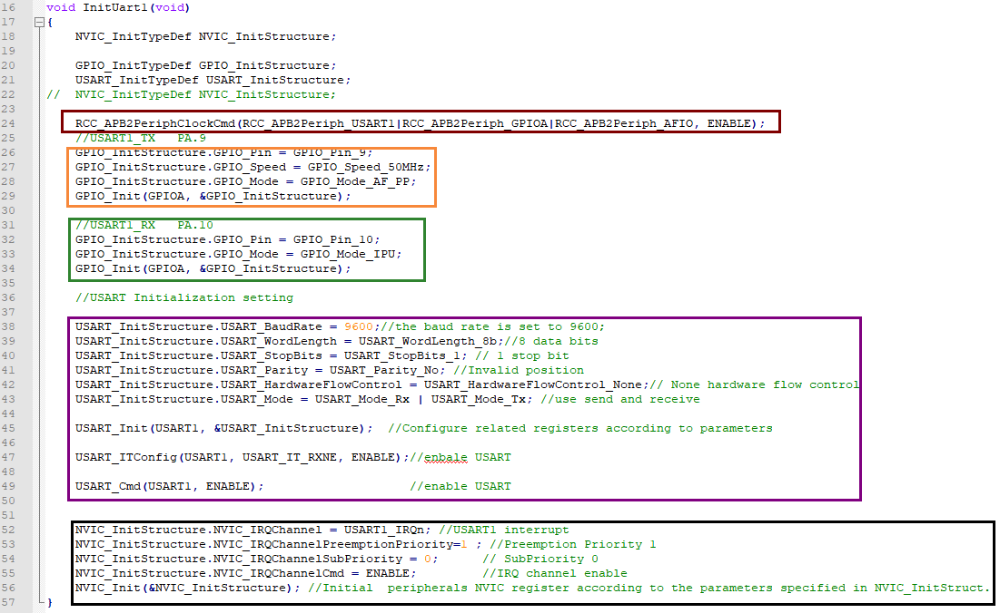

2)  The above figure is the code for initializing the serial port. The code in red box is for configuring the starting of the serial port and the clock of the used I/O port. The code in orange box is for configuring the sending pin of the serial port -PA9 to the multiplexed push-pull output;The code in green box is for configuring the receiving pin of the serial port PA10 to pull-up input.

3)  The code in purple box is for configuring the parameters of the serial port, starting the serial port and related interrupt. Serial port parameters: baud rate 9600, 8 data bits, 1 stop bit, no parity bit. The code in black box is for configuring the serial port interrupt control parameters

4)  After configuring the serial port, it can receive and send. We use the receive interrupt to receive, while the send uses the polling register method.

```c
void USART1_IRQHandler(void)
{
	uint8 i;
	uint8 rxBuf;

	static uint8 startCodeSum = 0;
	static bool fFrameStart = FALSE;
	static uint8 messageLength = 0;
	static uint8 messageLengthSum = 2;
	

    if(USART_GetITStatus(USART1, USART_IT_RXNE) != RESET)
    {

        rxBuf = USART_ReceiveData(USART1);//(USART1->DR);	
		if(!fFrameStart)
		{
			if(rxBuf == 0x55)
			{

				startCodeSum++;
				if(startCodeSum == 2)
				{
					startCodeSum = 0;
					fFrameStart = TRUE;
					messageLength = 1;
				}
			}
			else
			{

				fFrameStart = FALSE;
				messageLength = 0;
	
				startCodeSum = 0;
			}
			
		}
		if(fFrameStart)
		{
			Uart1RxBuffer[messageLength] = rxBuf;
			if(messageLength == 2)
			{
				messageLengthSum = Uart1RxBuffer[messageLength];
				if(messageLengthSum < 2)// || messageLengthSum > 30
				{
					messageLengthSum = 2;
					fFrameStart = FALSE;
					
				}
					
			}
			messageLength++;
	
			if(messageLength == messageLengthSum + 2) 
			{
				if(fUartRxComplete == FALSE)
				{
					fUartRxComplete = TRUE;
					for(i = 0;i < messageLength;i++)
					{
						UartRxBuffer[i] = Uart1RxBuffer[i];
					}
				}
				

				fFrameStart = FALSE;
			}
		}
    }

}
```

1)  The code in the above figure is the serial receiving code. According to the communication protocol, the starting of the frame header is composed of two 0x55 so the function needs to use a static variable to record whether the frame header is received. If it is, then proceed to the next step, otherwise, discard the data and re-receive.

2)  After the receiving is completed, the third byte is the data length except the frame header.If a byte is received in the program, the data length of the command of the current byte will be queried. If it meets the length indicated by the third byte, then it is considered that this command is received.

A complete data at least requires two frame headers 0x55 and a data length. A command, that is, its minimum data length is 2. Therefore, if the data length is less than 2, then there is a problem with the data transfer, and it will restart.

If there is no problem, the next frame will continue to be received until the total received frame length (the total frame length of the data we sent is 7) is equal to the data length (5) plus 2, that is, a complete data is received.

3)  Finally, copy the received data to a buffer. Then call the following function to perform operations according to different commands..

```c
void TaskPCMsgHandle(void)
{

	uint16 i;
	uint8 cmd;
	uint8 id;
	uint8 servoCount;
	uint16 time;
	uint16 pos;
	uint16 times;
	uint8 fullActNum;
	if(UartRxOK())
	{
		LED = !LED;
		cmd = UartRxBuffer[3];
 		switch(cmd)
 		{
 			case CMD_MULT_SERVO_MOVE:
				servoCount = UartRxBuffer[4];
				time = UartRxBuffer[5] + (UartRxBuffer[6]<<8);
				for(i = 0; i < servoCount; i++)
				{
					id =  UartRxBuffer[7 + i * 3];
					pos = UartRxBuffer[8 + i * 3] + (UartRxBuffer[9 + i * 3]<<8);
	
					ServoSetPluseAndTime(id,pos,time);
					BusServoCtrl(id,SERVO_MOVE_TIME_WRITE,pos,time);
				}				
 				break;
			
			case CMD_FULL_ACTION_RUN:
				fullActNum = UartRxBuffer[4];
				times = UartRxBuffer[5] + (UartRxBuffer[6]<<8);
				McuToPCSendData(CMD_FULL_ACTION_RUN, 0, 0);
				FullActRun(fullActNum,times);
				break;
				
			case CMD_FULL_ACTION_STOP:
				FullActStop();
				break;
				
			case CMD_FULL_ACTION_ERASE:
				FlashEraseAll();
				McuToPCSendData(CMD_FULL_ACTION_ERASE,0,0);
				break;

			case CMD_ACTION_DOWNLOAD:
				SaveAct(UartRxBuffer[4],UartRxBuffer[5],UartRxBuffer[6],UartRxBuffer + 7);
				McuToPCSendData(CMD_ACTION_DOWNLOAD,0,0);
				break;
 		}
	}
}
```

4)  This function will be called in TaskRun in the main function. It calls the `UartRxOk` function to detect weather a command had been received. If a command is received, then it will execute commands such as run action group, ease action group and download action `group.`

### 5.2.8 Lesson 8 PS2 Handle Control

####  5.2.8.1 Project Purpose

Learn the principle of PS2 handle control and realize the data communication of PS2 handle.

#### 5.2.8.2 Project Principle

The human–computer interface is very important in control system. Handle is easy and convenient to operation and suitable for robot control. In this section, we choose a common PS handle as the control device.

The PS handle requires only four signal wires to communicate with the microcontroller. The communication method between the handle and microcontroller is serial mode, which occupies fewer I/O ports and the communication protocol is simpler. Therefore, it is very suitable for development. The following is the pin definition diagram of the PS handle receiver.

| **Pin** | **Definition** |                       **Application**                        |
| :-----: | :------------: | :----------------------------------------------------------: |
|    1    |      DATA      | The serial data line from the handle to the host, this signal is an 8-bit serial data, synchronously transmitted on the falling edge of the clock (input and output signals change from high to low in the clock signal, and all signals are read from the front edge of the clock to the level Done before the change.) |
|    2    |    COMMAND     | The serial data line from the host to the handle works in the same way as the DATA signal. |
|    3    |       NC       |                            No use                            |
|    4    |      GND       |                Power ground and signal ground                |
|    5    |      3.3v      |    Power votage. The effective working voltage is 3V-5V.     |
|    6    |   Attention    | Used to provide a handle trigger signal and the signal is at a low level during communication. Equivalent to chip select signal |
|    7    |     CLOCK      | Signal direction: from the host to the handle. Used to keep data in sync |
|    8    |       NC       |                            No use                            |
|    9    |   acknolege    | The response signal from the handle to the host. This signal becomes low in the last clock cycle after each 8Bit data is sent, and remains low. If the ACK signal does not go low for about 60us, the PS host will try another handle. |


#### 5.2.8.3 Program Analyst 

1)  The host can connect multiple receivers at the same time, and select the designated handle by pulling down the corresponding AttentIOn signal. All communication data of the PS handle receiver is 8-bit serial data, with the least significant bit first. The following figure shows the timing of sending and receiving a byte when the PS handle receiver communicates:

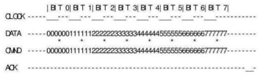

2)  From the above figure, we can see that the data lines (DATA，COMMAND) all change as the CLOCK falls. Therefore, the data reception should be completed from the rising edge of the clock (marked by \* in the above diagram) to the time when the level changes again.

3)  After the selected handle receives the COMMAND data bytes, ACK will be pulled down for a clock cycle. If the selected handle does not response, the host will consider that the handle is not connected. Through the information above, we can write a function of the handle receiver to send command, as shown in the following figure:

```c
void PS2_Cmd(u8 CMD)
{
	volatile u16 ref=0x01;
	Data[1] = 0;
	for(ref=0x01;ref<0x0100;ref<<=1)
	{
		if(ref&CMD)
		{
			DO_H;                  
		}
		else DO_L;

		Delay(10);
		CLK_L;
		Delay(40);
		CLK_H;
		if(DI)
			Data[1] = ref|Data[1];
		Delay(10);
	}
}
```

4. In the above code, we did not find that the use of the AttentIOn and ACK signals. Because there is only a receiver, we do not need to switch among multiple receivers. Therefore, the ACK signal does not need to be used.

5. The AttentIOn signal is because we manually set the AttentIOn signal before calling PS2_Cmd. But before using the above function, we still need to configure the functions between each I/O port.

6. The AttentIOn signal is because we manually set the AttentIOn signal before calling PS2_Cmd. Before using the above function, we need to configure the functions among each I/O port.

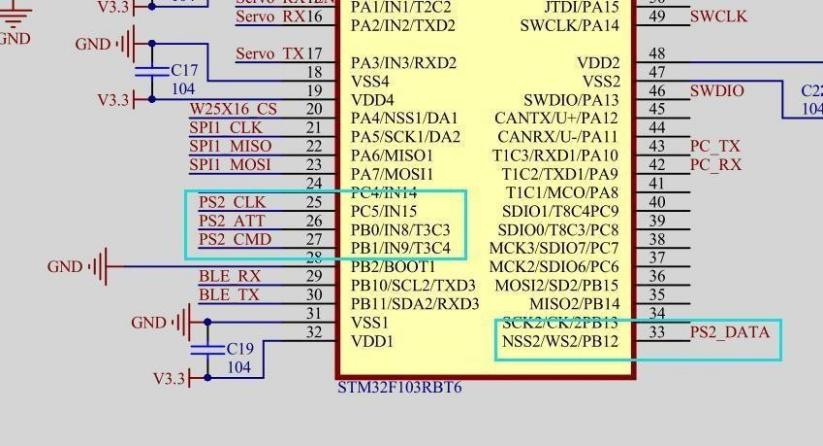

   Configure PS2_CLK、PS2_CMD、PS2ATT to push–pull output and PS2_DATA to pull-up input.

```c
void InitPS2(void)
{
	GPIO_InitTypeDef  GPIO_InitStructure;
	
	RCC_APB2PeriphClockCmd(RCC_APB2Periph_GPIOB, ENABLE);
	GPIO_InitStructure.GPIO_Pin = GPIO_Pin_12;
	GPIO_InitStructure.GPIO_Mode = GPIO_Mode_IPU;
	GPIO_Init(GPIOB, &GPIO_InitStructure);
	
	RCC_APB2PeriphClockCmd(RCC_APB2Periph_GPIOB, ENABLE);
	GPIO_InitStructure.GPIO_Pin = GPIO_Pin_0 | GPIO_Pin_1;
	GPIO_InitStructure.GPIO_Mode = GPIO_Mode_Out_PP; 		 //推挽输出  (push-pull output)
	GPIO_InitStructure.GPIO_Speed = GPIO_Speed_50MHz;
	GPIO_Init(GPIOB, &GPIO_InitStructure);
	
	RCC_APB2PeriphClockCmd(RCC_APB2Periph_GPIOC, ENABLE);
	GPIO_InitStructure.GPIO_Pin = GPIO_Pin_5;
	GPIO_InitStructure.GPIO_Mode = GPIO_Mode_Out_PP; 		 //推挽输出  (push-pull output)
	GPIO_InitStructure.GPIO_Speed = GPIO_Speed_50MHz;
	GPIO_Init(GPIOC, &GPIO_InitStructure);
	
	PS2_SetInit();		 //配配置初始化,配置“红绿灯模式”，并选择是否可以修改  (configure initialization, set "traffic light mode", and choose whether to allow modification)									  
}
```

7. According to the timing and protocol, we can write such a function which is used to read the data of the handle button, as shown in the following figure:

```c
void PS2_ReadData(void)
{
	volatile u8 byte;
	volatile u16 ref;

	CS_L;
	Delay(10);
	PS2_Cmd(Comd[0]);  
	PS2_Cmd(Comd[1]);  
	for(byte=2;byte<9;byte++)          
	{
		for(ref=0x01;ref<0x100;ref<<=1)
		{

			CLK_L;
				Delay(50);
			CLK_H;
		      if(DI)
		      {
				Data[byte] = ref|Data[byte];
			  }
				Delay(20);
		     
		}
			Delay(40);
	}
	CS_H;
}
```

8)  In the above function, we can see the process of data reception: pull down the level of AttentIOn wire first, and send the start command and the request date command. Then start to receive the button data returned from the receiver.

9)  The start command is 0x01 and the request command is 0x42. In fact, the reception of each byte is the same as the implementation of PS_Cmd. Therefore, the level of AttentIOn line is pulled up after the reception is completed, which can end the communication.

10)  The read data may be different due to the different handle working modes. The working mode of the handle can be set by sending command. Program will set the handle to the red light mode during initialization. The data format in the red light mode is shown in the following table:

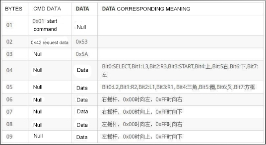

11) In the table above, the fourth and the fifth bytes contain the button data of the handle. We can judge whether a button is pressed according to the requirement. The sixth to the ninth bytes are the joystick data. The maximum value is 255 and the minimum value is 0.

12) Finally ,in program, you only need to set the handle data that is periodically read in the handle receiver, and then make the corresponding operation according to the obtained button data to realize the handle remote control.

### 5.2.9 Lesson 9 SPI_Flash Write and Read

####  5.2.9.1 Project Purpose

Learn the principle of FLASH memory and SPI bus communication and realize to read and write SPI FLASH on the controller, and display the written characters in the serial port assistant.

#### 5.2.9.2 Project Principle

Flash memory is a type of [nonvolatile memory](https://searchstorage.techtarget.com/definition/nonvolatile-memory) that can retain data for an extended period of time even without current supply, and its storage characteristic is equivalent to the hard disk drive. This feature is the basis for flash memory to become the storage medium for various portable digital devices.

The Serial Peripheral Interface (SPI), developed by Motorola, is a high-speed full duplex interface. It is widely used in ADCs, LCDs and MCUs and suitable for occasions with higher communication speed requirements.

SPI FLASH is a type of flash memory that reads and writes through `SPI` interface. The general SPI FLASH has two characteristics for reading and writing:

1. When writing, only 1 can be written, not 0.

2. When erasing, it is erased by sector (that is, all data becomes 0), and the sector size varies according to different chips (the chip we chose has 4096 bytes per sector).

   Based on the above two points, we can know that the data of a byte is to change the corresponding data bit in the chip from 0 to 1 or from 1 to zero.

   Because FLASH does not support writing 0 when writing so we are required to erase the corresponding sector to 0. However, the original data will be lost after erasing, so it is generally read first, and then the sector is erased. At the end, rewrite the modified data into Flash.

#### 5.2.9.3 Program Analyst

1)  The STM32 has a SPI hardware interface `inside.` Communication with SPI_FLASH can be completed as long as it is properly configured.

2)  After configuring the clock and each I/O port and then setting the SPI, the communication can be started.

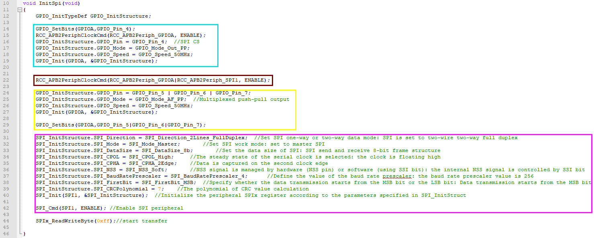

3)  As shown in the figure above, the code in green box is the chip select pin for configuring Flash. The code in red box is for turning on the related clock. The code in yellow box is for configuring the three pins SPI_MISO、SPI_MOSI、SPI_CLK to the multiplexed push-pull output. The code in purple box is for configuring the working parameters of SPI.

4)  After configuring the `SPI` interface, we can write the data to be sent into the register, the hardware processing will be automatically completed. According to the feature of SPI, each time a byte is sent, the microcontroller will also receive a byte. The following figure is the function of data interaction:

5)  When the SPI communication function is available, we can enable communication between SPI Flash. Writing and reading SPI Flash requires sending corresponding commands to SPI Flash and these commands are usually described in the chip manual.

The figure shown below is the command table of SPI FLASH:

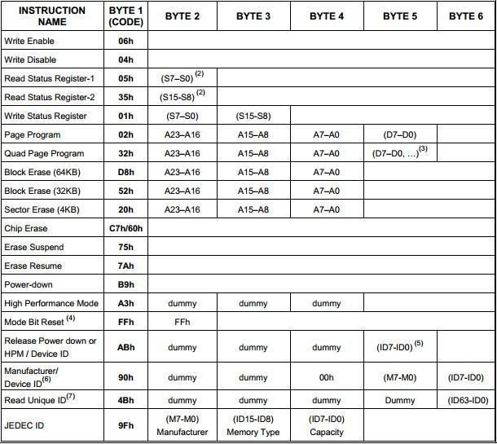

6)  According to the table above, define the commands that may be used are defined in the header files with micro definition for later use.

```c
#define W25X_WriteEnable		0x06
#define W25X_WriteDisable		0x04
#define W25X_ReadStatusReg		0x05
#define W25X_WriteStatusReg		0x01
#define W25X_ReadData			0x03
#define W25X_FastReadData		0x0B
#define W25X_FastReadDual		0x3B
#define W25X_PageProgram		0x02
#define W25X_BlockErase			0xD8
#define W25X_SectorErase		0x20
#define W25X_ChipErase			0xC7
#define W25X_PowerDown			0xB9
#define W25X_ReleasePowerDown	0xAB
#define W25X_DeviceID			0xAB
#define W25X_ManufactDeviceID	0x90
#define W25X_JedecDeviceID		0x9F
```

7. Then check whether Flash is busy or not. When Flash is busy, it will not read or write commands. Therefore, the status of Flash should be checked first before reading and writing. When Flash is idle, it can write and read. In addition, FlashErase and FLashEraseSector perform all ease and sector erase respectively.

```c
u8 SPI_Flash_ReadSR(void)
{
	u8 byte=0;
	SPI_FLASH_CS=0;                            //使能器件  (enable device)
	SPIx_ReadWriteByte(W25X_ReadStatusReg);    //发送读取状态寄存器命令  (send read status register command)
	byte=SPIx_ReadWriteByte(0Xff);             //读取一个字节  (read one byte)
	SPI_FLASH_CS=1;                            //取消片选  (deselect chip)
	return byte;
}

//等待空闲  (wait for idle)
void SPI_Flash_Wait_Busy(void)
{
	while((SPI_Flash_ReadSR()&0x01)==0x01);    // 等待BUSY位清空  (wait for BUSY bit to clear)
}
```

```c
//SPI_FLASH写使能  (SPI_FLASH write enable)
//将WEL置位  (set WEL bit)
void SPI_FLASH_Write_Enable(void)
{
	SPI_FLASH_CS=0;                            //使能器件  (enable device)
	SPIx_ReadWriteByte(W25X_WriteEnable);      //发送写使能  (send write enable)
	SPI_FLASH_CS=1;                            //取消片选  (deselect chip)
}
```

```c

/************************************************
擦除扇区 扇区大小4096,Flash最小擦除大小是以扇区为单位擦除  (erase sector, sector size 4096, Flash minimum erase is sector-based)
入口参数: 
		addr
出口参数: 无
************************************************/
void FlashEraseSector(DWORD addr)
{
	SPI_FLASH_Write_Enable();                  //SET WEL
	SPI_Flash_Wait_Busy();
	SPI_FLASH_CS=0;                            //使能器件  (enable device)
	SPIx_ReadWriteByte(W25X_SectorErase);      //发送扇区擦除指令  (send sector erase command)
	SPIx_ReadWriteByte((u8)((addr)>>16));  //发送24bit地址  (send 24-bit address)
	SPIx_ReadWriteByte((u8)((addr)>>8));
	SPIx_ReadWriteByte((u8)addr);
	SPI_FLASH_CS=1;                            //取消片选  (deselect chip)
	SPI_Flash_Wait_Busy();   				   //等待擦除完成  (wait for erase complete)
}
```

8)  The following two functions is to read and write the data in Flash:

```c
/************************************************
从Flash中读取数据  (read data from Flash)
入口参数:
    addr   : 地址参数  (address parameter)
    size   : 数据块大小  (data block size)
    buffer : 缓冲从Flash中读取的数据  (buffer for data read from Flash)
出口参数:
    无
************************************************/
void FlashRead(DWORD addr, DWORD size, BYTE *buffer)
{
    u16 i;
	SPI_FLASH_CS=0;                            //使能器件  (enable device)
	SPIx_ReadWriteByte(W25X_ReadData);         //发送读取命令  (send read command)
	SPIx_ReadWriteByte((u8)((addr)>>16));  //发送24bit地址  (send 24-bit address)
	SPIx_ReadWriteByte((u8)((addr)>>8));
	SPIx_ReadWriteByte((u8)addr);
	for(i=0; i<size; i++)
	{
		buffer[i]=SPIx_ReadWriteByte(0XFF);   //循环读数  (loop read)
	}
	SPI_FLASH_CS=1;                            //取消片选  (deselect chip)
}


/************************************************
写数据到Flash中  (write data to Flash)
入口参数:
    addr   : 地址参数  (address parameter)
    size   : 数据块大小  (data block size)
    buffer : 缓冲需要写入Flash的数据  (buffer for data to write to Flash)
出口参数: 无
************************************************/
void FlashWrite(DWORD addr, DWORD size, BYTE *buffer)
{
    u16 i;
	SPI_FLASH_Write_Enable();                  //SET WEL
	SPI_FLASH_CS=0;                            //使能器件  (enable device)
	SPIx_ReadWriteByte(W25X_PageProgram);      //发送写页命令  (send page program command)
	SPIx_ReadWriteByte((u8)((addr)>>16)); //发送24bit地址  (send 24-bit address)
	SPIx_ReadWriteByte((u8)((addr)>>8));
	SPIx_ReadWriteByte((u8)addr);
	for(i=0; i<size; i++)SPIx_ReadWriteByte(buffer[i]); //循环写数  (loop write)
	SPI_FLASH_CS=1;                            //取消片选  (deselect chip)
	SPI_Flash_Wait_Busy();					   //等待写入结束  (wait for write complete)
}
```

Instead of reading, modifying, then erasing, and finally rewriting as described above, the above operation writes the function `directly.` Why does this situation occur?

It’s not that these operations are not required, but we need to finish them ourselves in programming. Because the operations to be performed on Flash are not complex, the task in Flash is relatively single and the situation is relatively fixed. Therefore, we can manually erase the number of sectors and the number of the bytes written, which can solve this problem.

For example, we modify only one byte but cause the program to read and write all 4KB data of the entire sector once, which can improve the efficiency and reduce the RAM usage. Through the combination of the above several functions, you can keep your own data on the SPI Flash.

### 5.2.10 Lesson 10 Save Action to Flash

#### 5.2.10.1 Project Purpose

Write the received action data to Flash through the serial communication.

#### 5.2.10.2 Project Principle

We have learned the writing and reading of SPI Flash. In this section, we are going to save the action data into Flash. The working process is as follow:

Yes No

Learning from the above, we need to extract the action data from the data received by the serial port, and then write it into Flash correctly. In the previous section, we learned that Flash erasing is sector-based, and at the same time only 1 can be written but not 0.

Therefore, in order to facilitate programming and management, storage address is aligned with the sector size of the Flash chip saved by 4096 bytes, which improves the efficiency and reduce the error rate.

#### 5.2.10.3 Program Analyst

```c
void TaskBLEMsgHandle(void)
{

	uint16 i;
	uint8 cmd;
	uint8 id;
	uint8 servoCount;
	uint16 time;
	uint16 pos;
	uint16 times;
	uint8 fullActNum;
	if(UartRxOK())
	{
		LED = !LED;
		cmd = UartRxBuffer[3];
 		switch(cmd)
 		{
 			case CMD_MULT_SERVO_MOVE:
				servoCount = UartRxBuffer[4];
				time = UartRxBuffer[5] + (UartRxBuffer[6]<<8);
				for(i = 0; i < servoCount; i++)
				{
					id =  UartRxBuffer[7 + i * 3];
					pos = UartRxBuffer[8 + i * 3] + (UartRxBuffer[9 + i * 3]<<8);
	
					ServoSetPluseAndTime(id,pos,time);
	
				}
 				break;
			
			case CMD_FULL_ACTION_RUN:
				fullActNum = UartRxBuffer[4];//动作组编号  (action group number)
				times = UartRxBuffer[5] + (UartRxBuffer[6]<<8);//运行次数  (run times)
				FullActRun(fullActNum,times);
				break;
				
			case CMD_FULL_ACTION_STOP:
				FullActStop();
				break;				
				
			case CMD_FULL_ACTION_ERASE:
				FlashEraseAll();
				McuToPCSendDataByBLE(CMD_FULL_ACTION_ERASE,0,0);
				break;

			case CMD_ACTION_DOWNLOAD:
				SaveAct(UartRxBuffer[4],UartRxBuffer[5],UartRxBuffer[6],UartRxBuffer + 7);
				McuToPCSendDataByBLE(CMD_ACTION_DOWNLOAD,0,0);
				break;

 		}
	}
}
```

1)  As you can see from the above figure, the action erase and the action download functions have been added. This two functions are implemented by two functions `FlashEraseAll()` and SaveAct(). The protocols of the two commands are as follows.

2)  Before implementing these two functions, the storage location of the data in Flash needs to be arranged first. The following figure shows address distribution of data storage:

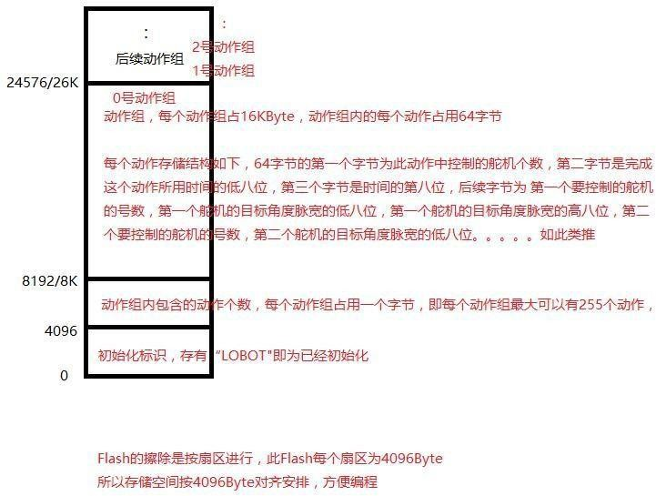

The first sector is used to store LOBOT signs; If there is no LOBOT sign, the sector will be considered to be a new Flash chip;

3)  The second sector stores the number of actions of the action `group.` Each action group occupies one byte, that is, each action group can store 255 actions. We only use the first 256 bytes of this sector, that is, up 256 action groups can be stored. All 256 bytes of the data is read during operating. Then erase the data of this sector and rewrite the modified data into.

4)  Starting from the this sector is the area for storing action group data. Each action group occupies 16KB, that is, four sectors. The process of writing an action group is as follows:

The first step: erase the storage area 48 of the action group to be written.

The second step: Write the actions of the action group one by one. At the same time, check if the written action is the last action in this action `group.`

The third step: If it is the last action, we consider that the action has been written completely, and then update the number of the action groups in the second sector. The way to erase an action is to change the number of the actions of the corresponding action group to 0. The way to erase all action groups is to change the first 256 bytes of the second sector to 0. The following figure shows the implementation of this part of the program:

```c
void SaveAct(uint8 fullActNum,uint8 frameIndexSum,uint8 frameIndex,uint8* pBuffer)
{
	uint8 i;
	
	if(frameIndex == 0)
	{
		for(i = 0;i < 4;i++)//ACT_SUB_FRAME_SIZE/4096 = 4
		{
			FlashEraseSector((MEM_ACT_FULL_BASE) + (fullActNum * ACT_FULL_SIZE) + (i * 4096));
		}
	}

	FlashWrite((MEM_ACT_FULL_BASE) + (fullActNum * ACT_FULL_SIZE) + (frameIndex * ACT_SUB_FRAME_SIZE)
		,ACT_SUB_FRAME_SIZE,pBuffer);
	
	if((frameIndex + 1) ==  frameIndexSum)
	{
		FlashRead(MEM_FRAME_INDEX_SUM_BASE,256,frameIndexSumSum);
		frameIndexSumSum[fullActNum] = frameIndexSum;
		FlashEraseSector(MEM_FRAME_INDEX_SUM_BASE);
		FlashWrite(MEM_FRAME_INDEX_SUM_BASE,256,frameIndexSumSum);
	}
}


void FlashEraseAll(void)
{
	uint16 i;
	
	for(i = 0;i <= 255;i++)
	{
		frameIndexSumSum[i] = 0;
	}
	FlashEraseSector(MEM_FRAME_INDEX_SUM_BASE);
	FlashWrite(MEM_FRAME_INDEX_SUM_BASE,256,frameIndexSumSum);
}
void InitMemory(void)
{
	uint8 i;
	uint8 logo[] = "LOBOT";
	uint8 datatemp[8];

	FlashRead(MEM_LOBOT_LOGO_BASE,5,datatemp);
	for(i = 0; i < 5; i++)
	{
		if(logo[i] != datatemp[i])
		{
		LED = LED_ON;
			FlashEraseSector(MEM_LOBOT_LOGO_BASE);
			FlashWrite(MEM_LOBOT_LOGO_BASE,5,logo);
			FlashEraseAll();
			break;
		}
	}
```

5)  The `InitMemory` function is used to clear some unused storage in the Flash. Then write a loge to mark that the Flash has been initialized.

```c
void InitMemory(void)
{
	uint8 i;
	uint8 logo[] = "LOBOT";
	uint8 datatemp[8];

	FlashRead(MEM_LOBOT_LOGO_BASE,5,datatemp);
	for(i = 0; i < 5; i++)
	{
		if(logo[i] != datatemp[i])
		{
		LED = LED_ON;
			//如果发现不相等的，则说明是新FLASH，需要初始化  (if not equal, indicates new Flash, need to initialize)
			FlashEraseSector(MEM_LOBOT_LOGO_BASE);
			FlashWrite(MEM_LOBOT_LOGO_BASE,5,logo);
			FlashEraseAll();
			break;
		}
	}
	
}
```

### 5.2.11 Lesson 11 Run the Action stored in Flash

#### 5.2.11.1 Project Purpose

Through the serial command or PS2 handle, control to read the action data in Flash and run the read action `group.`

#### 5.2.11.2 Project Principle

In this section, we will implement the robotic arm to run the specified action group through the serial command. We need to implement the function of running the action group, and implement the corresponding serial command and call the corresponding action group through the button of PS2 handle. Design the corresponding serial port command protocol is as follow:

Run action group command

Command name: `CMD_ACTION_RUN` Command valueL:6 Data length:5

Instruction: run action `group.` If the parameter times are unlimited, the parameter value is 0.

Parameter 1: The number parameter of the action group to be run.

Parameter 2: The `lower-byte` parameter of the times of the action group to be executed.

Parameter 3: The upper byte parameter of the times of the action group to be executed.

To realize the function of running the action group in SPI Flash, you must understand that the action group is actually a combination of several actions, and the action is the change of the position of the servo.

#### 5.2.11.3 Program Analyst

Before running the action group, the environment for running action group need to be set first. For example, whether there are actions in action group, the number of actions it contains and check whether there is an action group currently running. Next do corresponding process according to different situations to prevent errors. Then set the parameters for the action group to be run and set the mark of the action group to be run.

```c
void FullActRun(uint8 actFullnum,uint32 times)//初始化并运行新的动作  (initialize and run new action)
{
	uint8 frameIndexSum;
	FlashRead(MEM_FRAME_INDEX_SUM_BASE + actFullnum,1, &frameIndexSum);
	if(frameIndexSum > 0)//该动作组的动作数大于0，说明是有效的，已经下载过动作了。  (action count > 0, valid, actions have been downloaded)
	{
		FrameIndexSum = frameIndexSum;
		if(ActFullNum != actFullnum)
		{
			if(actFullnum == 0)
			{//0号动作组强制运行，可以中断当前正在运行的其他动作组  (action group 0 forced, can interrupt other running action groups)
				fRobotRun = FALSE;
				ActFullRunTimes = 0;
				fFrameRunFinish = TRUE;
			}
		}
		else
		{	//只用前后两次动作组编号相同才能修改次数  (only modify times when action group numbers are same)
			ActFullRunTimesSum = times;
		}
		
		
		if(FALSE == fRobotRun)
		{
			ActFullNum = actFullnum;
			ActFullRunTimesSum = times;
			FrameIndex = 0;
			ActFullRunTimes = 0;
			fRobotRun = TRUE;
			
			TimeActionRunTotal = gSystemTickCount;
		}
		
	}
```

Running an action is reading the running time of the action and the angle of each servo from the corresponding position in Flash. Then control the servo through the previous control servo program to implement the effect of rotating the corresponding angle within a specified time.

```c
uint16 ActSubFrameRun(uint8 fullActNum,uint8 frameIndex)
{
	uint32 i = 0;

//	uint16 frameSumSum = 0;	//由于子动作都是连续存放的，子动作的帧数又是不确定的数  (since sub-actions are stored continuously, frame count uncertain)
	//，所以要总在一起算。所有前面子动作的帧加起来  (so count together, sum all previous sub-action frames)
	uint8 frame[ACT_SUB_FRAME_SIZE];
	uint8 servoCount;
	uint32 time;
	uint8 id;
	uint16 pos;

	FlashRead((MEM_ACT_FULL_BASE) + (fullActNum * ACT_FULL_SIZE) + (frameIndex * ACT_SUB_FRAME_SIZE)
		,ACT_SUB_FRAME_SIZE,frame);
	
	servoCount = frame[0];
	time = frame[1] + (frame[2]<<8);

	if(servoCount > 8)
	{//舵机数超过8个，说明下载了错误动作  (servo count > 8, indicates wrong action downloaded)
		FullActStop();
		return 0;
	}
	for(i = 0; i < servoCount; i++)
	{
		id =  frame[3 + i * 3];
		pos = frame[4 + i * 3] + (frame[5 + i * 3]<<8);
		ServoSetPluseAndTime(id,pos,time);
		BusServoCtrl(id,SERVO_MOVE_TIME_WRITE,pos,time);
	}
	return time;
}
```

1)  After an action is executed, the executing time of the action is deferred. When the action time is expired, the action will be judged that the execution of the action is complete and the next new action can be execute.

(At the same time the function will check the action group running flag, the flag is true to execute the action group, for false will not be executed)

```c
void TaskRobotRun(void)
{

	if(fRobotRun)
	{
		if(TRUE == fFrameRunFinish)
		{//运行完成后开始下一帧动作运行  (after completion, start next frame action)
			fFrameRunFinish = FALSE;
			TimeActionRunTotal += ActSubFrameRun(ActFullNum,FrameIndex);//将这帧动作的时间累加上  (add the time of this frame action)
		}
		else
		{
			if(gSystemTickCount >= TimeActionRunTotal)
			{//不断检测这帧动作在指定时间内运行完成  (constantly check if this frame action completes within specified time)
				fFrameRunFinish = TRUE;
				if(++FrameIndex >= FrameIndexSum)
				{//已运行完该动作组最后一个动作  (finished the last action of this action group)
					FrameIndex = 0;
					if(ActFullRunTimesSum != 0)
					{//如果运行次数等于0，即代表无限次运行，就不进入if语句，就一直运行了  (if run times = 0, infinite, skip if and keep running)
						if(++ActFullRunTimes >= ActFullRunTimesSum)
						{//到达运行次数，运行停止  (reached run times, stop)
							McuToPCSendData(CMD_FULL_ACTION_STOP,0,0);
							fRobotRun = FALSE;
							if(ActFullNum == 100)
							{
								FullActRun(101,1);
							}
						}
					}
				}
			}
		}
	}
	else
	{
		FrameIndex = 0;
		
		ActFullRunTimes = 0;

		fFrameRunFinish = TRUE;

		TimeActionRunTotal = gSystemTickCount;
		//只需要在运行完整动作组的最开始赋一下初值就可以，避免累积误差  (only need to assign initial value at the beginning of running full action group to avoid cumulative error)
	}
}
```

2)  SystemTickCount is the number of milliseconds elapsed from the start of the program to this moment. The number of the milliseconds plus the running time of the action is the time required for the entire program to complete the action. When the number of the milliseconds matches, it is judge that the next action will be run or the entire action group has been run.

3)  After implementation of the function of running action group, look at the function of the serial data processing: process the command of the movement action `group.`

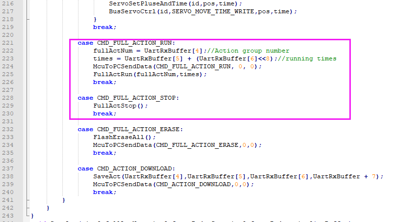

4)  Stop the action group is to call the stop action group function. This function will set variable and flags, so that `Task_RobotRun` function will stop running action `group.`

```c
void FullActStop(void)
{
	fRobotRun = FALSE;
	ActFullRunTimes = 0;

	fFrameRunFinish = TRUE;

	FrameIndex = 0;
}
```

### 5.2.12 Lesson 12 Single Servo Mode

#### 5.2.12.1 Project Purpose 

Add the mode of controlling a single servo by the handle, so that the handle button can directly control a certain servo on the robot.

#### 5.2.12.2 Project Principle

In the previous program, the function of PS2 handle to call the corresponding action group has been implemented, but sometimes running the `pre-programmed` action group can not meet the actual needs, for example, directly controlling the rotation of a certain servo. In order to implement this function, we add a single servo mode.

The handle principle can be reviewed in Lesson 8 PS2 Handle Control.

#### 5.2.12.3 Program Analyst

1)  Create a variable mode to record the working mode: 0 is the action group mode. 1 is single servo mode. Because the variable is initialized to 0, it defaults to single servo mode.

```c
		if(mode == 1)
		{
			if( PS2_Button( PSB_SELECT ) & PS2_ButtonPressed( PSB_START ) )
			{
				mode = 0;
				Ps2State = 0;
				manual = TRUE;
				BuzzerState = 1;
				LED=~LED;
				DelayMs(80);
				manual = FALSE;
				DelayMs(50);
				manual = TRUE;
				BuzzerState = 1;
				DelayMs(80);
				manual = FALSE;
				LED=~LED;
			}
			else
			{
				if(PS2KeyValue && !PS2_Button(PSB_SELECT))
			{
				LED=~LED;
			}
						
				switch( PS2KeyValue )
				{
					//根据按下的按键，控制舵机转动  (Control servo rotation according to pressed button)
					case PSB_PAD_LEFT:
						ServoSetPluseAndTime( 6, ServoPwmDutySet[6] + 20, 50 );
						BusServoPwmDutySet[6] = BusServoPwmDutySet[6] + 10;
						if (BusServoPwmDutySet[6] > 2500)
							BusServoPwmDutySet[6] = 2500;
						BusServoCtrl(6,SERVO_MOVE_TIME_WRITE,BusServoPwmDutySet[6],50);
						break;
					case PSB_PAD_RIGHT:
						ServoSetPluseAndTime( 6, ServoPwmDutySet[6] - 20, 50 );
						BusServoPwmDutySet[6] = BusServoPwmDutySet[6] - 10;
						if (BusServoPwmDutySet[6] < 500)
							BusServoPwmDutySet[6] = 500;
						BusServoCtrl(6,SERVO_MOVE_TIME_WRITE,BusServoPwmDutySet[6],50);
						break;
					case PSB_PAD_UP:
						ServoSetPluseAndTime( 5, ServoPwmDutySet[5] - 20, 50 );
						BusServoPwmDutySet[5] = BusServoPwmDutySet[5] - 10;
						if (BusServoPwmDutySet[5] < 900)
							BusServoPwmDutySet[5] = 900;
						BusServoCtrl(5,SERVO_MOVE_TIME_WRITE,BusServoPwmDutySet[5],50);
						break;
					case PSB_PAD_DOWN:
						ServoSetPluseAndTime( 5, ServoPwmDutySet[5] + 20, 50 );
						BusServoPwmDutySet[5] = BusServoPwmDutySet[5] + 10;
						if (BusServoPwmDutySet[5] > 2200)
							BusServoPwmDutySet[5] = 2200;
						BusServoCtrl(5,SERVO_MOVE_TIME_WRITE,BusServoPwmDutySet[5],50);
						break;
					case PSB_L1:
						ServoSetPluseAndTime( 2, ServoPwmDutySet[2] + 20, 50 );
						BusServoPwmDutySet[2] = BusServoPwmDutySet[2] + 10;
						if (BusServoPwmDutySet[2] > 2200)
							BusServoPwmDutySet[2] = 2200;
						BusServoCtrl(2,SERVO_MOVE_TIME_WRITE,BusServoPwmDutySet[2],50);
						break;
```

The program above is the code of mode 1 (single servo mode), which detects the status of PSB_SELECT and PSB_START by calling PS2_Button and PS2_ButtonPressed.

When PSB_SELECT has been pressed, and then PSB_START is pressed, it can switch to mode 0 (action group mode).

```c
bool PS2_NewButtonState( u16 button )
{
  button = 0x0001u << ( button - 1 );  //输入的button的值是 该按键在数据中所在bit的值+1， 例如 PSB_SELECT 宏的值 是 1， 在数据中的位是0位， 如此类推，  (Input button value is bit position +1, e.g. PSB_SELECT macro is 1, bit 0, and so on)
  return ( ( ( LastHandkey ^ Handkey ) & button ) > 0 );  //将上次的按键数据和这次的按键数据进行异或运算，结果就是两次不同的部分会是1，就得到了状态发生了变化的按键  (XOR last and current button data, bits that differ become 1, indicating state changed)
	                                                    //然后在与我们想要检测的按键进行与运算，如果这个按键发生了变化，那么结果就是1， 大于0，所以返回就是true  (Then AND with the button we want to check; if changed, result is 1 > 0, returns true)
}

bool PS2_Button( u16 button )
{
  button = 0x0001u << ( button - 1 );  //输入的button的值是 该按键在数据中所在bit的值+1， 例如 PSB_SELECT 宏的值 是 1， 在数据中的位是0位， 如此类推，  (Input button value is bit position +1, e.g. PSB_SELECT macro is 1, bit 0, and so on)
  return ( ( (~Handkey) & button ) > 0 );  //按键按下则对应位为0，没按下为1， 将按键数据取反之后，就变成了按键为1，没按下为0  (Pressed bit is 0, released is 1; invert so pressed becomes 1, released 0)
	                                         //再与我们想要检测的按键做与运算，若这个按键被按下，对应位就是1，没按下就是0，返回与0比较的结果，  (Then AND with the button to check; if pressed, bit is 1, else 0; return result > 0)
}

bool PS2_ButtonPressed( u16 button )
{
  return (PS2_NewButtonState( button ) && PS2_Button( button ));  //按键被按住，并且这个是按键的一个新的状态，那么就是按键刚被按下  (Button is held and this is a new state, meaning it was just pressed)
}

bool PS2_ButtonReleased( u16 button )
{
  return ( PS2_NewButtonState( button ) && !PS2_Button( button )); //按键没被按住，并且这个是按键的一个新的状态，那么就是按键刚被松开  (Button is not held and this is a new state, meaning it was just released)
}
```

2)  As the figure shown above, in PS2_ButtonPressed and `PS_Button` functions, Handkey is the latest status of the button read, while LastHandkey is the status of the button read in the last time. The difference between the two states can be used to determine whether the button is continuously pressed or just pressed. Similarly, the code of mode 0 (action group mode) is shown in the following figure.

```c
			 if( PS2_Button( PSB_SELECT ) && PS2_ButtonPressed( PSB_START ) )  //检查是不是 SELECT按钮被按住，然后按下START按钮， 是的话，切换模式  (Check if SELECT is held and START is pressed, if yes, switch mode)
        {
          mode = 1; //将模式变为1， 就单舵机模式  (Set mode to 1, single servo mode)
          FullActStop();  //停止动作组运行  (Stop action group running)
          Ps2State = 0;  //清除动作组模式用到的标志。 (Clear flags used in action group mode)
          ServoSetPluseAndTime( 1, 1500, 1000 );  //将机械臂的舵机都转到1500的位置  (Move all servos of the arm to position 1500)
          ServoSetPluseAndTime( 2, 1500, 1000 );
          ServoSetPluseAndTime( 3, 1500, 1000 );
          ServoSetPluseAndTime( 4, 1500, 1000 );
          ServoSetPluseAndTime( 5, 1500, 1000 );
          ServoSetPluseAndTime( 6, 1500, 1000 );
					manual = TRUE;
				BuzzerState = 1;
				LED=~LED;
				DelayMs(80);
				manual = FALSE;
				DelayMs(50);
				manual = TRUE;
				BuzzerState = 1;
				DelayMs(80);
				manual = FALSE;
				LED=~LED;
        }
				else
				{
			if(PS2KeyValue && !Ps2State && !PS2_Button(PSB_SELECT))
			{
				LED=~LED;
			}

			switch(PS2KeyValue)
			{
				case 0:
					if(Ps2State)
					{
						Ps2State = FALSE;
					}
					break;
				
				case PSB_START:
					if(!Ps2State)
					{
						FullActRun(0,1);
					}
					Ps2State = TRUE;
					break;
				
				case PSB_PAD_UP:
					if(!Ps2State)
					{
						FullActRun(1,1);
					}
					Ps2State = TRUE;
					break;
```

3)  We can find that the status of PSB_SELECT and PSB_STAR is judged like mode 1 (single servo mode), and then whether the mode has been switched is judged according to the status. If the mode does not be switched, the palm will execute different action groups according to the different pressed buttons.

### 5.2.13 Lesson 13 Add APP Control

####  5.2.13.1 Project Purpose

Use Bluetooth module to implement the communicate with the controller.

#### 5.2.13.2 Project Principle 

This section will add APP control function to uHand2.0.

The Bluetooth module will be connected to the controller of the palm through the serial port. The serial port used is the same as the communication serial port of the uHand2.0 PC software, so the same protocol is used for Bluetooth communication and uHand2.0 PC software communication. Therefore, we just need to copy a communication protocol, and then adapt it to the serial port communicating with the Bluetooth module.

#### 5.2.13.3 Program Analyst

1. By viewing the schematic diagram, the Bluetooth module is connected to the UART3 serial port of STM32 so the serial port needs to be initialized.

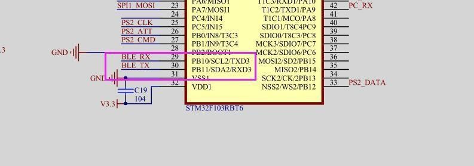

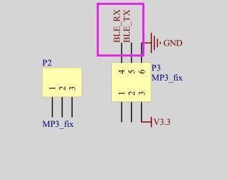

```c
void InitUart1(void)
{
	NVIC_InitTypeDef NVIC_InitStructure;
	
	GPIO_InitTypeDef GPIO_InitStructure;
	USART_InitTypeDef USART_InitStructure;
//	NVIC_InitTypeDef NVIC_InitStructure;

	RCC_APB2PeriphClockCmd(RCC_APB2Periph_USART1|RCC_APB2Periph_GPIOA|RCC_APB2Periph_AFIO, ENABLE);
	//USART1_TX   PA.9
	GPIO_InitStructure.GPIO_Pin = GPIO_Pin_9;
	GPIO_InitStructure.GPIO_Speed = GPIO_Speed_50MHz;
	GPIO_InitStructure.GPIO_Mode = GPIO_Mode_AF_PP;
	GPIO_Init(GPIOA, &GPIO_InitStructure);

	//USART1_RX	  PA.10
	GPIO_InitStructure.GPIO_Pin = GPIO_Pin_10;
	GPIO_InitStructure.GPIO_Mode = GPIO_Mode_IPU;
	GPIO_Init(GPIOA, &GPIO_InitStructure);

	//USART 初始化设置  (USART initialization settings)

	USART_InitStructure.USART_BaudRate = 9600;//一般设置为9600; (Usually set to 9600)
	USART_InitStructure.USART_WordLength = USART_WordLength_8b;
	USART_InitStructure.USART_StopBits = USART_StopBits_1;
	USART_InitStructure.USART_Parity = USART_Parity_No;
	USART_InitStructure.USART_HardwareFlowControl = USART_HardwareFlowControl_None;
	USART_InitStructure.USART_Mode = USART_Mode_Rx | USART_Mode_Tx;

	USART_Init(USART1, &USART_InitStructure);

	USART_ITConfig(USART1, USART_IT_RXNE, ENABLE);//开启中断  (Enable interrupt)

	USART_Cmd(USART1, ENABLE);                    //使能串口  (Enable USART)
	
	
	NVIC_InitStructure.NVIC_IRQChannel = USART1_IRQn;
	NVIC_InitStructure.NVIC_IRQChannelPreemptionPriority=1 ;
	NVIC_InitStructure.NVIC_IRQChannelSubPriority = 0;		//
	NVIC_InitStructure.NVIC_IRQChannelCmd = ENABLE;			//IRQ通道使能  (IRQ channel enable)
	NVIC_Init(&NVIC_InitStructure);	//根据NVIC_InitStruct中指定的参数初始化外设NVIC寄存器USART1  (Initialize USART1 NVIC registers according to parameters)
}
```

2)  After initializing the serial port, Bluetooth can be used to communicate. The method of sending polling register to implement that the receiving end uses the reception interrupt.

```c
void USART3_IRQHandler(void)                	//串口3中断服务程序  (USART3 interrupt service routine)
{
	u8 rxBuf;
	static uint8 startCodeSum = 0;
	static bool fFrameStart = FALSE;
	static uint8 messageLength = 0;
	static uint8 messageLengthSum = 2;
	if(USART_GetITStatus(USART3, USART_IT_RXNE) != RESET)  //接收中断(接收到的数据必须是0x0d 0x0a结尾)  (Receive interrupt, data must end with 0x0d 0x0a)
	{
		rxBuf =USART_ReceiveData(USART3);//(USART1->DR);	//读取接收到的数据  (Read received data)

		if(!fFrameStart)
		{
			if(rxBuf == 0x55)
			{

				startCodeSum++;
				if(startCodeSum == 2)
				{
					startCodeSum = 0;
					fFrameStart = TRUE;
					messageLength = 1;
				}
			}
			else
			{

				fFrameStart = FALSE;
				messageLength = 0;
	
				startCodeSum = 0;
			}
			
		}
		if(fFrameStart)
		{
			UartRxBuffer[messageLength] = rxBuf;
			if(messageLength == 2)
			{
				messageLengthSum = UartRxBuffer[messageLength];
				if(messageLengthSum < 2)// || messageLengthSum > 30
				{
					messageLengthSum = 2;
					fFrameStart = FALSE;
					
				}
					
			}
			messageLength++;
	
			if(messageLength == messageLengthSum + 2) 
			{

				fUartRxComplete = TRUE;

				fFrameStart = FALSE;
			}
		}

	}

}
```

3)  After the reception is completed, process with TaskBLEMsgHandle. TaskBLEMsgHandle will be called in main function, and then perform the corresponding operation based on the received commands.

```c
void TaskBLEMsgHandle(void)
{

	uint16 i;
	uint8 cmd;
	uint8 id;
	uint8 servoCount;
	uint16 time;
	uint16 pos;
	uint16 times;
	uint8 fullActNum;
	if(UartRxOK())
	{
		LED = !LED;
		cmd = UartRxBuffer[3];
 		switch(cmd)
 		{
 			case CMD_MULT_SERVO_MOVE:
				servoCount = UartRxBuffer[4];
				time = UartRxBuffer[5] + (UartRxBuffer[6]<<8);
				for(i = 0; i < servoCount; i++)
				{
					id =  UartRxBuffer[7 + i * 3];
					pos = UartRxBuffer[8 + i * 3] + (UartRxBuffer[9 + i * 3]<<8);
	
					ServoSetPluseAndTime(id,pos,time);
	
				}
 				break;
			
			case CMD_FULL_ACTION_RUN:
				fullActNum = UartRxBuffer[4];//动作组编号  (Action group number)
				times = UartRxBuffer[5] + (UartRxBuffer[6]<<8);//运行次数  (Run times)
				FullActRun(fullActNum,times);
				break;
				
			case CMD_FULL_ACTION_STOP:
				FullActStop();
				break;				
				
			case CMD_FULL_ACTION_ERASE:
				FlashEraseAll();
				McuToPCSendDataByBLE(CMD_FULL_ACTION_ERASE,0,0);
				break;

			case CMD_ACTION_DOWNLOAD:
				SaveAct(UartRxBuffer[4],UartRxBuffer[5],UartRxBuffer[6],UartRxBuffer + 7);
				McuToPCSendDataByBLE(CMD_ACTION_DOWNLOAD,0,0);
				break;

 		}
	}
}
```
