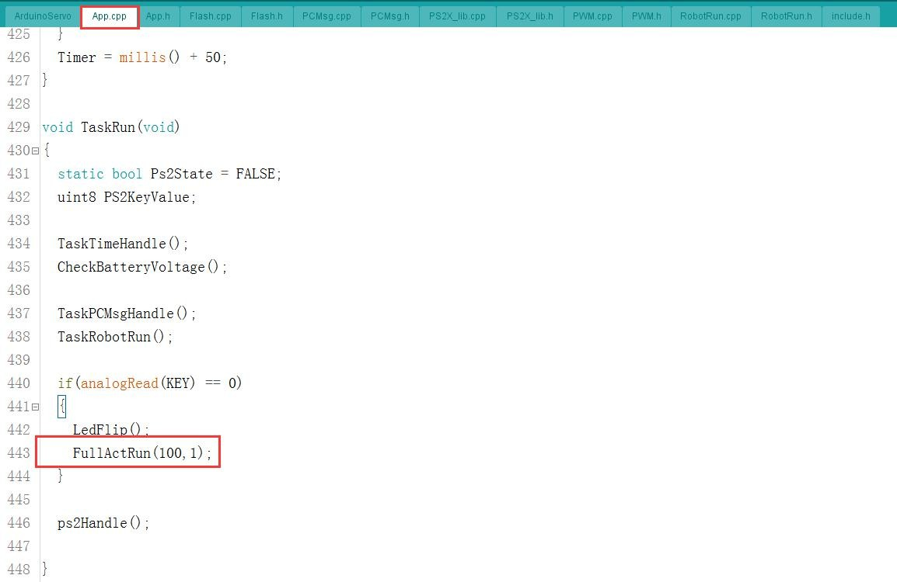
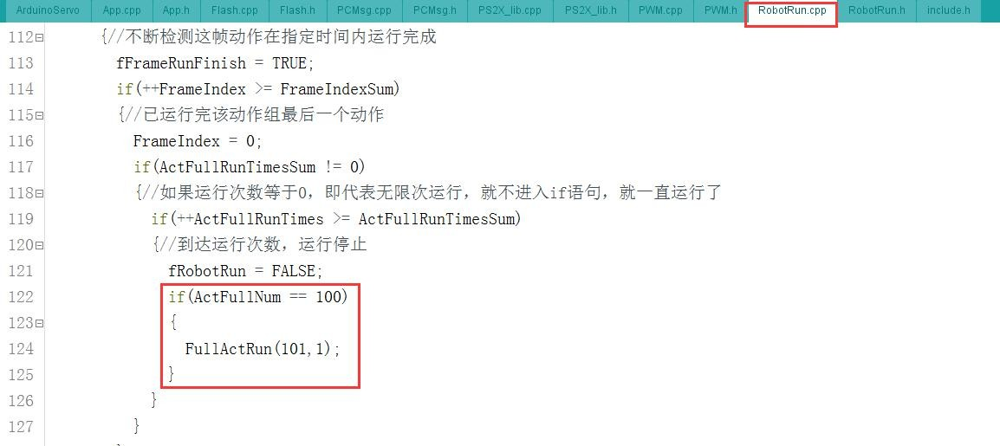
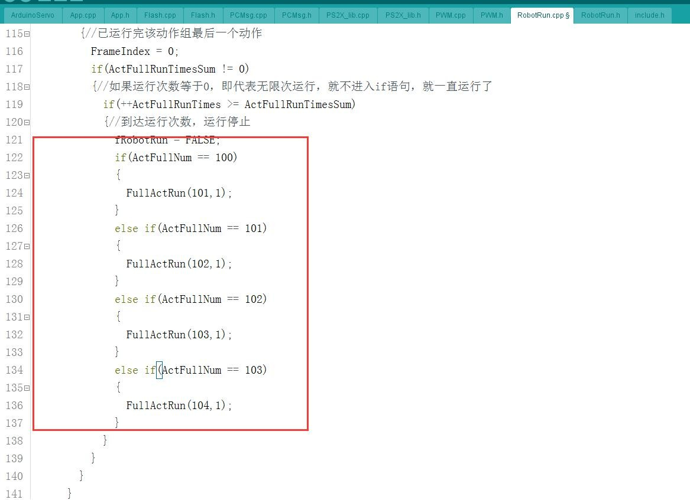
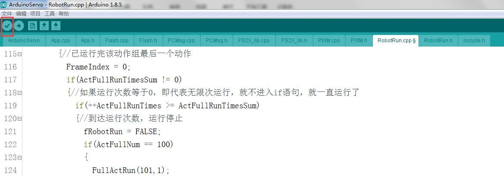
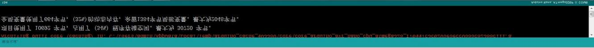
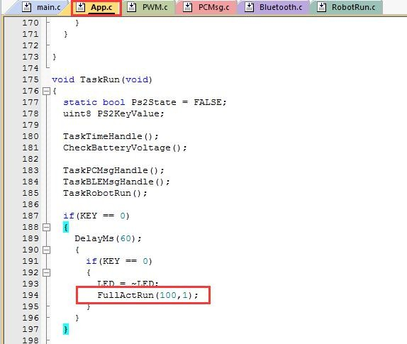
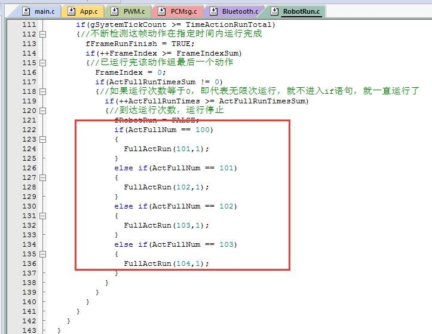
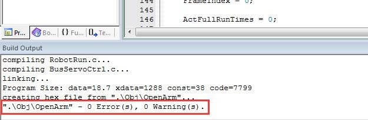

# 6. Advanced Lesson

## 6.1 Arduino Nano

### 6.1.1 "Add Offline Running Action"

The provided program and PC software can only save up to 255 actions in each action `group.` If this number is exceeded, the action will not run. If you want to add action, please follow these steps:

1)  Divide the action to be programmed into multiple action groups, e.g. when 225 actions have been programmed into an action group, then save the file and the remaining actions is programmed into the new action `group.`

2)  Open the source code and find the following code in App.C.

The code means that the programmed action is downloaded into `No.100` action group, then press the KEY 1 button on the controller to execute this action. This parameter 100 can be modified. If it is modified, the action is required to download into the modified action group and then the corresponding action can be executed when pressing the key.

1)  After the modification is completed in the previous step, there are another modification need to be made, as shown in the following figure: 

1)  An if statement is added here, which will continue to execute the `No.101` action group after the 100th action group is executed. Note: If we modified the value 100 in the previous step, then it also needs to be modified here.

2)  According to this method, you can continue to add action followed by this action, as shown in the figure:

The rule is: the previously executed action group is the judgment condition of the next action group to be executed, so it must be followed when modifying.

4)  Click the icon in the red box and wait for the compilation to be completed.

5)  If no error is displayed after compiling, then the program will be burnt into Arduino Nano microcontroller .

## 6.2 STM32

### 6.2.1 Add offline Running Action

The provided program and PC software can only save up to 255 actions in each action `group.` If this number is exceeded, the action will not run. If you want to add action, please follow these steps:

1)  Divide the action to be programmed into multiple action groups, e.g. when 225 actions have been programmed into an action group, then save the file and the remaining actions is programmed into the new action `group.`

2)  Open the source code and find the following code in App.C.

The code means that the programmed action is downloaded into `No.100` action group, then press the KEY 1 button on the controller to execute this action. This parameter 100 can be modified. If it is modified, the action is required to download into the modified action group and then the corresponding action can be executed when pressing the key.

3. After the modification is completed in the previous step, there are another modification need to be made, as shown in the following figure:

   An if statement is added here, which will continue to execute the `No.101` action group after the 100th action group is executed.

> [!NOTE]
>
> **If we modified the value 100 in the previous step, then it also needs to be modified here.**

4. According to this method, you can continue to add action followed by this action, as shown in the figure:

   The rule is: the previously executed action group is the judgment condition of the next action group to be executed, so it must be followed when modifying.

5. We have finished adding the action. Finally, compile the program.

6. If no error is displayed after compiling, then the program will be burnt into Arduino Nano microcontroller .
